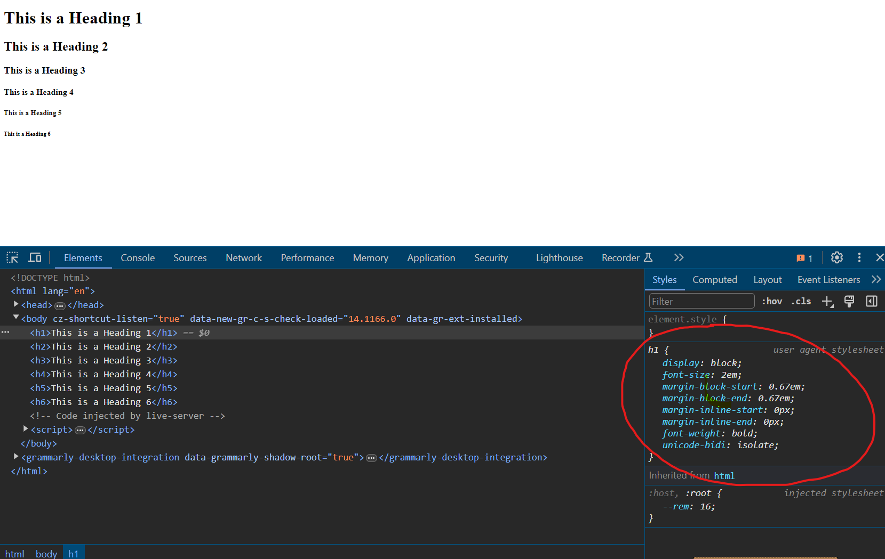

# Headings, Paragraphs & Typography

So now we know how to create a basic HTML document and we know how to structure it. The next step is to add some content to our page. In this lesson, we're going to cover headings and paragraphs as well as some basic typography and inline tags for emphasis.

The browser has default styles for headings and paragraphs. Headings are larger and bold, while paragraphs are smaller and have a line height. We can override these styles with our own CSS, but it's good to know the default styles so we can work with them.

## Headings

Headings are used to define the structure of a page. They are used to create a hierarchy of content. There are six levels of headings, from `<h1>` to `<h6>`. The `<h1>` tag is the most important and the `<h6>` tag is the least important.

Here's an example of how to use headings:

```html
<h1>This is a Heading 1</h1>
<h2>This is a Heading 2</h2>
<h3>This is a Heading 3</h3>
<h4>This is a Heading 4</h4>
<h5>This is a Heading 5</h5>
<h6>This is a Heading 6</h6>
```

Headings are "block-level elements", which means they take up the full width of the container they are in. That's why they are on their own line. I'll get more into block-level vs inline elements in a future lesson.

Let's open up the devtools in the browser by right-clicking on the page and selecting "Inspect". You can also press `Ctrl + Shift + I` on Windows or `Cmd + Option + I` on Mac. Click on the "Elements" tab and you'll see the HTML structure of the page.

If you click on one of the headings, you'll see the default styles applied by the browser. There is a font size, font weight, and margin applied to each heading level. You can override these styles with your own CSS, but these are the default styles. In many cases, developers such as myself will reset these styles to have a clean slate to work with. We'll cover all this when we get to CSS.



Typically, there is only one `<h1>` tag on a page. It's used for the main heading of the page. The other heading levels are used to create a hierarchy of content. For example, you might have an `<h2>` tag for a section heading and `<h3>` tags for sub-sections within that section.

## Paragraphs

Paragraphs are used to group text together. They are block-level elements, so they take up the full width of the container they are in. Here's an example of how to use paragraphs:

```html
<p>This is a paragraph. It's a block of text that is grouped together.</p>
<p>This is another paragraph. It's a separate block of text.</p>
```

Paragraphs also have default styles applied by the browser. There is a margin applied to the top and bottom of each paragraph.

## Text Emphasis

Text emphasis in HTML involves using specific tags to highlight or emphasize certain parts of the text. While HTML is not primarily meant for styling text, it provides a set of tags that can be used to add emphasis to text content.

- `<strong>` - This tag is used to define important text. By default, it's bold.
- `<em>` - This tag is used to define emphasized text. By default, it's italic.
- `<mark>` - This tag is used to highlight text. By default, it has a yellow background.
- `<del>` - This tag is used to define deleted text. By default, it has a line through it.
- `<ins>` - This tag is used to define inserted text. By default, it's underlined.
- `<sub>` - This tag is used to define subscript text. It's smaller and below the baseline. You would use this for things like chemical formulas.
- `<sup>` - This tag is used to define superscript text. It's smaller and above the baseline. You would use this for things like dates.

Here's an example of how to use these tags:

```html
<p>This is <strong>important</strong> text.</p>
<p>This is <em>emphasized</em> text.</p>
<p>This is <mark>highlighted</mark> text.</p>
<p>This is <del>deleted</del> text.</p>
<p>This is <ins>inserted</ins> text.</p>
<p>This is <sub>subscript</sub> text.</p>
<p>This is <sup>superscript</sup> text.</p>
```

If you look in the devtools, you will see the default styling applied to these tags.
