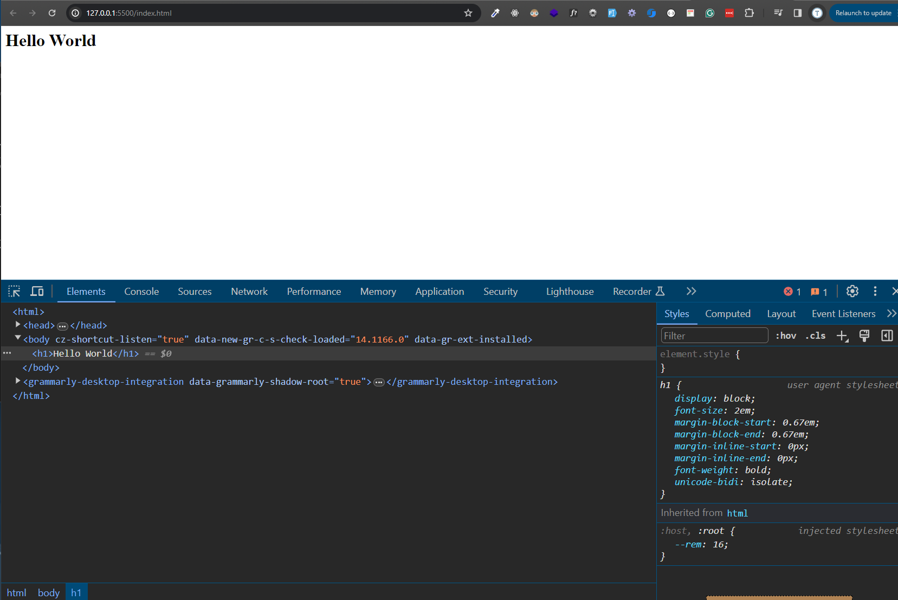

# Page Source & Dev Tools

In this lesson, we'll learn how to view the source code of a webpage and use the developer tools to inspect and modify the elements of a webpage.

## Viewing Page Source

Every webpage you visit on the internet has an underlying source code that defines its structure and content. You can view the source code of a webpage by right-clicking on the page and selecting "View Page Source" or "View Source" from the context menu. On Windows, you can also press `Ctrl+U` to view the page source and on Mac, you can press `Cmd+Option+U`.

This will show you all of the source HTML including the head, body and the tags, attributes, and content that make up the webpage. You can use this information to learn how websites are built and to see how different elements are structured.

If you are using Live Server, you are going to see some weird stuff in the source code. This is because Live Server injects some JavaScript code into the page to enable live reloading and other features. Don't worry about that. If you deploy your website to a server, you won't see that extra code.

## Using Developer Tools

Modern web browsers come with built-in developer tools that allow you to inspect and modify the elements of a webpage. You can access the developer tools by right-clicking on the page and selecting "Inspect" or by pressing `Ctrl+Shift+I` on Windows or `Cmd+Option+I` on Mac.

From here, you will see a bunch of tabs. This can be a little confusing at first, but the most important for this course is the "Elements" tab. This is where you can see all of the HTML and CSS for the page. You can hover over elements in the "Elements" tab to see how they are styled and where they are located in the source code. You can also click the "select" button in the top left corner of the "Elements" tab and then click on an element on the page to highlight it in the source code.

Not only can you inspect the HTML and CSS, but you can also modify them in real-time. You can change the text of an element, adjust the styling, or even add new elements to the page. This is a great way to experiment and learn how different changes affect the appearance and behavior of a webpage. Let's click on the select tool and click on the `<h1>` element and change the text to "Hello There!". You can see the change reflected on the page in real-time. Obviously, this is just a temporary change on your local machine only and will revert when you refresh the page. Imagine what the Internet would look like if anyone could change any website!

So we will use the devtools throughout the course and I would suggest you get comfortable with them.
