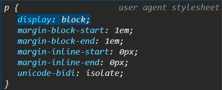

# Block-Level vs Inline Elements

I briefly mentioned block-level and inline elements in a previous lesson. Let's dive deeper into the differences between these two types of elements.

## Block-Level Elements

Block-level elements are elements that take up the full width available to them. They start on a new line and stretch out as far as they can. Block-level elements can contain other block-level elements as well as inline elements. They can also have margin and padding applied to them, which we will get into later.

Here are some examples of block-level elements:

- `<div>`
- `<p>`
- `<h1>` to `<h6>`
- `<ul>`
- `<ol>`
- `<li>`
- `<table>`
- `<form>`
- `<header>`
- `<footer>`
- `<section>`
- `<nav>`
- `<article>`
- `<aside>`
- `<main>`
- `<blockquote>`
- `<hr>`
- `<pre>`

## Inline Elements

Inline elements, on the other hand, only take up as much width as necessary. They do not start on a new line and only take up as much space as their content. Inline elements cannot contain block-level elements, but they can contain other inline elements. They also can not have margins or padding applied to them.

Here are some examples of inline elements:

- `<span>`
- `<a>`
- `<strong>`
- `<em>`
- ``
- `<input>`
- `<button>`
- `<label>`
- `<small>`

I know we have not gone over any CSS yet, but I am going to add a background color to the `<p>` and `<a>` tags so that you can see the difference. Add the following to the `<head>` section of the `index.html` file:

```html
<style>
  p {
    background-color: #aaa;
    padding: 1rem;
    margin-bottom: 1rem;
  }

  a {
    background-color: #eee;
    padding: 0.5rem;
    margin-right: 0.5rem;
  }
</style>
```

Now let's put two paragraphs and two anchor tags in the `body` section of the `index.html` file:

```html
<!-- Block level element -->
<p>Lorem ipsum dolor sit amet.</p>
<p>Lorem ipsum dolor sit amet.</p>

<!-- Inline element -->
<a href="#">Link 1</a>
<a href="#">Link 2</a>
```


As you can see both paragraphs are on their own line and take up the full width of the container. The anchor tags are on the same line and only take up as much space as their content.

If you look at the default styling with the developer tools in your browser, you will see that the `<p>` tags have a `display: block` property, while the `<a>` tags have a `display: inline` property.



Understanding the difference between block-level and inline elements is important when structuring your HTML and styling your website with CSS.
