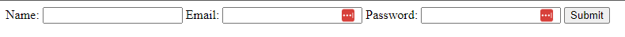

# Text Based Inputs

In HTML, text inputs are used to collect single-line text data from users. They are commonly used for things like usernames, passwords, and email addresses. Text inputs are created using the `<input>` tag with the `type` attribute set to `text`. There are other text-like input types as well, such as `password`, `email`, and `number`. If you need to collect longer text, you can use a `<textarea>` input. We also have `<label>` tags to provide a description for each input field.

Let's create a simple form with text inputs for a user's name, email, and password:

```html
<form>
  <label for="name">Name:</label>
  <input type="text" />

  <label for="email">Email:</label>
  <input type="email" />

  <label for="password">Password:</label>
  <input type="password" />

  <button type="submit">Submit</button>
</form>
```

Without any styling, this form is pretty ugly:



`<input>` elements are inline by default, so they appear next to each other. We will later use CSS to style the form and make it look more visually appealing. You could use line breaks (`<br>`) to separate the input fields, but it's better to use CSS for layout purposes.

The `<text>` input type is the default type for `<input>` elements, so you don't need to specify it explicitly. However, it's a good practice to be explicit about the type of input you are expecting from the user.

The `type="email"` input type is used to ensure that the user enters a valid email address. When the user submits the form, the browser will validate the email address and show an error message if it's not in the correct format.

The `type="password"` input type is used to hide the text the user enters. This is commonly used for password fields to keep the password secure.

The `<label>` elements are used to provide a description for each input field. The `for` attribute of the `<label>` should match the `id` attribute of the corresponding `<input>` element. This helps screen readers and other assistive technologies associate the label with the input field.

If we add the `id` attribute to each `<input>` element and update the `<label>` elements to reference the correct `id`, the form will be more accessible:

```html
<form>
  <label for="name">Name:</label>
  <input type="text" id="name" />

  <label for="email">Email:</label>
  <input type="email" id="email" />

  <label for="password">Password:</label>
  <input type="password" id="password" />

  <button type="submit">Submit</button>
</form>
```

Now, if we click on the label, the corresponding input field will be focused. This makes it easier for users to interact with the form.

The button has a `type="submit"` attribute, which tells the browser that it should submit the form when the button is clicked. An alternative is to use an `<input>` element with `type="submit"` instead of a `<button>` element:

```html
<input type="submit" value="Submit" />
```

We can also add a reset button to clear the form:

```html
<button type="reset">Reset</button>
```

Now when you click the "Reset" button, all the input fields will be cleared.

If we submit the form with no action, it will submit to the current page and if we don't add a method, it will default to `GET`. Learning about HTTP methods is a bit beyond this course, but just know that when we submit with a `GET` method, the form data will be appended to the URL. This is not secure for sensitive data like passwords. For that, you would use the `POST` method.
