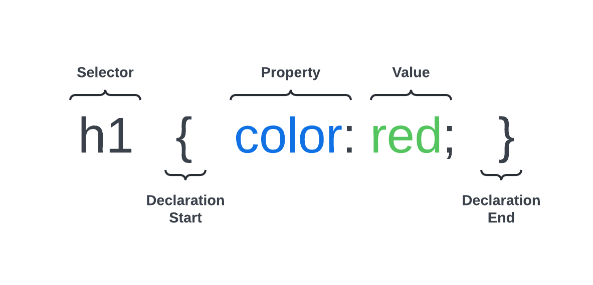

# CSS Syntax

Now that we know how to implement CSS in our HTML, let's dive into the syntax of CSS.

There are three main parts to a CSS rule:

1. **Selector**: This is the HTML element you want to style. You can select elements by their tag name, class, or ID. For example, to select all `<h1>` elements, you would use `h1` just like we did here. We'll get more into selectors in the next lesson but you can use classes, IDs, and tags to select elements.

2. **Property**: This is the attribute of the HTML element you want to style. For example, `color` is a property that changes the text color of an element. We'll cover tons of properties throughout this course.

3. **Value**: This is the value you want to set the property to. For example, `red` is a value you can set the `color` property to. You can also use hex codes, RGB, RGBA, and HSL values.

In the next lesson, we'll look at some different selectors.
