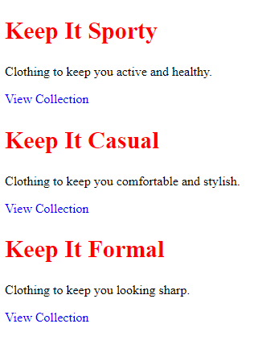
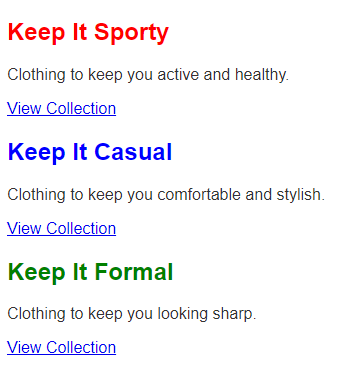
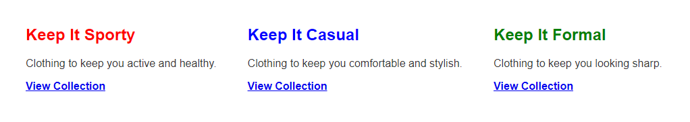

# Basic Selectors

Now that we know how to implement CSS in our HTML, let's dive into the syntax of CSS.


There are three main parts to a CSS rule:

1. **Selector**: This is the HTML element you want to style. You can select elements by their tag name, class, or ID. For example, to select all `<h1>` elements, you would use `h1` just like we did here. We'll get more into selectors in the next lesson but you can use classes, IDs, and tags to select elements.

2. **Property**: This is the attribute of the HTML element you want to style. For example, `color` is a property that changes the text color of an element. We'll cover tons of properties throughout this course.

3. **Value**: This is the value you want to set the property to. For example, `red` is a value you can set the `color` property to. You can also use hex codes, RGB, RGBA, and HSL values.

In the next lesson, we'll look at some different selectors.


When you want to style an element, there are all kinds of ways to target it. You can target elements based on their type, class, ID, or even their relationship to other elements. These are known as selectors in CSS. In this lesson, we'll cover the basic selectors you'll use most often.

Here is the HTML for this lesson:

```html
<div>
  <div>
    <h2>Keep It Sporty</h2>
    <p>Clothing to keep you active and healthy.</p>
    <a href="#">View Collection</a>
  </div>

  <div>
    <h2>Keep It Casual</h2>
    <p>Clothing to keep you comfortable and stylish.</p>
    <a href="#">View Collection</a>
  </div>

  <div>
    <h2>Keep It Formal</h2>
    <p>Clothing to keep you looking sharp.</p>
    <a href="#">View Collection</a>
  </div>
</div>
```

## Type Selector

The type selector targets elements based on their type. For example, if you want to style all of the `h2` and `a` elements on your page, you would use the `h2` and `a` selectors. Here's an example:

```css
h2 {
  color: red;
  font-size: 30px;
}

a {
  color: blue;
  text-decoration: none;
}
```



This is the result of the CSS above. The `h2` elements are red and have a font size of 30px. The `a` elements are blue and have no underline. We will go more into these properties soon.

## Class Selector

The class selector targets elements based on their assigned class. You can add a class to an element by using the `class` attribute. Here's an example:

```html
<div>
  <div>
    <h2 class="sporty">Keep It Sporty</h2>
    <p>Clothing to keep you active and healthy.</p>
    <a href="#">View Collection</a>
  </div>

  <div>
    <h2 class="casual">Keep It Casual</h2>
    <p>Clothing to keep you comfortable and stylish.</p>
    <a href="#">View Collection</a>
  </div>

  <div>
    <h2 class="formal">Keep It Formal</h2>
    <p>Clothing to keep you looking sharp.</p>
    <a href="#">View Collection</a>
  </div>
</div>
```

```css
.sporty {
  color: red;
}

.casual {
  color: blue;
}

.formal {
  color: brown;
}
```



This is the result of the CSS above. The `h2` elements with the class of `sporty` are red, the `h2` elements with the class of `casual` are blue, and the `h2` elements with the class of `formal` are green.

You can also specify the element:

```css
h2.sporty {
  color: red;
}
```

This will only target `h2` elements with the class of `sporty`. So if you had a `p` element with the class of `sporty`, it would not be styled.

## ID Selector

The ID selector targets elements based on their ID attribute. Now, this comes down to preference, but I no longer use ID selectors. I prefer to use class selectors because they are more flexible. You can only use an ID once on a page, but you can use a class multiple times. I used to say if the style is unique, use an ID, and style with that, but I have changed my opinion on that over time. I also find most people use classes only including all of the frameworks and libraries I have used. Here's an example of an ID selector:

```html
<div id="container">
  <div>
    <h2 class="sporty">Keep It Sporty</h2>
    <p>Clothing to keep you active and healthy.</p>
    <a href="#">View Collection</a>
  </div>

  <div>
    <h2 class="casual">Keep It Casual</h2>
    <p>Clothing to keep you comfortable and stylish.</p>
    <a href="#">View Collection</a>
  </div>

  <div>
    <h2 class="formal">Keep It Formal</h2>
    <p>Clothing to keep you looking sharp.</p>
    <a href="#">View Collection</a>
  </div>
</div>
```

```css
#container {
  max-width: 600px;
  margin: 100px auto;
  padding: 0 20px;
}
```

Don't worry abut the actual styles yet, we'll cover everything soon. This is just an example of an ID selector.

In reality, I would make this a class selector, but I just want to show you how an ID selector works.

## HTML, Body Selectors

There are many times where you want to add some global styles. For instance, the color of the text and the font family. We usually put these properties on the body selector. You can also add styles to the html selector, which is the root of the webpage, but the body tag is more specific, meaning it will override html selector styles. Specificity is something that is very important in CSS and we'll get to that soon.

Let's add a font family of Arial on the body:

```css
body {
  font-family: 'Arial', sans-serif;
}
```

We will talk more about the font-family property later, but just know, we are setting it to arial and if arial is not available, it will default to any sans-serif font, which I'll also talk about soon.

This will be applied to all of the elements within the body because most elements inherit the font family. It is important to know that not all properties get inherited by the child elements. For instance, properties like background-color, border, and margin do not inherit from parent elements. Each element must explicitly define these properties unless a default value from the browser is applied. 


## Descendant Selectors

The descendant selector targets an element that is a descendant of another element. For example, if you want to style all `p` elements that are descendants of a `div` element, you would use the `div p` selector. Here's an example:

```css
div p {
  color: #333;
}
```

If you only wanted to target `p` elements that are descendants of the `.container` element:

```css
.container p {
  color: #333;
}
```

This goes for A LOT of things in CSS. Everyone has their own opinions and preferences. I have seen a trend lately where people are not using descendant selectors at all. They are using classes for everything. I think Tailwind CSS, which is a CSS framework has a lot to to with this style. The advantage to not using descendant selectors is that you can move things around in your HTML without breaking your CSS and you have less issues with specificity. I will talk more about this later. Just know that in most cases, there are a bunch of ways to do the same thing in CSS. Half of the people will say one way is better and the other half will say the other way is better. It's all about what works best for you.

I prefer to use descendant selectors when I need to target a specific element that is a descendant of another element. I think it makes the CSS easier to read. We also have a new feature in CSS called **nesting** that allows you to nest selectors in your CSS. I will talk more about this later as well.

## Multiple Selectors

You can also target multiple elements at once by using a comma. For example, if you want to style all `h2` and `a` elements on your page, you would use the `h2, a` selector. Here's an example:

```css
h2,
a {
  font-weight: bold;
}
```



This is the result of the CSS above. The `h2` and `a` elements are bold.

There are all kinds of other ways to target elements, but these are the basic selectors you'll use most often. We'll cover more advanced selectors in future lessons.

