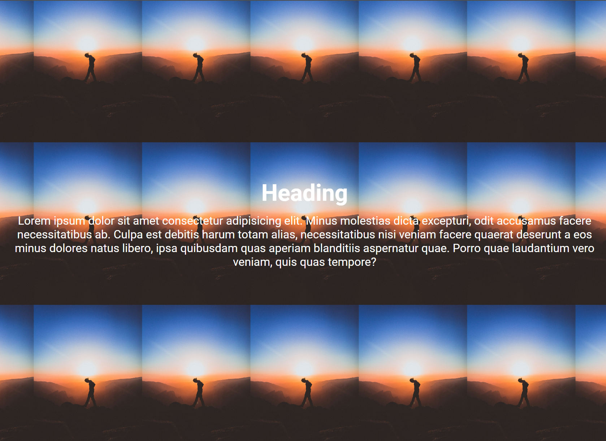

# Backgrounds

There are a few properties in CSS that allow you to style the background of an element. These properties can be used to add color, images, and other effects to the background of an element.

## Background Color

The `background-color` property is used to set the background color of an element. You can specify a color using a color name, a hex code, an RGB value, or an HSL value.

We already saw an example of this. Here's how you can set the background color of the `body` element to light blue:

```css
body {
  background-color: lightblue;
}
```

In this example, we are setting the background color of the `body` element to light blue. You can use any color you like.

## Background Image

The `background-image` property is used to set a background image for an element. You can specify an image path or URL, and the browser will display the image as the background of the element.

Let's use the following HTML:

```html
<div class="hero">
  <h1>Welcome</h1>
  <p>
    Lorem ipsum dolor sit amet consectetur adipisicing elit. Minus molestias
    dicta excepturi, odit accusamus facere necessitatibus ab. Culpa est debitis
    harum totam alias, necessitatibus nisi veniam facere quaerat deserunt a eos
    minus dolores natus libero, ipsa quibusdam quas aperiam blanditiis
    aspernatur quae. Porro quae laudantium vero veniam, quis quas tempore?
  </p>
</div>
```

I am going to give you some pre-written CSS to style this HTML. Don't worry about this for now, we will cover this in a later lesson. I just want to focus on the background image property for now:

```css
body {
  font-family: Arial, sans-serif;
  margin: 0;
}

.hero {
  height: 100vh;
  display: flex;
  flex-direction: column;
  justify-content: center;
  align-items: center;
  padding: 0 20px;
}

.hero h1 {
  color: white;
  font-size: 40px;
  margin-bottom: 20px;
}

.hero p {
  color: white;
  text-align: center;
  font-size: 2rem;
}
```

Let's add a background image to the `.hero` class:

```css
.hero {
  background-image: url('./hero.jpg');
  /* ...Rest of the styles */
}
```

You should have the `hero.jpg` image in the same directory as your CSS file. If you don't have an image, you can use any image you like.

You can also use a URL to an image on the web. Just replace the path with the URL of the image you want to use.

```css
background-image: url('https://images.unsplash.com/photo-1506748686214-e9df14d4d9d0');
```

Open the HTML file in your browser, and you should see the background image displayed behind the text. However, the image is going to be really big and you will probably only see the blue sky or part of whatever image you used.


We will get to that soon. First, let's cover the `background-repeat` property.

## Background Repeat

The `background-repeat` property is used to specify how a background image should be repeated. By default, the background image will repeat both horizontally and vertically. You can not tell with this image because it is so big, but if you use a smaller image you will see the repetition. You really only repeat images that are small and can be tiled. I think it is silly that this is the default, but it is what it is.

So we want to set the background image to not repeat. Let's set the `background-repeat` property of the `.hero` class to `no-repeat`:

```css
.hero {
  background-image: url('./hero.jpg');
  background-repeat: no-repeat;
  /* ...Rest of the styles */
}
```

## Background Size

The `background-size` property is used to specify the size of the background image. You can set the size of the image using a keyword, a percentage, or a length value. A common value to use is `cover`, which will make the image cover the entire element.

Let's set the background size of the `.hero` class to `cover`:

```css
.hero {
  background-image: url('./hero.jpg');
  background-repeat: no-repeat;
  background-size: cover;
  /* ...Rest of the styles */
}
```


Now the background image should cover the entire `.hero` element, however it still is not positioned correctly. This is where the `background-position` property comes in.

Just to see the repeat effect, change the `background-repeat` property to `repeat` and the `background-size` property to `300px`:

```css
.hero {
  background-image: url('./hero.jpg');
  background-repeat: repeat;
  background-size: 300px;
  /* ...Rest of the styles */
}
```



Now put it back to `no-repeat` and `cover`.

## Background Position

The `background-position` property is used to specify the position of the background image. You can set the position using keywords, percentages, or length values.

Let's set the background position of the `.hero` class to `center`:

```css
.hero {
  background-image: url('./hero.jpg');
  background-repeat: no-repeat;
  background-size: cover;
  background-position: center;
  /* ...Rest of the styles */
}
```


Now the image is centered.

One thing you probably notice is that the readability of the text is not great. Later I will show you how to add an overlay to the background image to make the text more readable.

## Background Shorthand

You can also use the `background` shorthand property to set all the background properties at once. The `background` property can take multiple values, including the background color, image, repeat, size, and position.

Here's an example of how you can use the `background` shorthand property to set the background of the `.hero` class:

```css
.hero {
  background: url('./hero.jpg') no-repeat center/cover;
  /* ...Rest of the styles */
}
```

You can also set a background color and image at the same time:

```css
.hero {
  background: lightblue url('./hero.jpg') no-repeat center/cover;
  /* ...Rest of the styles */
}
```

## Background Attachment

The `background-attachment` property is used to specify whether the background image should scroll with the content or remain fixed in place. By default, the background image will scroll with the content.

Let's set the background attachment of the `.hero` class to `fixed`:

```css
.hero {
  background: url('./hero.jpg') no-repeat center/cover;
  background-attachment: fixed;
  /* ...Rest of the styles */
}
```

We see no difference because there is not enough content to scroll. If you add more content, you will see the background image stay in place while the content scrolls.

## Background Gradient

You can also create a gradient background using the `linear-gradient()` function. The `linear-gradient()` function takes two or more color values and creates a gradient between them.

Here's an example of how you can create a gradient background:

```css
.hero {
  background: linear-gradient(to bottom, lightblue, darkblue);
}
```

In this example, we are creating a gradient background that goes from light blue to dark blue from top to bottom.

You can also create a gradient background that goes from left to right:

```css
.hero {
  background: linear-gradient(to right, lightblue, darkblue);
}
```

You can also create a gradient background that goes from one corner to another:

```css
.hero {
  background: linear-gradient(to bottom right, lightblue, darkblue);
}
```

You can also specify the percentage of the gradient:

```css
.hero {
  background: linear-gradient(to bottom right, lightblue 10%, darkblue 90%);
}
```

This will create a gradient that is 10% light blue and 90% dark blue.
