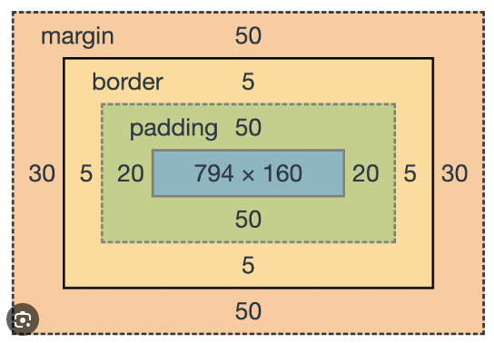

# What Is The Box Model

The box model is a fundamental concept in CSS that defines the design and layout of elements on a webpage. Every element on a webpage is a rectangular box, and the box model describes how the content, padding, border, and margin of the box are rendered.

If you go to any webpage and inspect an element using the browser's developer tools and click on `Computed` over where the CSS is, you will see a visual representation of the box model. The box model consists of four parts:

1. **Content**: The content of the box, where text and images are displayed.

2. **Padding**: The space between the content and the border. Padding is used to create space around the content.

3. **Border**: The border of the box, which separates the content from the padding and margin.

4. **Margin**: The space outside the border. Margin is used to create space between elements.

The box model is important because it allows you to control the layout and spacing of elements on a webpage. By setting the padding, border, and margin of an element, you can create the desired spacing and layout for your webpage.

## Box Model Properties

There are several CSS properties that allow you to control the box model of an element:

1. **`width` and `height`**: The `width` and `height` properties set the width and height of the content box. By default, the `width` and `height` properties only apply to the content box, but you can change this behavior using the `box-sizing` property.

2. **`padding`**: The `padding` property sets the padding around the content box. You can set the padding for all four sides of the box or individually for each side.

3. **`border`**: The `border` property sets the border of the box. You can set the border width, style, and color using the `border-width`, `border-style`, and `border-color` properties.

4. **`margin`**: The `margin` property sets the margin around the box. You can set the margin for all four sides of the box or individually for each side.

5. **`box-sizing`**: The `box-sizing` property controls how the `width` and `height` properties are applied to the box model. By default, the `width` and `height` properties only apply to the content box, but you can change this behavior to include the padding and border in the total width and height of the box. I always do this for every element because it makes more sense to me to include the padding and border in the total width and height of the box. Otherwise you have to do math to figure out the total width and height of the box with maths and stuff.

Many elements have default padding, border, and margin values set by the browser. I like to use something called a CSS reset to remove these default values and start with a clean slate. We'll get to that soon. In the next lesson, we will look at sizing.
