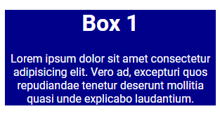
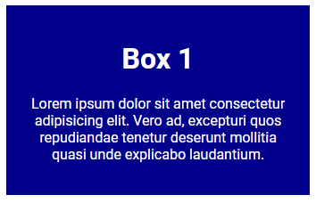
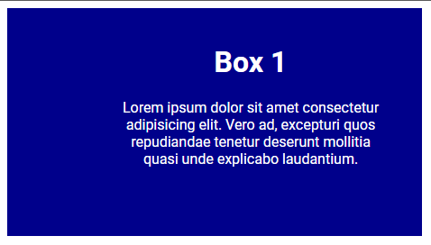
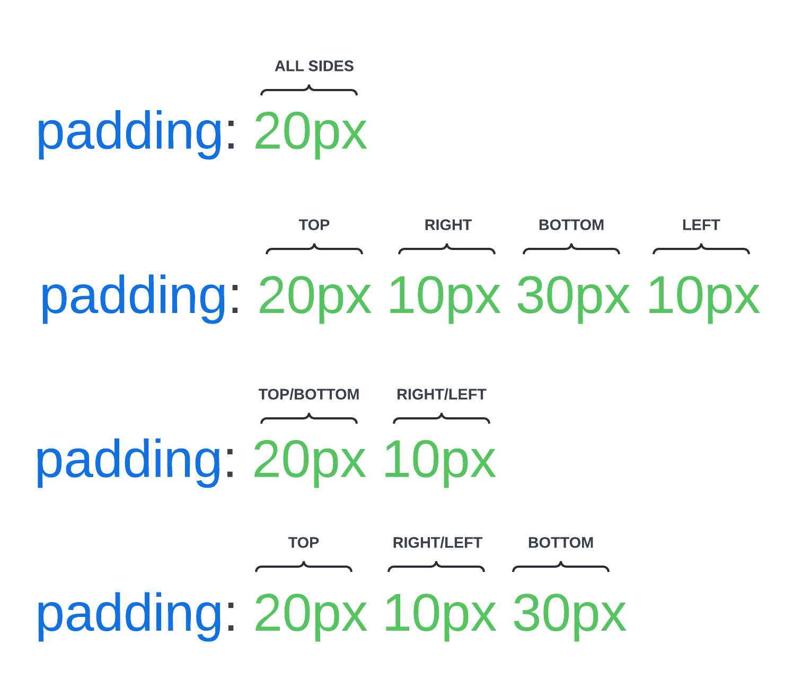

# Padding

We talked about the content part of the box model in the previous lesson. Now, let's talk about the padding. Some people get confused about margin and padding. The padding is the space between the content and the border of the box. It is the inner space of the box. Margin is the outer space of the box.

Let's use the following HTML code:

```html
<div class="box">
  <h2>Box 1</h2>
  <p>
    Lorem ipsum dolor sit amet consectetur adipisicing elit. Vero ad, excepturi
    quos repudiandae tenetur deserunt mollitia quasi unde explicabo laudantium.
  </p>
</div>
```

Here is the starting CSS:

```css
body {
  font-family: 'Poppins', sans-serif;
}

.box {
  background-color: darkblue;
  color: white;
  text-align: center;
  width: 300px;
}
```

It looks like this:



There is no space between the content and the border. Let's add some padding:

```css
.box {
  /* ...Other styles */
  padding: 20px;
}
```

Now, it looks like this:



See how the spacing is on the inside? That is the padding. You can add padding to all sides or just one side. You can also use percentages, pixels, or ems. You can also use the `padding-top`, `padding-right`, `padding-bottom`, and `padding-left` properties to add padding to specific sides.

```css
.box {
  /* ...Other styles */
  padding-top: 20px;
  padding-right: 40px;
  padding-bottom: 60px;
  padding-left: 120px;
}
```



This will add padding to the top, right, bottom, and left sides respectively.

## Padding Shorthand

You can also use the `padding` property as a shorthand.

Here is a cheat sheet for the order of the padding values:



To give us the same result as the previous example, you can use the following shorthand:

```css
.box {
  /* ...Other styles */
  padding: 20px 40px 60px 120px;
}
```

#### T-R-B-L

It can be difficult to remember the order of the padding values. You can use the `T-R-B-L` method (think of it as "trouble") to remember the order. `TRBL` stands for `top`, `right`, `bottom`, and `left`. You can use this order to remember the order of the padding values.

If you have the same padding on the top and bottom and the same padding on the right and left, you can use the following shorthand:

```css
.box {
  /* ...Other styles */
  padding: 20px 40px;
}
```

This will give you 20px of padding on the top and bottom and 40px of padding on the right and left.

Let's say that you want to different padding on the top and bottom but the same on the right and left. You can use the following shorthand:

```css
.box {
  /* ...Other styles */
  padding: 20px 40px 60px;
}
```

This will give you 20px of padding on the top, 40px of padding on the right and left, and 60px of padding on the bottom.

Now that you know how to add padding to your boxes, let's move on to the next lesson and talk about margins.
