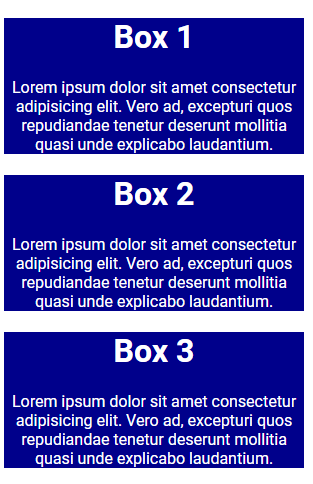
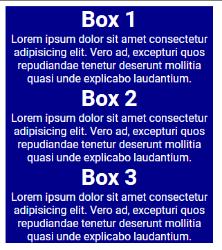
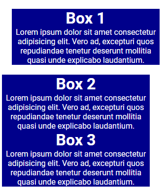
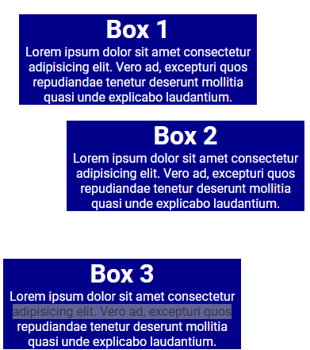
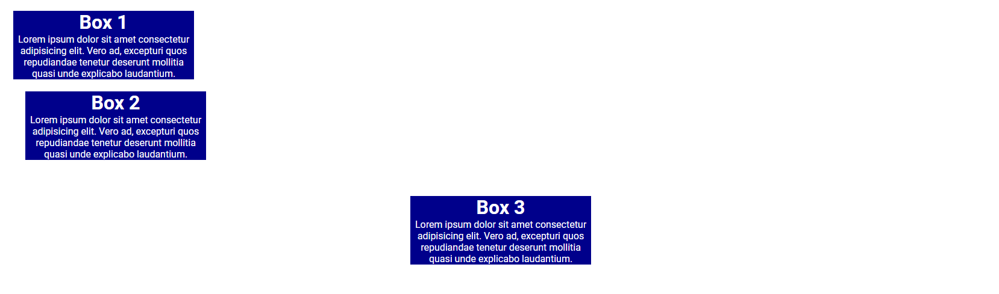

# Margin

We looked at padding in the previous lesson, which is spacing on the inside of an element. Now, let's talk about margin, which is spacing on the outside of an element.

Let's use the following HTML code:

```html
 <div class="box box-1">
  <h3>Box 1</h3>
  <p>
    Lorem ipsum dolor sit amet consectetur adipisicing elit. Tempora,
    architecto!
  </p>
</div>
<div class="box box-2">
  <h3>Box 2</h3>
  <p>
    Similique vero aliquid animi corrupti, itaque doloremque iusto eligendi
    voluptatum.
  </p>
</div>
<div class="box box-3">
  <h3>Box 3</h3>
  <p>
    Iste recusandae cum reprehenderit maxime laborum obcaecati quisquam
    dolorem minima.
  </p>
</div>
```

and the following CSS:

```css
body {
  font-family: 'Poppins', sans-serif;
}

.box {
  background-color: darkblue;
  color: white;
  text-align: center;
  width: 300px;
}
```

It should look like this:



Now this can be a bit confusing because there is already spacing between the boxes. This is the margin. This is the default margin applied to the `h3` and `p` tags. You can use the devtools to see the margin applied to the elements.

Let's remove the margin from the `h3` and `p` tags:

```css
h3,
p {
  margin: 0;
}
```

Now it looks like this:



I always reset the margin and padding on all elements at the beginning of my CSS file. I will talk about that in the next lesson.

Let's add some margin to the first box:

```css
.box-1 {
  margin: 20px;
}
```

This added 20px of margin to all sides of the box. It looks like this:



We have the same options for margin as we do for padding. We can use `margin-top`, `margin-right`, `margin-bottom`, and `margin-left` to add margin to specific sides.

We can also use the `margin` property to add margin to all sides at once.

```css
.box-2 {
  margin-top: 20px;
  margin-right: 40px;
  margin-bottom: 60px;
  margin-left: 80px;
}
```



#### T-R-B-L

We can use the "TRBL" method here as well.

```css
.box-2 {
  /* TRBL */
  margin: 20px 40px 60px 80px;
}
```

This will give you the same result.

For vertical and horizontal margins, you can use the following:

```css
.box-2 {
  /* Vertical and horizontal */
  margin: 20px 40px;
}
```

## Auto Margin

You can use the `auto` value for the `margin` property to center an element horizontally within its parent element/container. In this case, the container is the `body` element(the entire page)

```css
.box-3 {
  margin: 0 auto;
}
```

This will center the box horizontally within the body element. It will look like this:



You will use this a lot to center your web page content, usually in a class called `container` or `wrapper`.

## Negative Margin

You can also use negative margin to move an element outside of its container. This is not recommended, but it can be useful in some situations.

```css
.box-3 {
  margin-top: -100px;
}
```

This will move the box up 100px. Negative margins are useful when you want to overlap elements.
