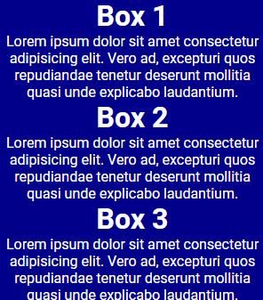
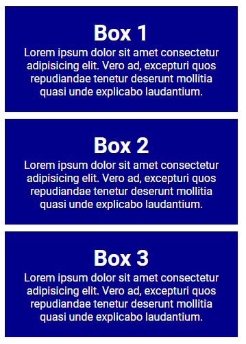
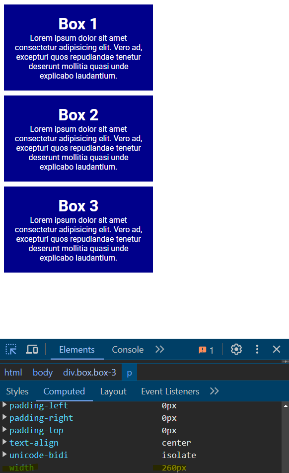

# Universal Selector & Reset

We are now going to talk about a selector called the universal selector as well as a property called `box-sizing` and resetting style. These are two things that I always include in my projects to make sure that everything looks the same across all browsers and devices.

## Reset Margin & Padding

Certain browsers have default styles for elements. For example, Chrome has a default margin on the `body` element. If you don't reset the margin and padding on all elements, you may see differences in how your website looks across different browsers.

Let's start with the following HTML:

```html
 <div class="box box-1">
  <h3>Box 1</h3>
  <p>
    Lorem ipsum dolor sit amet consectetur adipisicing elit. Tempora,
    architecto!
  </p>
</div>
<div class="box box-2">
  <h3>Box 2</h3>
  <p>
    Similique vero aliquid animi corrupti, itaque doloremque iusto eligendi
    voluptatum.
  </p>
</div>
<div class="box box-3">
  <h3>Box 3</h3>
  <p>
    Iste recusandae cum reprehenderit maxime laborum obcaecati quisquam
    dolorem minima.
  </p>
</div>
```

And the base CSS:

```css
body {
  font-family: 'Poppins', sans-serif;
}

.box {
  background-color: darkblue;
  color: white;
  text-align: center;
  width: 300px;
}
```

I want to remove the default margin on the `h1` and `p` tags AND every other element. I do this by adding the following CSS at the beginning of my CSS file:

```css
* {
  margin: 0;
  padding: 0;
}
```

The `*` is the universal selector, which I briefly talked about a few sections ago. It selects all elements on the page. The CSS above will remove the default margin and padding on all elements. This is called a reset.

Now, the boxes look like this:



So in almost all projects from here on out, we will be including a reset. So you know margin and padding is 0 for everything when you start.

Let's manually add some margin and padding to the boxes:

```css
.box {
  /* ...Other styles */
  margin: 10px;
  padding: 20px;
}
```

Now it looks like this:



## Box Sizing

The `box-sizing` property is used to tell the browser how to calculate the total width and height of an element.

The `box-sizing` property can have one of the following values:

- `content-box`: This is the default value. The width and height properties are only applied to the content of the element. The padding, border, and margin are not included in the width and height of the element.
- `border-box`: The width and height properties are applied to the content, padding, and border of the element. The margin is not included in the width and height of the element.

The default is `content-box`, which means that the width and height properties are only applied to the content of the element. If you set the width of an element to `200px`, the padding, border, and margin will be added to the total width of the element.

I always set the `box-sizing` property to `border-box` for all elements in my projects. This ensures that the width and height properties are applied to the content, padding, and border of the element and you don't have to worry about the padding and border affecting the total width and height of the element.

So add the following to your reset:

```css
* {
  margin: 0;
  padding: 0;
  box-sizing: border-box;
}
```

The box will shrink a little bit because now it is 300px wide including that 20px of padding.

If you use the devtools and inspect the content of the box, you will see that the width is 260px because the padding is included in the width of the box. 260px (content) + 20px (padding) + 20px (padding) = 300px.


