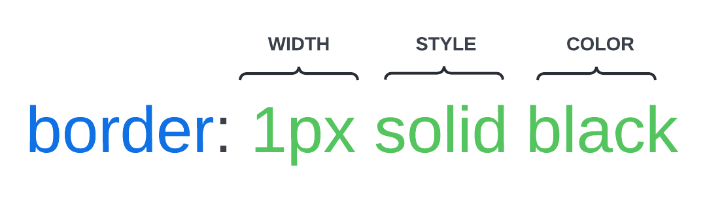

# Border

Remember, there are basically 4 parts to the box model: content, padding, border, and margin. We've already covered content, margin and padding, so let's move on to the border.

Let's use the following HTML:

```html
<div class="box box-1">
  <h3>Box 1</h3>
  <p>
    Lorem ipsum dolor sit amet consectetur adipisicing elit. Vero ad, excepturi
    quos repudiandae tenetur deserunt mollitia quasi unde explicabo laudantium.
  </p>
</div>
<div class="box box-2">
  <h3>Box 2</h3>
  <p>
    Lorem ipsum dolor sit amet consectetur adipisicing elit. Vero ad, excepturi
    quos repudiandae tenetur deserunt mollitia quasi unde explicabo laudantium.
  </p>
</div>
<div class="box box-3">
  <h3>Box 3</h3>
  <p>
    Lorem ipsum dolor sit amet consectetur adipisicing elit. Vero ad, excepturi
    quos repudiandae tenetur deserunt mollitia quasi unde explicabo laudantium.
  </p>
</div>
```

and the following CSS:

```css
* {
  margin: 0;
  padding: 0;
  box-sizing: border-box;
}

body {
  font-family: 'Poppins', sans-serif;
}

.box {
  text-align: center;
  width: 300px;
  margin: 10px;
  padding: 20px;
}
```

Let's add a black border to the boxes:

```css
.box {
  text-align: center;
  width: 300px;
  margin: 10px;
  padding: 20px;
  border: 1px solid black;
}
```

The value order for the `border` property is the following:



## Border Width

You can set the width of the border using the `border-width` property:

```css
.box-1 {
  border-width: 3px;
}
```

This will set the border width to 3 pixels for the first box:

## Border Style

You can set the style of the border using the `border-style` property:

```css
.box-2 {
  border-style: dashed;
}
```

This will set the border style to dashed for the second box:

## Border Color

You can set the color of the border using the `border-color` property:

```css
.box-3 {
  border-color: red;
}
```

So this CSS:

```css
border: 1px solid black;
```

is the same as:

```css
border-width: 1px;
border-style: solid;
border-color: black;
```

## Top Border

You can set the top border using the `border-top` property:

```css
.box-1 {
  /* ...Other styles */
  border-top: 3px solid blue;
}
```

## Right Border

You can set the right border using the `border-right` property:

```css
.box-2 {
  /* ...Other styles */
  border-right: 3px solid green;
}
```

## Bottom Border

You can set the bottom border using the `border-bottom` property:

```css
.box-3 {
  /* ...Other styles */
  border-bottom: 3px solid yellow;
}
```

## Left Border

You can set the left border using the `border-left` property:

```css
.box-1 {
  /* ...Other styles */
  border-left: 3px dotted purple;
}
```

## Border Radius

You can set the border radius using the `border-radius` property:

```css
.box-2 {
  /* ...Other styles */
  border-radius: 10px;
}
```

This will set the border radius to 10 pixels for the second box.

We can also use percentages:

```css
.box-3 {
  /* ...Other styles */
  border-radius: 50%;
}
```

This will make the element a circle or oval, depending on the width and height of the element and content.

## Specific Corners

You can set the border radius for specific corners using the following properties:

- `border-top-left-radius`
- `border-top-right-radius`
- `border-bottom-right-radius`
- `border-bottom-left-radius`

```css
.box-2 {
  /* ...Other styles */
  border-top-left-radius: 10px;
  border-top-right-radius: 20px;
  border-bottom-right-radius: 30px;
  border-bottom-left-radius: 40px;
}
```

This will set the border radius for each corner of the second box.

So that concludes the box model layers. Next, we'll look at the `display` property.
