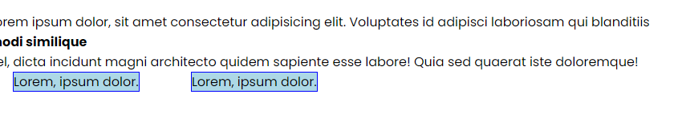
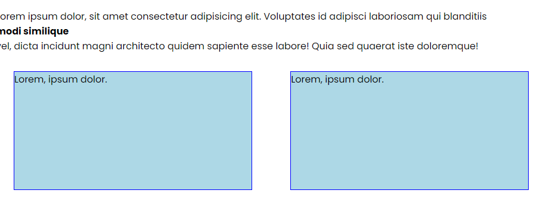

# Display Property

The display property specifies the display behavior (the type of rendering box) of an element.

The display property is the most important CSS property for controlling layout. Every element has a default display value depending on what type of element it is. The default value for most elements is usually block or inline. We talked about the difference between block and inline elements in the previous lesson. A block element takes up the full width available, and has a line break before and after it. An inline element only takes up as much width as necessary, and does not force line breaks.

We can change the display value of an element by using the display property. There are a lot of values that the display property can take. In fact, this is how you initialize a flexbox container or a grid container. We will talk about flexbox and grid soon. For now, let's look at `none`, `block`, `inline`, and `inline-block`.

Let's use the following HTML:

```html
<h2 class="none-element">Set me to display: none</h2>
<h2 class="hidden-element">Set me to visibility: hidden</h2>
<p>
  Lorem ipsum dolor, sit amet consectetur adipisicing elit. Voluptates id
  adipisci laboriosam qui blanditiis
  <span class="block-element">modi similique</span> vel, dicta incidunt magni
  architecto quidem sapiente esse labore! Quia sed quaerat iste doloremque!
</p>
<p class="inline-element">Lorem, ipsum dolor.</p>
<p class="inline-element">Lorem, ipsum dolor.</p>
```

## Display: none

The `display: none` property is used to completely hide an element. The page will act as if the element is not there. It will not take up any space on the page. This is different
from `visibility: hidden`, which hides an element, but still takes up space on
the page. I'll show you that in a second.

Let's add the following CSS:

```css
.none-element {
  display: none;
}
```

If you go to the browser, you will see that the first `h2` element is not visible. It's as if it's not there.

## Visibility: hidden

The `visibility: hidden` property is used to hide an element, but it still takes up space on the page. Let's add the following CSS:

```css
.hidden-element {
  visibility: hidden;
}
```

If you go to the browser, you will see that the second `h2` element is not visible, but it still takes up space on the page.

If you change the class of the second `h2` element to `none-element`, it will not take up space on the page.

Most of the time, you will use `display: none` to hide an element. There are not many use cases for `visibility: hidden` in my own opinion.

## Display: block

The `display: block` property is used to make an element a block element. This means that the element will take up the full width available and will have a line break before and after it. Let's add the following CSS:

```css
.block-element {
  display: block;
  font-weight: bold;
}
```

So now the `span` element will take up the full width available and will have a line break before and after it. I made it bold so you can see it better.

## Display: inline

The `display: inline` property is used to make an element an inline element. This means that the element will only take up as much width as necessary and will not force line breaks. Let's add the following CSS:

```css
.inline-element {
  display: inline;
}
```

Now you can see that the 2 paragraphs, which are `block` elements, are on the same line. This is because the `p` elements are now `inline` elements.

## Inline Block

Height abd width properties are not applied to inline elements. In some situations, margin also will not be applied. Let's try setting a width, height and margin on the `inline` elements:

```css
.inline-element {
  display: inline;
  background: lightblue;
  border: blue 1px solid;
  width: 400px;
  height: 200px;
  margin: 30px;
}
```

You can see that the height and width properties are not applied to the `inline` elements. The margin is applied horizontally, but not vertically.



You may still want to have these elements inline but also want to apply height, width, and margin. In this case, you can use the `inline-block` value for the display property. Let's change the `inline` elements to `inline-block`:

```css
.inline-element {
  display: inline-block;
  background: lightblue;
  border: blue 1px solid;
  width: 400px;
  height: 200px;
  margin: 30px;
}
```

Now you can see that the height, width, and margin properties are applied to the `inline-block` elements.



Here are all of the possible values for the display property:

- `none`: The element is completely removed from the page.
- `block`: The element is displayed as a block element.
- `inline`: The element is displayed as an inline element.
- `inline-block`: The element is displayed as an inline-level block container. The element itself is formatted as an inline element, but you can apply height and width values to it.
- `flex`: The element is displayed as a block-level flex container.
- `grid`: The element is displayed as a block-level grid container.
- `table`: The element is displayed as a block-level table.
- `table-row`: The element is displayed as a block-level table row.
- `table-cell`: The element is displayed as a block-level table cell.
- `list-item`: The element is displayed as a list-item. The bullet points are added to the element.
- `inherit`: The element inherits the display value from its parent element.
- `initial`: The element uses the default display value for its type.
- `unset`: The element uses the default display value for its type, but it can be changed.

You can see that the display property is very powerful. It can be used to change the layout of an element in many ways. We will talk about flexbox and grid soon, which are two of the most powerful layout tools in CSS.
