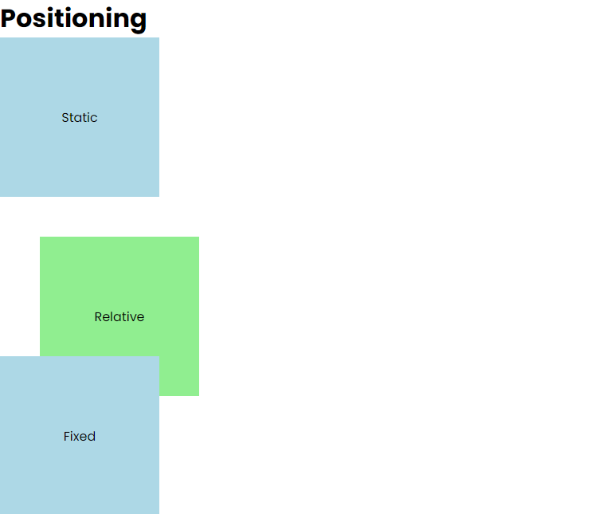
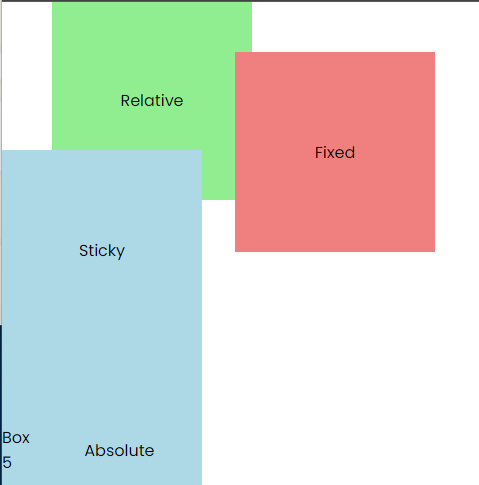
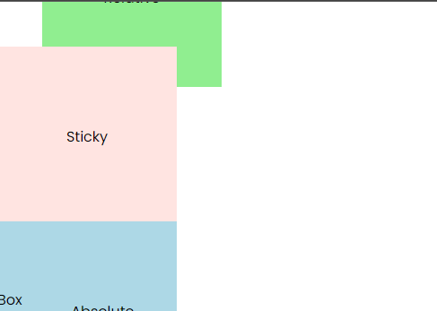
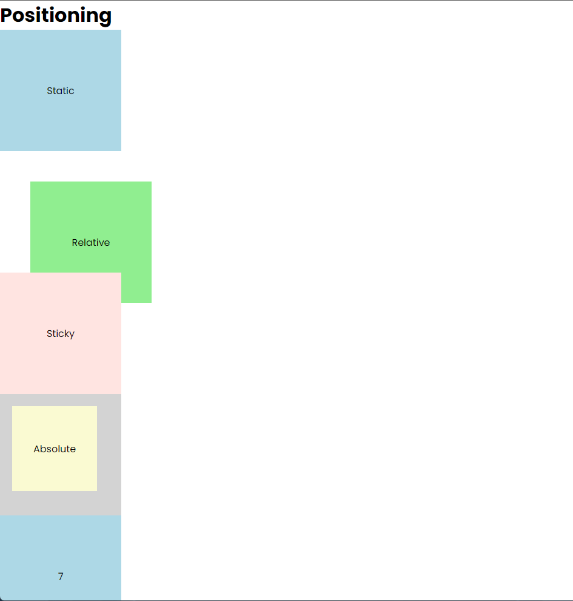

# Positioning

In this lesson, we will learn about the different ways to position elements on a webpage with the `position` property.

Let's use the following HTML:

```html
<header>
  <h1>Positioning</h1>
</header>
<section class="container">
  <div class="box box1">Static</div>
  <div class="box box2">Relative</div>
  <div class="box box3">Fixed</div>
  <div class="box box4">Sticky</div>
  <div class="box box5">
    Box 5
    <div class="box box6">Absolute</div>
  </div>
  <div class="box box7">7</div>
  <div class="box box8">8</div>
  <div class="box box9">9</div>
</section>
```

## Static Positioning

By default, all elements on a webpage are positioned statically. This means that the elements are displayed in the order they appear in the HTML document. It is just the natural flow of where things land. The `position` property is set to `static` by default but you could set it explicitly to `static` to override any other positioning.

```css
div {
  position: static;
}
```

## Relative Positioning

When an element is positioned relatively, it is positioned relative to its normal position. This means you can move the element up, down, left, or right from its normal position. The element will still occupy the same space as it would if it were statically positioned.

To do, this we can use the `position` property with the value of `relative` and then use the `top`, `right`, `bottom`, and `left` properties to move the element.

```css
.box2 {
  background: lightgreen;
  position: relative;
  top: 50px;
  left: 50px;
}
```

This will move the `.box2` element 50 pixels down and 50 pixels to the right from its normal position.



## Fixed Positioning

When an element is positioned fixed, it is positioned relative to the viewport. This means that the element will stay in the same position even when the page is scrolled. This is useful for creating elements like sticky headers or footers.

To do this, we can use the `position` property with the value of `fixed` and then use the `top`, `right`, `bottom`, and `left` properties to position the element.

```css
.box3 {
  background: lightcoral;
  position: fixed;
  top: 50px;
  right: 50px;
}
```



## Sticky Positioning

When an element is positioned sticky, it is positioned based on the user's scroll position. This means that the element will behave like a `relative` positioned element until it reaches a certain point and then it will behave like a `fixed` positioned element.

To do this, we can use the `position` property with the value of `sticky` and then use the `top`, `right`, `bottom`, and `left` properties to position the element.

```css
.box4 {
  background: lightblue;
  position: sticky;
  top: 50px;
}
```

Make the browser window smaller vertically and scroll down to see the `.box4` element stick to the top of the viewport.



Notice that it goes behind the other elements when you scroll down. We can control this with the `z-index` property. I will cover this in a minute.

## Absolute Positioning

When an element is positioned absolutely, it is positioned relative to the nearest positioned ancestor. If there is no positioned ancestor, it is positioned relative to the initial containing block (the viewport).

Since the `.box6` element is a child of the `.box5` element, it will be positioned relative to the `.box5` element.

Let's make the `.box5` element positioned relative and the `.box6` element positioned absolutely.

```css
.box5 {
  background: lightgray;
  position: relative;
}

.box6 {
  background: lightgoldenrodyellow;
  position: absolute;
  width: 140px;
  height: 140px;
  top: 20px;
  left: 20px;
}
```

Now the `.box6` element is positioned 20 pixels down and 20 pixels to the right from the `.box5` element.



## Z-Index

The `z-index` property specifies the stack order of an element. An element with a higher `z-index` value will be displayed on top of an element with a lower `z-index` value.

Let's make the `.box4` element have a higher `z-index` value than the `.box5` element.

The default value of `z-index` is `auto`. The `z-index` property only works on positioned elements (position: absolute, position: relative, position: fixed, or position: sticky). We can set it to a number to specify the stack order of the element.

```css
.box4 {
  background: lightblue;
  position: sticky;
  top: 50px;
  z-index: 1;
}
```

Now when we scroll down, the `.box4` element will be displayed on top of the `.box5` element.

We can also use negative values for the `z-index` property. Let's say we want the `.box5` element to be displayed on top of the `.box6` element. We could make the `.box6` element have a negative `z-index` value.

```css
.box6 {
  background: lightgoldenrodyellow;
  position: absolute;
  width: 140px;
  height: 140px;
  top: 20px;
  left: 20px;
  z-index: -1;
}
```

Now the `.box5` element will be displayed on top of the `.box6` element.
