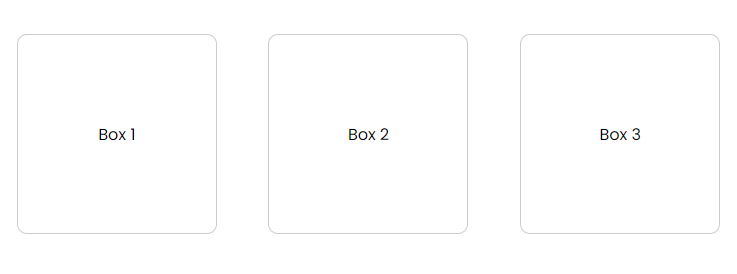
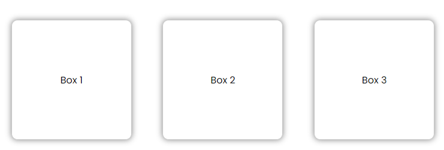
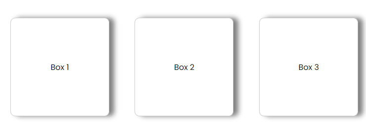
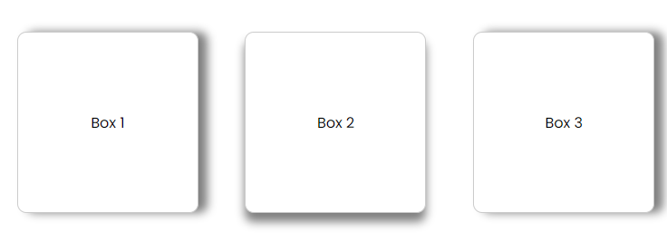
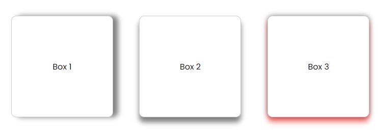
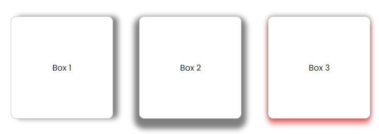

# Box Shadow

The `box-shadow` property is used to add a shadow effect to an element. The property takes a few values to define the shadow such as the horizontal and vertical offset, blur radius, spread radius, and color.

Let's start with this HTML:

```html
<div class="container">
  <div class="box box1">Box 1</div>
  <div class="box box2">Box 2</div>
  <div class="box box3">Box 3</div>
</div>
```

and this CSS:

```css
body {
  font-family: Arial, sans-serif;
}

.container {
  display: flex;
  justify-content: space-around;
  margin-top: 50px;
}

.box {
  width: 200px;
  height: 200px;
  display: flex;
  justify-content: center;
  align-items: center;
  background-color: white;
  border-radius: 10px;
  border: 1px solid #ccc;
}
```

Don't worry about the flexbox stuff. I just wanted to have some boxes in a row.

It should look like this:



Let's add some shadows to the boxes.

Here is the syntax:

```css
.box {
  box-shadow: 0 0 10px 0 rgba(0, 0, 0, 0.5);
}
```



This can be a bit confusing at first.

The values are as follows:

- `0` is the horizontal offset of the shadow.
- `0` is the vertical offset of the shadow.
- `10px` is the blur radius.
- `0` is the spread radius.
- `rgba(0, 0, 0, 0.5)` is the color of the shadow.

Offset just means how far the shadow is from the element. The blur radius is how blurry the shadow is. The spread radius is how much the shadow should grow or shrink. The color is the color of the shadow.

All we are seeing is the blur radius and the color, which is set to black with an opacity of `0.5`.

Let's make the horizontal offset `10px` and the vertical offset `10px`:

```css
.box {
  box-shadow: 10px 0 10px 0 rgba(0, 0, 0, 0.5);
}
```



Now it comes out on the right side. If we wanted it on the left side, we would make the horizontal offset `-10px`.

Let's add some vertical offset to the second box:

```css
.box2 {
  box-shadow: 0 10px 10px 0 rgba(0, 0, 0, 0.5);
}
```



If you want it on the top, you would make the vertical offset `-10px`.

You can also add multiple shadows to an element. Let's do that and add a red shadow to the third box:

```css
.box3 {
  box-shadow: 0 0 10px 0 rgba(0, 0, 0, 0.5), 0 10px 10px 0 rgba(255, 0, 0, 0.5);
}
```



This is a cool effect. It looks like the box is floating.

Let's increase the spread radius to `10px` on the second box:

```css
.box2 {
  box-shadow: 0 10px 10px 10px rgba(0, 0, 0, 0.5);
}
```


