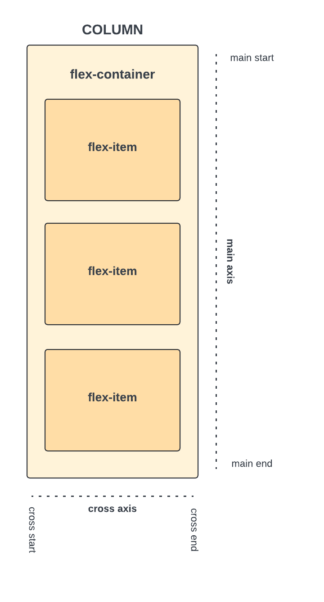

# What Is Flexbox?

Now we're going to get into something that is very important in web design and development and that is Flexbox. Flexbox, short for Flexible Box Layout, is a crucial aspect of modern web design and development. Its a layout model that provides and efficient way to arrange, align and distribute elements, particularly when dealing with dynamic or unknown sizes of elements.

At its core, Flexbox is a one-dimensional layout model, meaning it operates along a single axis—either horizontally or vertically. This allows developers to easily organize items within a container in rows or columns, depending on the desired layout. Whether you're building a simple navigation menu, a complex grid system, or anything in between, Flexbox provides the tools to achieve your design goals effectively.

## Flex Container and Flex Items

Before diving into the specifics of Flexbox, it's important to understand the two main components of the Flexbox model: the flex container and flex items. The flex container is the parent element that contains one or more flex items. By applying the `display: flex` property to the flex container, you can enable Flexbox layout for its child elements. This property transforms the container into a flex container, allowing you to control the layout of its child items using various Flexbox properties.

Any element can be a flex container or flex item. You may have a `div` element that serves as a flex container, with multiple `div` elements nested inside as flex items. You may have a `ul` element that acts as a flex container, with `li` elements as flex items.

## Flex Rows and Columns

Flexbox provides two main axes for layout: the main axis and the cross axis. The main axis is the primary axis along which flex items are laid out, either horizontally or vertically. By default, the main axis is horizontal and a flex row looks like this:

You can also change the layout to a flex column, you can set the `flex-direction` property to `column`. This allows you to stack flex items vertically within the container like this:

These 2 images will be really helpful to you in the future when you're working with Flexbox. Keep them accessible for reference.

In the next lesson, we will create a simple Flexbox layout to demonstrate how Flexbox works in practice.
