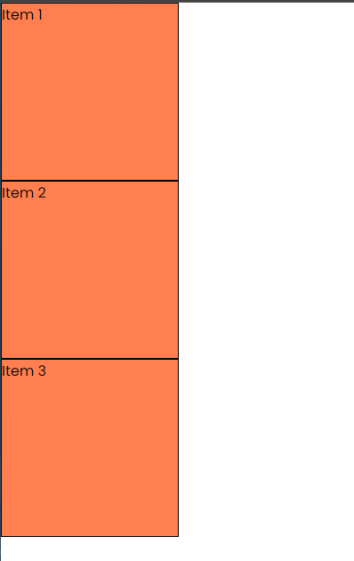
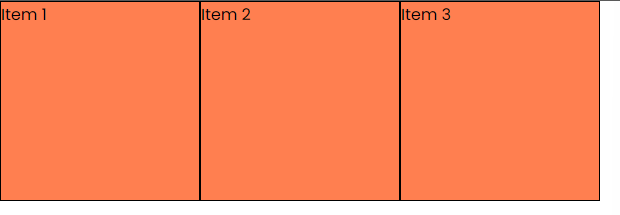
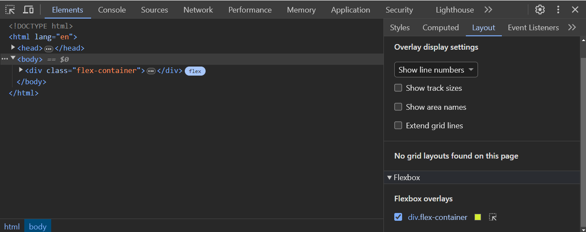
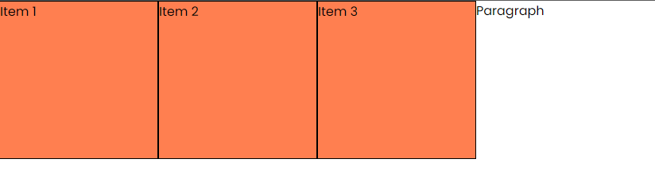
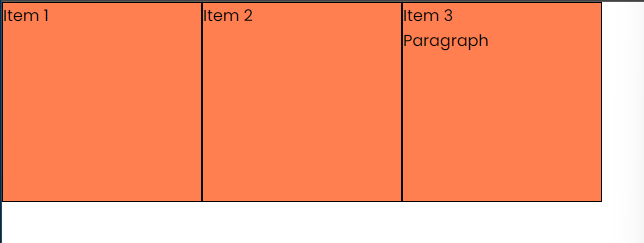
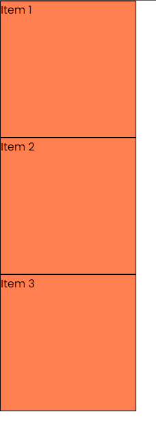

# Flex Containers & Items

In the last lesson, we talked about what flexbox is and that it uses a one-dimensional layout model. In this lesson, we will discuss the two main components of the flexbox model: the flex container and flex items.

You can think of the flex container as the parent element that contains one or more flex items. By applying the `display: flex` property to the flex container, you can enable flexbox layout for its child elements. This property transforms the container into a flex container, allowing you to control the layout of its child items using various flexbox properties.

Let's use the following HTML:

```html
<div class="flex-container">
  <div class="flex-item">Item 1</div>
  <div class="flex-item">Item 2</div>
  <div class="flex-item">Item 3</div>
</div>
```

and start with the following CSS:

```css
body {
  font-family: Arial, sans-serif;
}

.flex-item {
  height: 200px;
  width: 200px;
  background-color: coral;
  border: 1px solid black;
}
```

We just have 3 boxes in a regular layout one on top of the other.



Let's turn the parent `div` into a flex container by adding the `display: flex` property to the `.flex-container` class.

```css
.flex-container {
  display: flex;
  width: 100%;
}
```

Now, the boxes are displayed in a row, side by side. The container takes up the full width of the page. Of course, you could also set a fixed width for the container.



## Devtools

There is a great way to see the flex container and flex items in the browser. You can right-click on the container and select "Inspect" to open the developer tools. You can then hover over the container and see the flex items highlighted. You can also click on 'Layout' to see the flex properties.



The default layout direction of a flex container is a row. This means that the flex items are laid out horizontally along the main axis.

Now anything that I put directly inside the `.flex-container` will be a flex item. If I add a paragraph inside the `.flex-container`, it will also be a flex item.

```html
<div class="flex-container">
  <div class="flex-item">Item 1</div>
  <div class="flex-item">Item 2</div>
  <div class="flex-item">Item 3</div>
  <p>Paragraph</p>
</div>
```



You can see that it is aligned with the other flex items. This is because the paragraph is also a flex item inside the flex container.

In order for it to be a flex item of the container, it must be a direct child of the flex container. If I nest the paragraph inside one of the flex items, it will not be a flex item of the container.

```html
<div class="flex-container">
  <div class="flex-item">Item 1</div>
  <div class="flex-item">Item 2</div>
  <div class="flex-item">
    Item 3
    <p>Paragraph</p>
  </div>
</div>
```



Let's remove the paragraph and go back to the original layout.

```html
<div class="flex-container">
  <div class="flex-item">Item 1</div>
  <div class="flex-item">Item 2</div>
  <div class="flex-item">Item 3</div>
</div>
```

## Flex Direction

Like I said in the last lesson, your flexbox can be wither a row or a column. The default is a row, but you can change it to a column by adding the `flex-direction` property to the flex container.

```css
.flex-container {
  display: flex;
  width: 100%;
  flex-direction: column;
}
```

Now the boxes are displayed in a column, one on top of the other.



You may say that this is the same as the default layout, but it's not. When using a flexbox column, we can use certain alignment properties that we can't use with a regular layout.

We also have the option to reverse the order of the flex items by using the `flex-direction` property with the `row-reverse` or `column-reverse` value.

```css
.flex-container {
  display: flex;
  width: 100%;
  flex-direction: column-reverse;
}
```

This will be the same thing except the last item will be at the top.

You can also do the same with a row.

```css
.flex-container {
  display: flex;
  width: 100%;
  flex-direction: row-reverse;
}
```

This will be the same thing except the last item will be at the beginning.

Let's put it back to a row. You can either do that by removing the `flex-direction` property or setting it to `row`.

```css
.flex-container {
  display: flex;
  width: 100%;
  flex-direction: row;
}
```

## Flex Wrap

By default, flex items will try to fit in a single line. If you have a lot of items, they will shrink to fit in the container.

Let's try this by adding more items to the flex container.

You can use emmet:

```html
.flex-item*10{Item $}
```

To get the following HTML:

```html
<div class="flex-item">Item 1</div>
<div class="flex-item">Item 2</div>
<div class="flex-item">Item 3</div>
<div class="flex-item">Item 4</div>
<div class="flex-item">Item 5</div>
<div class="flex-item">Item 6</div>
<div class="flex-item">Item 7</div>
<div class="flex-item">Item 8</div>
<div class="flex-item">Item 9</div>
<div class="flex-item">Item 10</div>
```

Now when you make the browser window smaller, the items will just be hidden.

We can add the `flex-wrap` property to the flex container to make the items wrap to the next line.

```css
.flex-container {
  display: flex;
  width: 100%;
  flex-wrap: wrap;
}
```

Now when you make the browser window smaller, the items will wrap to the next line.


This is one option to make your layout more responsive.

You can also reverse the order of the items by using the `flex-wrap` property with the `wrap-reverse` value.

```css
.flex-container {
  display: flex;
  width: 100%;
  flex-wrap: wrap-reverse;
}
```

These are the basics of creating a flex container and flex items. In the next lesson, we will look at how to align and justify flex items within a flex container.
