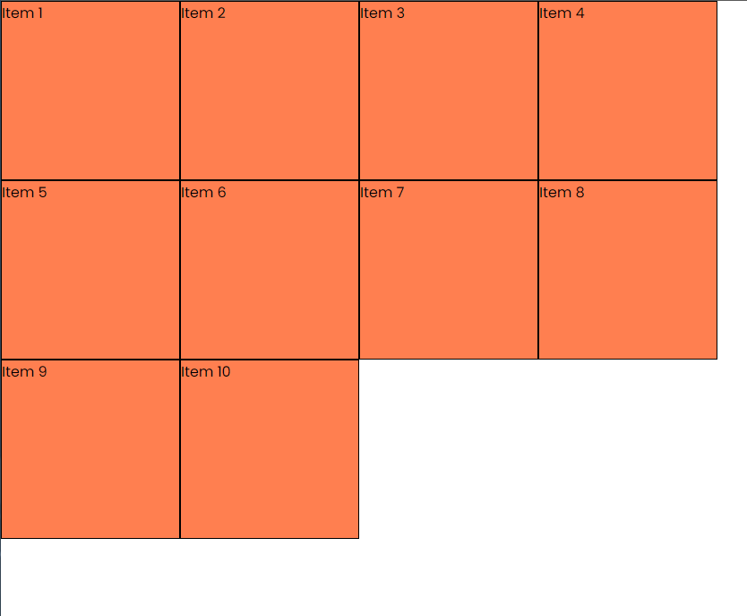
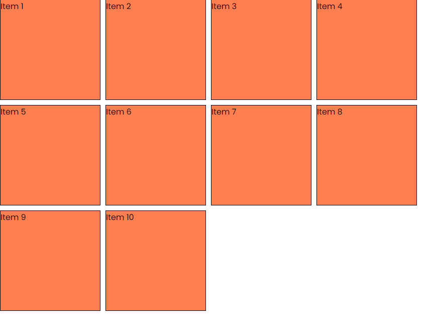

# Flex Wrap & Gap

We are now going to look at the `flex-wrap` property and the `gap` properties.

Let's use the following HTML:

```html
<div class="flex-container">
  <div class="flex-item">Item 1</div>
  <div class="flex-item">Item 2</div>
  <div class="flex-item">Item 3</div>
  <div class="flex-item">Item 4</div>
  <div class="flex-item">Item 5</div>
  <div class="flex-item">Item 6</div>
  <div class="flex-item">Item 7</div>
  <div class="flex-item">Item 8</div>
  <div class="flex-item">Item 9</div>
  <div class="flex-item">Item 10</div>
</div>
```

By the way, you could create this HTML using Emmet. Just type `.flex-item*10{Item $}` and press `Tab`.

## Flex Wrap

By default, flex items will try to fit in a single line. If you have a lot of items, they will shrink to fit in the container.

Make the browser window smaller, the items will just be hidden.

We can add the `flex-wrap` property to the flex container to make the items wrap to the next line.

```css
.flex-container {
  display: flex;
  width: 100%;
  flex-wrap: wrap;
}
```

Now when you make the browser window smaller, the items will wrap to the next line.



This is one option to make your layout more responsive. Later, when we get into media queries, we will see how to make the layout even more responsive.

You can also reverse the order of the items by using the `flex-wrap` property with the `wrap-reverse` value.

```css
.flex-container {
  display: flex;
  width: 100%;
  flex-wrap: wrap-reverse;
}
```

## Gap

There are a couple of ways to add space between the flex items. You could add margin to the flex items like this:

```css
.flex-item {
  margin: 10px;
}
```

But there is a better way to add space between the items. You can use the `gap` property on the flex container.

```css
.flex-container {
  display: flex;
  width: 100%;
  flex-wrap: wrap;
  gap: 10px;
}
```

This will add space between items both horizontally and vertically.



You can also use the `row-gap` and `column-gap` properties to add space between the items in a specific direction.

```css
.flex-container {
  display: flex;
  width: 100%;
  flex-wrap: wrap;
  row-gap: 10px; /* vertical space */
  column-gap: 20px; /* horizontal space */
}
```

This will add 10px of space between the items vertically and 20px of space between the items horizontally.
