# Align & Justify

Now that we know how to create a flexbox row and column, let's talk about how to align and justify the items.

Let's use the following HTML to start with:

```html
<div class="flex-container">
  <div class="flex-item item-1">Item 1</div>
  <div class="flex-item item-2">Item 2</div>
  <div class="flex-item item-3">Item 3</div>
  <div class="flex-item item-4">Item 4</div>
</div>
```

and the following CSS:

```css
body {
  font-family: Arial, sans-serif;
}

.flex-container {
  display: flex;
  width: 100%;
}

.flex-item {
  height: 200px;
  width: 200px;
  background-color: coral;
  border: 1px solid black;
}
```

The alignment and justification properties are applied to the flex container, not the flex items. There are properties for aligning individual items, but we'll cover those later. Right now, we are deciding how to align and justify all of the items within the flex container. So for more clarity, let's give the flex container a background color.

```css
.flex-container {
  display: flex;
  background-color: lightblue;
  width: 100%;
}
```

You could also add a height to the flex container to see the alignment and justification properties better.

```css
.flex-container {
  display: flex;
  background-color: lightblue;
  width: 100%;
  height: 400px;
}
```

Now it is clear exactly where our flex container is.

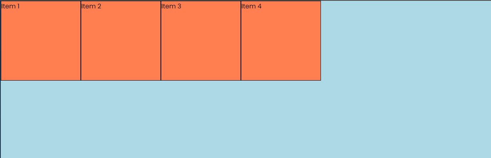

There are two main properties that we use to align and justify the items in a flex container: `justify-content` and `align-items`.

## Justify Content

The `justify-content` property aligns the items along the main axis. The main axis is the direction in which the flex items are laid out. By default, the main axis is horizontal, so the `justify-content` property will align the items horizontally.

Here is the image of a row just to make it clear:

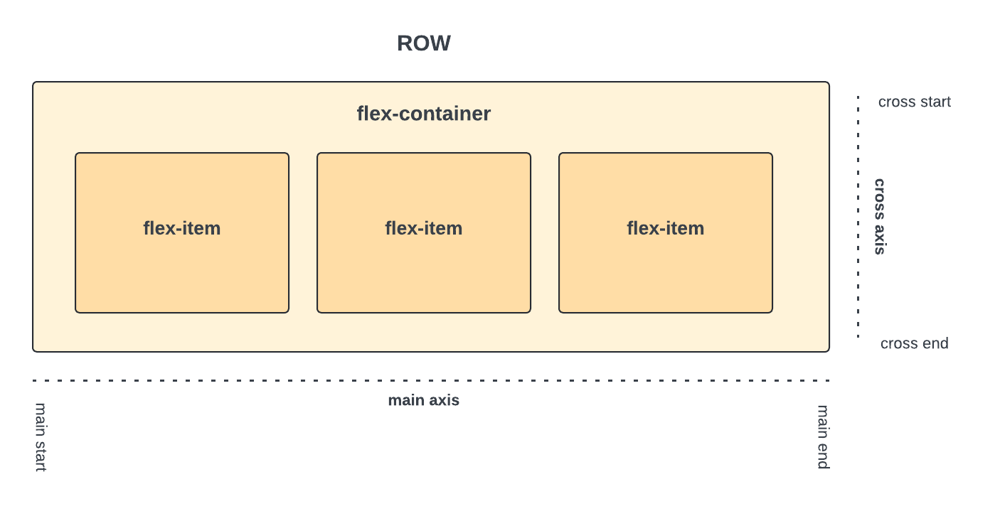

The `justify-content` property has 5 possible values:

- `flex-start`: This is the default value. The items are packed at the start of the main axis.
- `flex-end`: The items are packed at the end of the main axis.
- `center`: The items are centered along the main axis.
- `space-between`: The items are evenly distributed along the main axis. The first item is at the start of the main axis, the last item is at the end of the main axis, and the remaining items are spaced evenly between them.
- `space-around`: The items are evenly distributed along the main axis with a half-size space on either end.

Let's see how these values work.

### Flex Start

You can use either `flex-start` or `start` as the value for the `justify-content` property. I prefer `start` because you can also use this with CSS Grid.

```css
.flex-container {
  /* ...other styles */
  justify-content: start;
}
```

This will keep the items at the start of the main axis. So no change will be visible in the layout.

### Flex End

```css
.flex-container {
  /* ...other styles */
  justify-content: end;
}
```

This will keep the items at the end of the main axis.

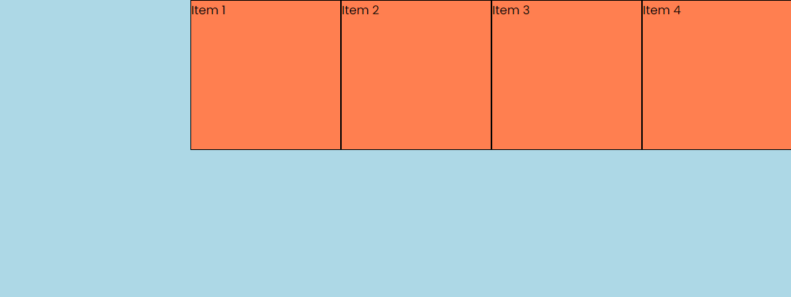

### Center

This will center the items along the main axis.

```css
.flex-container {
  /* ...other styles */
  justify-content: center;
}
```

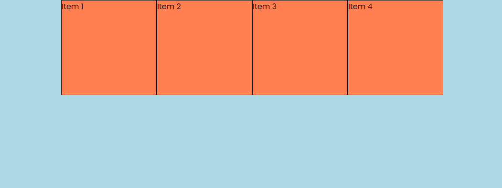

### Space Between

This will distribute the items evenly along the main axis. There is not space at the start and end of the main axis.

```css
.flex-container {
  /* ...other styles */
  justify-content: space-between;
}
```

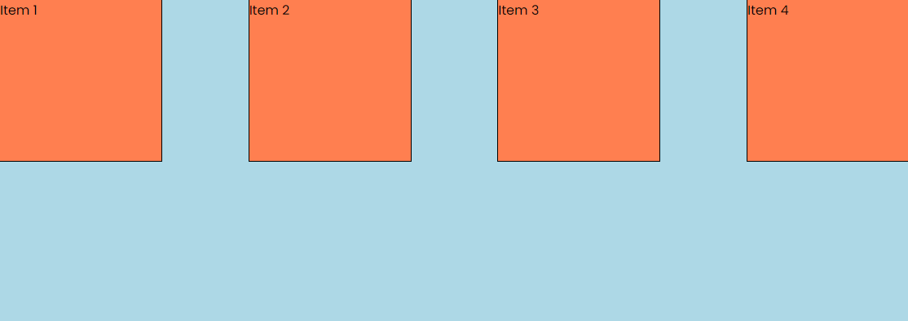

### Space Around

This will distribute the items evenly along the main axis with space at the start and end of the main axis.

```css
.flex-container {
  /* ...other styles */
  justify-content: space-around;
}
```

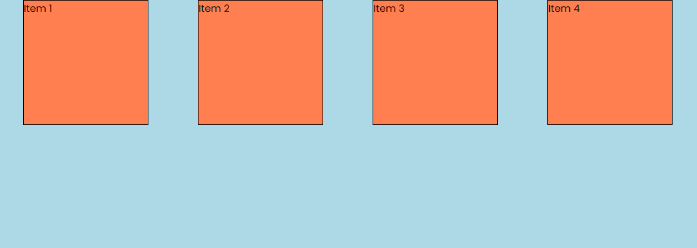

## Align Items

The `align-items` property aligns the items along the cross axis. The cross axis is the direction perpendicular to the main axis. By default, the cross axis is vertical, so the `align-items` property will align the items vertically.

In order to see any changes, the flex container needs to have a height. Which we do. The height is 400px.

I will leave the justify content property as `space-around` so that you can see the alignment of the items better.

There are 5 possible values for the `align-items` property:

- `stretch`: This is the default value. The items are stretched to fill the container.
- `flex-start`: The items are packed at the start of the cross axis.
- `flex-end`: The items are packed at the end of the cross axis.
- `center`: The items are centered along the cross axis.
- `baseline`: The items are aligned such as their baselines align.

### Stretch

This is the default value. The items are stretched to fill the container.

```css
.flex-container {
  /* ...other styles */
  align-items: stretch;
}
```

Now in this case, it won't change because the items have a fixed height. You can remove the height from the items to see the change.

```css
.flex-item {
  /* height: 200px; */
  width: 200px;
  background-color: coral;
  border: 1px solid black;
}
```

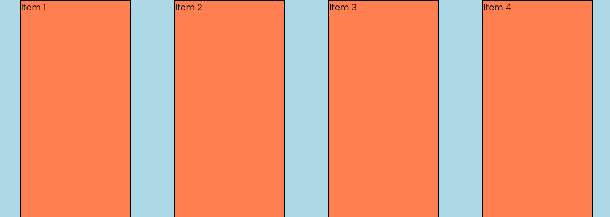

Let's put the height of the items back to 200px.

### Flex Start

This will keep the items at the start of the cross axis. So no change will be visible in the layout.

```css
.flex-container {
  /* ...other styles */
  align-items: start;
}
```

### Flex End

This will keep the items at the end of the cross axis.

```css
.flex-container {
  /* ...other styles */
  align-items: end;
}
```

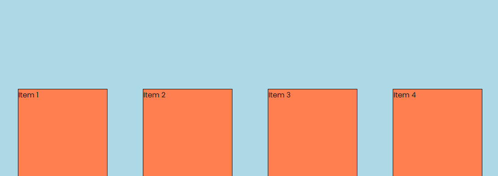

### Center

This will center the items along the cross axis.

```css
.flex-container {
  /* ...other styles */
  align-items: center;
}
```

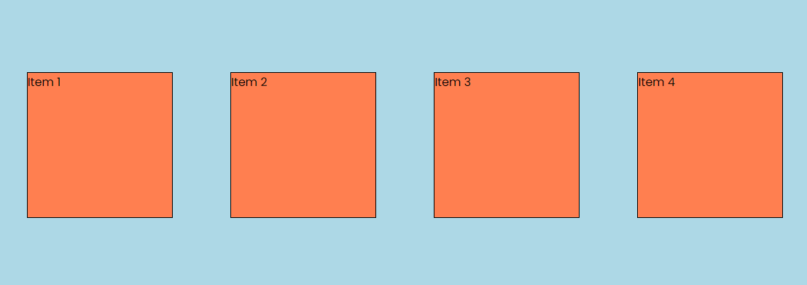

### Baseline

This will align the items such that their baselines align and they will not be stretched. So if we remove the height from the items, you will see that the items are aligned at the baseline.

```css
.flex-container {
  /* ...other styles */
  align-items: baseline;
}
```

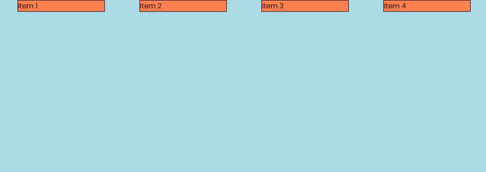

## Columns & Alignment

This is one of the more confusing things about flexbox. When you change the direction of the flex container to column, the main axis becomes vertical and the cross axis becomes horizontal.

Let's change the direction of the flex container to column.

```css
.flex-container {
  display: flex;
  background-color: lightblue;
  width: 100%;
  height: 400px;
  flex-direction: column;
}
```

Now the main axis is vertical and the cross axis is horizontal. This means that if you want to align the items vertically, you will use the `align-items` property. If you want to align the items horizontally, you will use the `justify-content` property.

So let's say we want to align the items at the center of the cross axis, we would use the `align-items` property.

```css
.flex-container {
  /* ...other styles */
  align-items: center;
}
```


This is really important to remember. When you change the direction of the flex container to column, the main axis becomes vertical and the cross axis becomes horizontal.

## Align Self

The `align-self` property is used to align individual items within the flex container. This property overrides the `align-items` property of the flex container.

Let's say we want only the first box to be at the end of the cross axis. We can use the `align-self` property on the first item.

```css
.item-1 {
  align-self: flex-end;
}
```

and the second item to be at the start of the cross axis.

```css
.item-2 {
  align-self: flex-start;
}
```

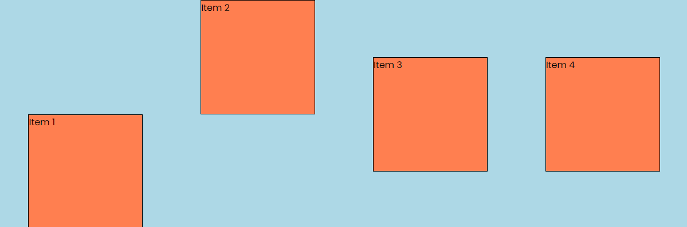

## Centering The Inner Content

This is something that you will use A LOT. Let's say we want to center the text in the flex item both horizontally and vertically. We can simply make the flex item a flex container as well and then use the `justify-content` and `align-items` properties.

```css
.flex-item {
  height: 200px;
  width: 200px;
  background-color: coral;
  border: 1px solid black;
  /* Center the inner content */
  display: flex;
  justify-content: center;
  align-items: center;
}
```

You will probably use those 3 lines all of the time.

Those are the properties when it comes to aligning and justifying items in a flex container. These properties are really powerful and can help you create complex layouts with ease.
