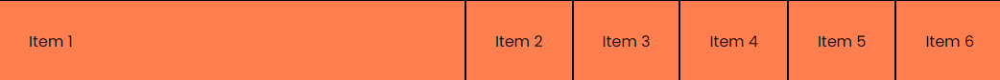
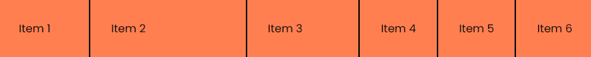
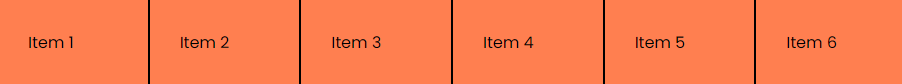

# Flex Properties & Sizing

In this lesson, we're going to talk about the various Flexbox properties that you can use to control the the sizing and the way that the elements grow and shrink within a Flex container.

Let's start with the following HTML:

```html
<div class="flex-container">
  <div class="flex-item item-1">Item 1</div>
  <div class="flex-item item-2">Item 2</div>
  <div class="flex-item item-3">Item 3</div>
  <div class="flex-item item-4">Item 4</div>
  <div class="flex-item item-5">Item 5</div>
  <div class="flex-item item-6">Item 6</div>
</div>
```

and the following CSS:

```css
body {
  font-family: Arial, sans-serif;
}

.flex-container {
  display: flex;
  width: 100%;
  background: lightblue;
}

.flex-item {
  background-color: coral;
  border: 1px solid black;
  padding: 30px;
  width: 200px;
}
```

It should look like this:


## Flex Item Properties

We are going to look at three properties that you can use to control the sizing of Flex items: `flex-shrink`, `flex-grow`, and `flex-basis`. In most cases, you won't use these properties directly, but you'll use the `flex` property, which is a shorthand for all three of these properties. But it's important to understand how these properties work so you can use the `flex` property effectively.

### `flex-shrink`

The `flex-shrink` property specifies how much a flex item will shrink relative to the other items in the flex container. By default, all flex items have a `flex-shrink` value of `1`, which means they will shrink equally when the flex container is smaller than the total size of the items. Go ahead and make the window smaller and you'll see that all the items shrink equally.

If you want a flex item to shrink more or less than the other items, you can set the `flex-shrink` property to a positive value.

Let's set the `flex-shrink` property for the first item to `0`:

```css
.item-1 {
  flex-shrink: 0;
}
```

Now try and make the window smaller. You'll see that the first item is not shrinking at all. The other items are shrinking because they have a `flex-shrink` value of `1`.

Let's set the `flex-shrink` property for the second item to `2`:

```css
.item-2 {
  flex-shrink: 2;
}
```

Now the second item is shrinking at twice the rate of the other items. The first item is not shrinking at all because it has a `flex-shrink` value of `0`.

Now, let's remove or comment out the last couple lines that we added and also remove the width from the `.flex-item` class:

```css
.flex-item {
  background-color: coral;
  border: 1px solid black;
  padding: 30px;
}
```

### `flex-grow`

The `flex-grow` property specifies how much a flex item will grow relative to the other items in the flex container. By default, all flex items have a `flex-grow` value of `0`, which means they will not grow. If you want a flex item to grow, you can set the `flex-grow` property to a positive value. The higher the value, the more the item will grow relative to the other items.

Let's set the `flex-grow` property for the first item to `1`:

```css
.item-1 {
  flex-grow: 1;
}
```

It will now be the same size until you start to resize the flex container and then it will grow to take up the remaining space.



The other items are not growing because they have a `flex-grow` value of `0`.

Let's set the `flex-grow` property for the second item to `2`:

```css
.item-1,
.item-2 {
  flex-grow: 1;
}
```

Now the second item is taking up the same as the first.

What if we set the third item to `2`?

```css
.item-3 {
  flex-grow: 2;
}
```

Now the third item is taking up twice as much space as the first and second items. It will grow at twice the rate of the other items as you increase the size of the flex container.

### `flex-basis`

The `flex-basis` property specifies the initial size of a flex item before any available space is distributed. It can be a length value, a percentage value, or `auto`. By default, the `flex-basis` property is set to `auto`, which means the initial size of the item will be determined by its content.

Let's set the `flex-basis` property for the second item to `200px`:

```css
.item-2 {
  flex-basis: 200px;
}
```

Now the second item will have an initial size of `200px`. So the first one will not grow until the second one reaches `200px`.



### `flex`

The `flex` property is a shorthand for the `flex-grow`, `flex-shrink`, and `flex-basis`.

Let's make it so that all the items have the same size and take up the full width of the flex container and have a flex-basis of `200px`:

```css
.flex-item {
  /* ...other styles */
  flex: 1 0 200px;
}
```

When we make the browser smaller, all the items will shrink equally, however, since we have a `flex-basis` of `200px`, they will not shrink below that size.

Let's remove the `flex-basis` value:

```css
.flex-item {
  /* ...other styles */
  flex: 1 0 0;
}
```

Now all of the items will shrink equally and take up the full width of the flex container.



We can take this a step further. Since the `flex-shrink` and `flex-basis` values are 0, we can actually just use the `flex-grow` value:

```css
.flex-item {
  /* ...other styles */
  flex: 1;
}
```

So if you want even columns that take up the full width of the flex container, you can just set the `flex` property to `1`.
