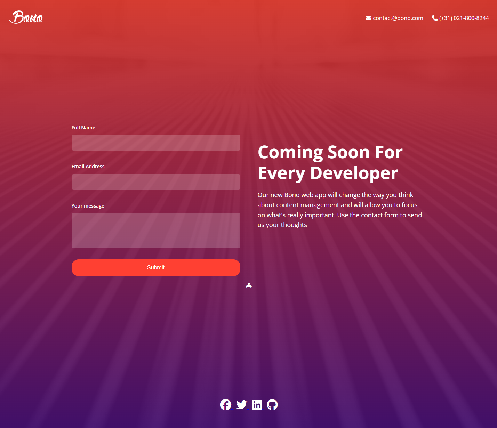

# Setup & HTML

In this section, we are going to create the Bono Form Landing Page. This is a form to join an email list for a new app that is being developed called Bono. It will have a simple design with a background image, a log and nav-like element at the top, two columns with a form ont the left and some text on the right. The form inputs will have some transparency and a border radius to make them stand out. There will be an input for a name, email and message. 

This mini-project will use a lot of the concepts we have learned so far, including flexbox, form styling, media queries and more. If you would like to try and create this on your own, you can do so. Otherwise, follow along with the steps below.



Let's start by creating an `index.html` file and adding some basic structure. We will include the Open Sans font from Google Fonts and Font Awesome for the icons. We will also link to a CSS file and add a favicon.

```html
<!DOCTYPE html>
<html lang="en">
  <head>
    <meta charset="UTF-8" />
    <meta name="viewport" content="width=device-width, initial-scale=1.0" />
    <link rel="preconnect" href="https://fonts.googleapis.com" />
    <link rel="preconnect" href="https://fonts.gstatic.com" crossorigin />
    <link
      href="https://fonts.googleapis.com/css2?family=Open+Sans:ital,wght@0,300..800;1,300..800&display=swap"
      rel="stylesheet"
    />
    <link
      rel="stylesheet"
      href="https://cdnjs.cloudflare.com/ajax/libs/font-awesome/6.5.1/css/all.min.css"
      integrity="sha512-DTOQO9RWCH3ppGqcWaEA1BIZOC6xxalwEsw9c2QQeAIftl+Vegovlnee1c9QX4TctnWMn13TZye+giMm8e2LwA=="
      crossorigin="anonymous"
      referrerpolicy="no-referrer"
    />
    <link rel="stylesheet" href="css/styles.css" />
    <link rel="icon" href="images/favicon.png" />
    <title>Bono App | Sign Up</title>
  </head>
  <body>
    <h1>Starter Template</h1>
  </body>
</html>
```

## Images

Get the images for this project from the final code and put them into the 'images' folder. There should be a logo, background image and a favicon.

## Wrapper & Header

We will have a background image for the entire page, so I want to have a wrapper div that will hold all the content. Inside the wrapper, we will have a header with a logo on the left and contact info on the right.

```html
 <div class="wrapper">
  <header class="header">
    <a href="index.html">
      
    </a>
    <div class="header-right">
      <div><i class="fas fa-envelope"></i> contact@bono.com</div>
      <div><i class="fas fa-phone"></i> (+31) 021-800-8244</div>
      <div>
        <a href="#"><i class="fa-brands fa-twitter"></i></a>
      </div>
    </div>
  </header>
</div>
```

## Main Content

Now we will add the main content, which will include the form and the text content. It is important to keep this and everything else inside the wrapper div. So put this directly under the header.

```html
 <main class="main-content">
  <form>
    <div class="form-group">
      <label for="name">Full Name</label>
      <input
        type="text"
        class="form-control"
        name="name"
        id="name"
        required
      />
    </div>
    <div class="form-group">
      <label for="email">Email Address</label>
      <input
        type="text"
        class="form-control"
        name="email"
        id="email"
        required
      />
    </div>
    <div class="form-group">
      <label for="message">Your Message</label>
      <textarea name="message" id="message"></textarea>
    </div>
    <div class="form-group">
      <button type="submit" class="btn">Submit</button>
    </div>
  </form>

  <div class="text-container">
    <h1>Coming Soon For Every Developer</h1>
    <p>
      Our new Bono web app will change the way you think about content
      management and will allow you to focus on what's really important.
      Use the contact form to send us your thoughts
    </p>
  </div>
</main>
```

That's it for the HTML. In the next lesson, we will start on the styling with CSS.
