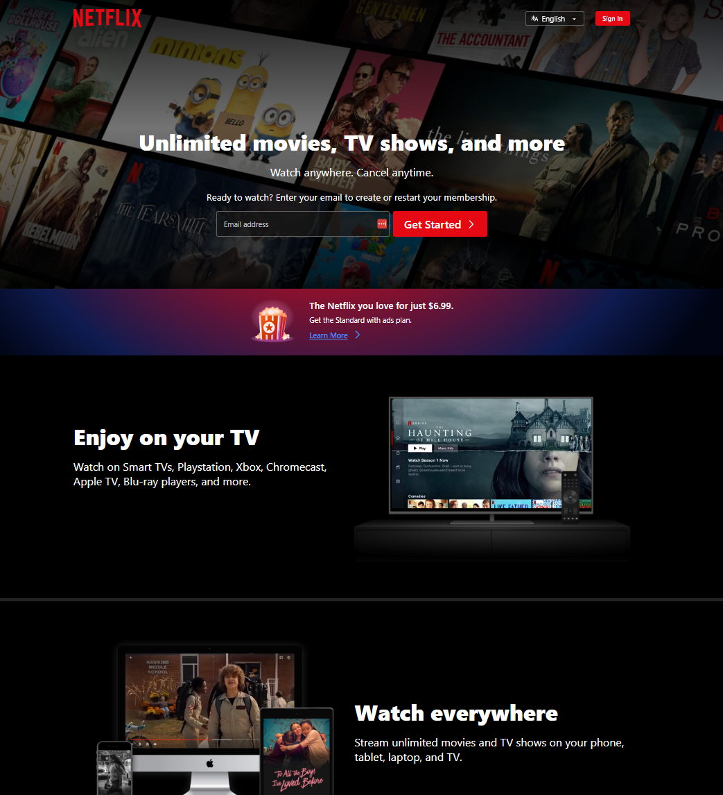

# What Is Responsive Design?

## Introduction

We are now going to get into one of the most important topics when it comes to UI and website design and layout and that is making your projects responsive. Responsive design is an approach that allows web pages to render well on a variety of devices and window or screen sizes. So your websites and applications should look good on smartphones, tablets, laptops, desktops, and even on large TV screens.

## Benefits of Responsive Design

### Improved User Experience

Responsive design ensures that your website or application is accessible and easy to use across all devices. Users can navigate and interact with your content without encountering layout issues or having to zoom in or out.

### Better Accessibility

By designing with responsiveness in mind, you make your content accessible to a wider range of users, including those with disabilities who may rely on assistive technologies or who use unconventional devices to browse the web.

### Enhanced SEO Performance

Search engines like Google prioritize mobile-friendly websites in their search results. By implementing responsive design principles, you improve your website's visibility and ranking in search engine results pages (SERPs), leading to increased traffic and engagement.

### Simplified Maintenance

Maintaining a single responsive website is more efficient than managing separate desktop and mobile versions. With responsive design, you only need to update and maintain one set of code and content, reducing the time and resources required for website management.

## How It Works

Responsive design relies on the use of flexible layouts, flexible images, and CSS media queries.

If we look at a website like Netflix, for example, on a larger screen, it looks like this:

There is a main hero area with a form and a 2-column layout below it.

If we make the browser smaller, you can see things start to change. The form button is now underneath the input fields and the 2-column layout is now a single column.

So these are some of the common things that will change as a website becomes responsive:

- The layout will change from multi-column to single column
- Images will resize and change position
- Text will resize and reflow
- Navigation menus will change to a hamburger menu
- Form fields will stack on top of each other

There are others as well, but these are some of the most common changes you will see.

Here's how each component contributes to the responsiveness of a website:

### Flexible Layouts

Flexible layouts use relative units such as percentages rather than fixed units like pixels. This allows content to adapt to the size of the viewport or device screen. For example, a container set to width: 100% will always fill the width of its parent element, making it responsive to changes in screen size. We also utilize properties like `max-width` to prevent elements from becoming too large on larger screens. For font sizing, we can use `em` or `rem` units to ensure text scales proportionally with the layout. We'll get to those soon.

### Correct Viewport Tag

It is important to have the correct viewport tag in the `<head>` section of your HTML document to ensure proper rendering and responsiveness on mobile devices. As I showed you back in the meta tag lesson, the viewport meta tag allows you to control the width and scaling of the viewport, ensuring that the page displays correctly on various devices.

### Flexible Images

Images in a responsive design are also sized using relative units, such as percentages or max-width: 100%, to ensure they scale proportionally with the layout. This prevents images from overflowing their containers or becoming distorted on different devices.

### Fluid Typography

Fluid typography is a key aspect of responsive design that ensures text scales seamlessly across different viewport sizes. Instead of using fixed font sizes, fluid typography adjusts the size of text based on the width of the viewport or the parent container. We're going to look at different units such as rem and em units and vh and vw units.

### Media Queries

Media queries are the most important part of responsive design because they allow you to apply different styles based on the characteristics of the device or viewport, such as screen width, height, or orientation. By using media queries, you can create breakpoints where your layout adjusts to better accommodate different screen sizes. For example, you might use a media query to change the layout from a multi-column grid to a single column for smaller screens. We also have something called container queries, which are a more recent feature in CSS that allows us to not only use the viewport, but we can use any container element and create queries for certain sizes. We'll look more into this soon.
