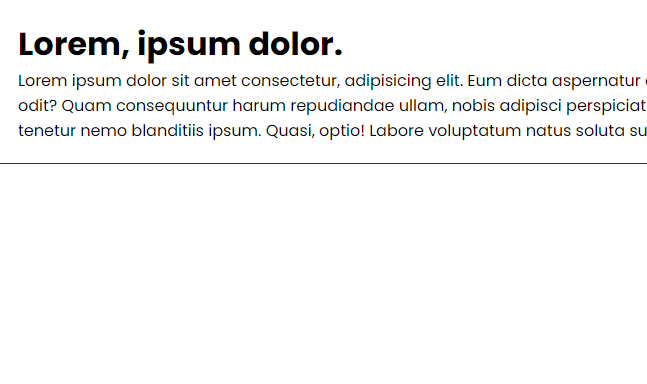
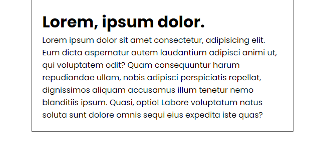
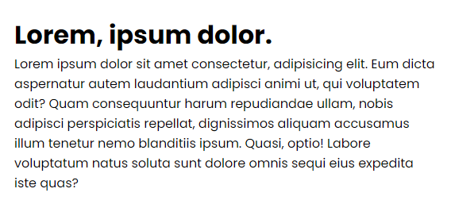
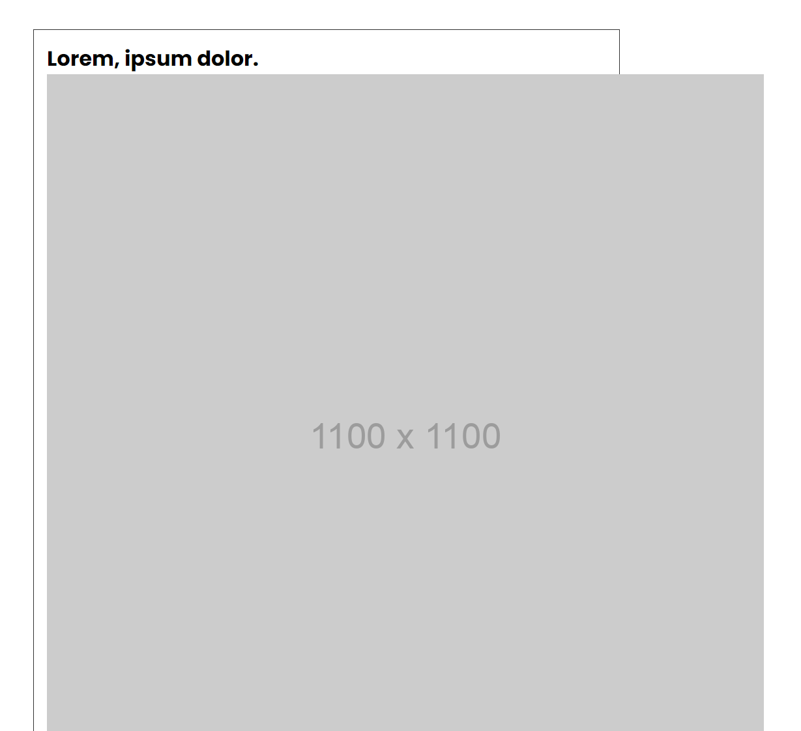
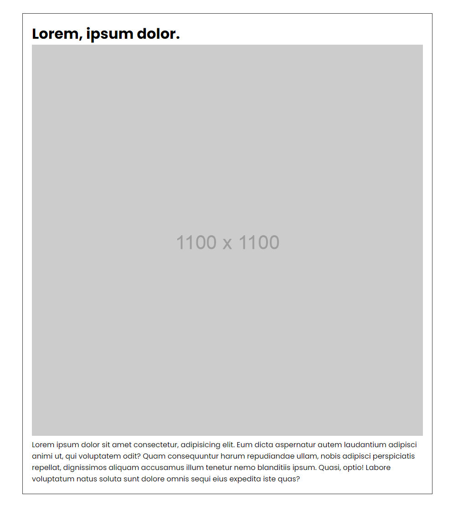

# Percentages

So far, we have really only used pixels to size our elements. This is fine in many cases, but there are other units that make your website a bit more flexible and responsive. In this lesson, we will look at percentages as well as the `min-height` and `max-height` properties.

Percentage is a relative unit that is relative to the parent element. If you set a width of 50% on an element, it will be 50% of the width of its parent element. This is great for creating flexible layouts that can adapt to different screen sizes.

Let's start of with a container that has a fixed width so we can see how that works.

Let's use the following HTML:

```html
<div class="container">
  <h1>Lorem, ipsum dolor.</h1>
  <p>
    Lorem ipsum dolor sit amet consectetur, adipisicing elit. Eum dicta
    aspernatur autem laudantium adipisci animi ut, qui voluptatem odit? Quam
    consequuntur harum repudiandae ullam, nobis adipisci perspiciatis repellat,
    dignissimos aliquam accusamus illum tenetur nemo blanditiis ipsum. Quasi,
    optio! Labore voluptatum natus soluta sunt dolore omnis sequi eius expedita
    iste quas?
  </p>
</div>
```

We have a simple container with an `h1` and a `p` element. Let's style this container:

```css
* {
  margin: 0;
  padding: 0;
  box-sizing: border-box;
}

body {
  font-family: 'Poppins', sans-serif;
}

.container {
  width: 1100px;
  margin: 0 auto;
  padding: 20px;
  border: 1px solid #333;
}
```

This will create a container with a fixed width of 1100px. The container will be centered on the page. This is fine for desktop screens, but go ahead and resize your browser window. You will see that the container will stay the same width no matter how small you make the window. This is not ideal for smaller screens as the text will get cut off.



## Percentage Width

There are a couple things that we could do to make this more flexible. One thing we could do is to set the width of the container to a percentage. Let's change the width of the container to 80%:

```css
.container {
  width: 80%;
  margin: 0 auto;
  padding: 20px;
  border: 1px solid #333;
}
```

Now the container will be 80% of the width of its parent element no matter what the size of the window is. This is a great way to make your website more flexible and responsive.



## Max Width

Another thing that we could do is to set a `max-width` on the container. This will make sure that the container will never be wider than the specified width. Let's set the `max-width` to 1100px:

```css
.container {
  width: 80%;
  max-width: 1100px;
  margin: 0 auto;
  padding: 20px;
  border: 1px solid #333;
}
```

Now the container will be 80% of the width of its parent element, but it will never be wider than 1100px. This is a great way to make sure that your website doesn't get too wide on larger screens.

I personally like to just set a max width on elements like containers, images, and text. This way, the website will be flexible and responsive, but it won't get too wide on larger screens.

You can take off the 80% width if you want to. It will still be responsive because of the `max-width`.

```css
.container {
  max-width: 1100px;
  margin: 0 auto;
  padding: 20px;
  border: 1px solid #333;
}
```

The text is still readable on smaller screens, but it won't get too wide on larger screens.



You can also set percentages on margins and paddings.

Let's add a margin of 10% to the top and bottom of the container:

```css
.container {
  max-width: 1100px;
  margin: 10% auto;
  padding: 20px;
  border: 1px solid #333;
}
```

Now there will always be a margin of 10% on the top and bottom of the container.

Again, this is something that you have to do, I'm just giving you examples of what you can do with percentages.

## Images

You can also use percentages on images. This is great for making images responsive.

By default, images will be their original size. This is not ideal for responsive design. You can set the width of an image to 100% to make it responsive. This will make sure that the image will always be the same width as its parent element.

For example, let's set our container max width to 900px:

```css
.container {
  max-width: 900px;
  margin: 10% auto;
  padding: 20px;
  border: 1px solid #333;
}
```

Now let's add an image to the container that is 1100px wide:

```html
<div class="container">
  <h1>Lorem, ipsum dolor.</h1>
  
  <p>
    Lorem ipsum dolor sit amet consectetur, adipisicing elit. Eum dicta
    aspernatur autem laudantium adipisci animi ut, qui voluptatem odit? Quam
    consequuntur harum repudiandae ullam, nobis adipisci perspiciatis repellat,
    dignissimos aliquam accusamus illum tenetur nemo blanditiis ipsum. Quasi,
    optio! Labore voluptatum natus soluta sunt dolore omnis sequi eius expedita
    iste quas?
  </p>
</div>
```

The image will be 1100px wide, but the container will only be 900px wide. This is not ideal.



Let's set the `max-width` of the image to 100%:

```css
img {
  max-width: 100%;
}
```

Now the image will be contained.



You can resize the window and the image will always be the same width as its parent element.

Many times, developers will set the `max-width` of all `img` elements to 100% by default.

## When To Not Use Percentages

- **Fixed-size elements:** If you need an element to be an exact size regardless of its surroundings, obviously you should use a fixed unit like pixels (px).
- **Font sizes:** Although you can technically use percentages for font sizes, it is not usually recommended. You chould use relative units like ’em’ or ‘rem’, which we will go over soon. These units scale proportionally based on the user’s settings or the parent element’s font size.
- **Precise positioning:** Sometimes you will be creating layouts that need to be pixel-perfect. In these cases, you should use fixed units like pixels (px) to ensure that your layout is consistent across all devices.
- **Nested percentage values:** Be careful when using percentages on elements with nested structures. Multiple percentages on child elements can give unintended results, as percentages will be applied relative to parent elements that could have their own percentages.
