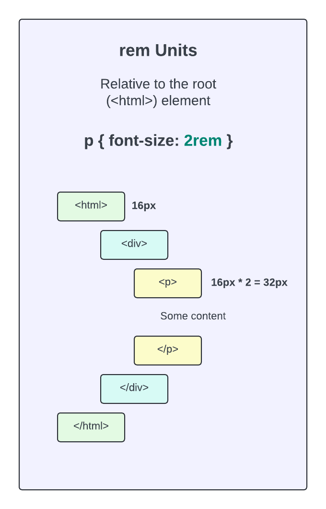
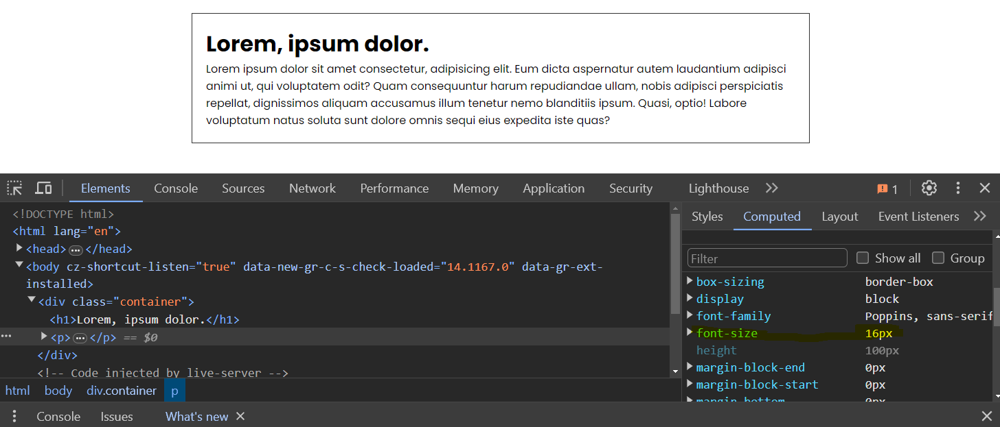
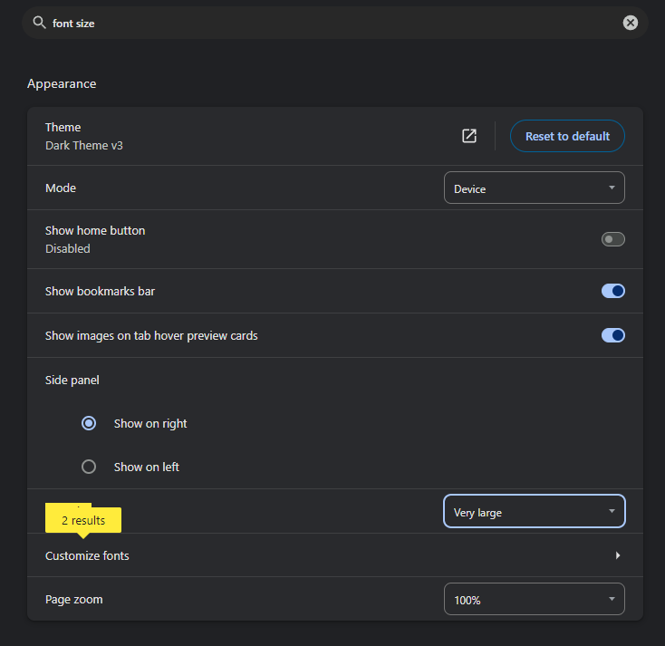
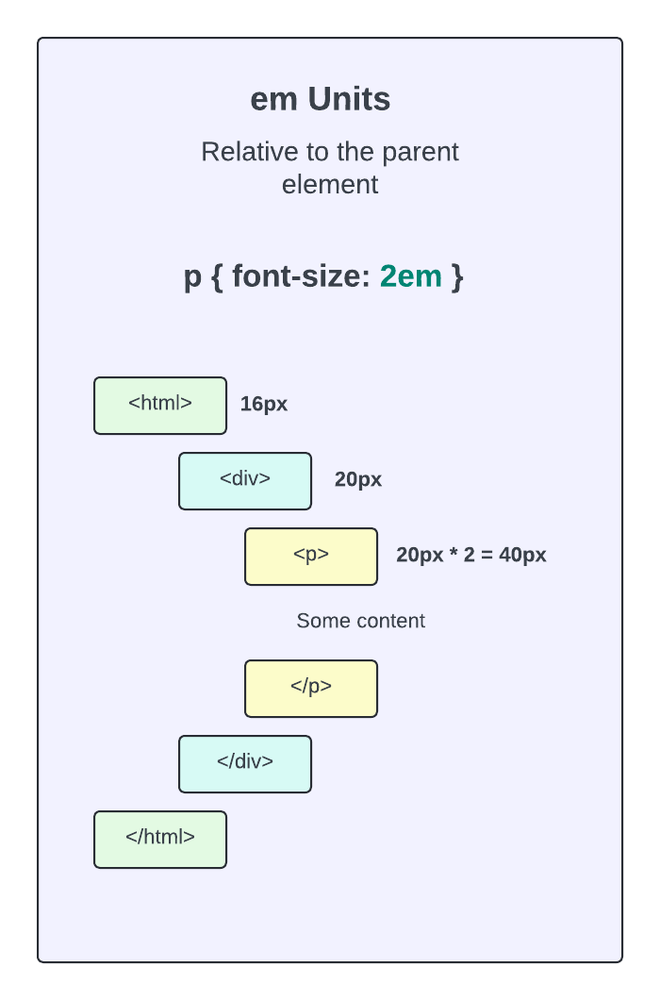
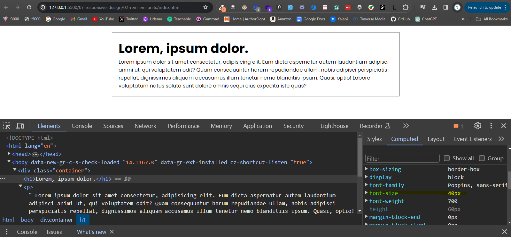

# Fluid Typography - `em` & `rem` Units

In the last lesson, we learned about flexible layouts and how to use `max-width` and percentages to help make our layouts responsive. In this lesson, we will learn about fluid typography and how to use `em` and `rem` units to make our text responsive.

up to this point, we have been using `px` units to set the font size, add margin and padding, etc. This is fine, but it doesn't make our text responsive. If we set the font size to `16px`, it will always be `16px` no matter what the size of the window is. We can use fluid typography to make the text more responsive.

## `rem` Units

The `rem` unit is relative to the root element. The root element is the `html` element. The default of that element is `16px`. So if we set `p` elements to `1rem`, that is going to be equal to `16px` because `1` x `16px` is `16px`. If we set it to `2rem`, it will be `32px` because `2` x `16px` is `32px`. It does't have to be a whole number either. We can set it to `1.5rem` and it will be `24px` because `1.5` x `16px` is `24px`.



Let's look at a simple example. We will use the following HTML:

```html
<div class="container">
  <h1>Lorem, ipsum dolor.</h1>
  <p>
    Lorem ipsum dolor sit amet consectetur, adipisicing elit. Eum dicta
    aspernatur autem laudantium adipisci animi ut, qui voluptatem odit? Quam
    consequuntur harum repudiandae ullam, nobis adipisci perspiciatis repellat,
    dignissimos aliquam accusamus illum tenetur nemo blanditiis ipsum. Quasi,
    optio! Labore voluptatum natus soluta sunt dolore omnis sequi eius expedita
    iste quas?
  </p>
</div>
```

We have a simple container with an `h1` and a `p` element. Let's add some basic styling:

```css
* {
  margin: 0;
  padding: 0;
  box-sizing: border-box;
}

body {
  font-family: 'Poppins', sans-serif;
}

.container {
  max-width: 900px;
  margin: 20px auto;
  padding: 20px;
  border: 1px solid #333;
}
```

And let's set the font size of the `p` element to `1rem`:

```css
p {
  font-size: 1rem;
}
```

We see no change because `1rem` is equal to `16px` by default. If you open your devtools and go to the **computed** tab, you will see that the font size is `16px`.



If we change the font size of the `html` element to `10px`, the `p` element will be `10px`:

```css
html {
  font-size: 10px;
}
```

In fact, one common practice is to set the font size of the `html` element to `62.5%` which is `10px`. This makes it easier to convert `px` to `rem`. If we want the `p` element to be `16px`, we can set it to `1.6rem`. If we want it to be `24px`, we can set it to `2.4rem`. Then there isn't any weird math to do. I don't do this personally, but it is a common practice.

The main advantage of using `rem` units is that it makes it easier to change the font size of the entire document. If we want to change the font size of the entire document, we can just change the font size of the `html` element and all the `rem` units will change accordingly. Also, if the user changes the font size in their browser settings, the `rem` units will change accordingly. If we use pixels, the user's settings will be ignored.

You can try this out. If you are using Chrome, go to the settings and search for font size. You can change the font size and see that the `rem` units will change accordingly.



## `em` Units

Everything that we just learned about `rem` units also applies to `em` units. The only difference is that `em` units are relative to the parent element. If our paragraph is set to `2em` and the parent element is set to `20px`, the paragraph will be `40px`.



If there is no parent element font size set, the `em` unit will be relative to the `html` element.

Let's add the following CSS:

```css
h1 {
  font-size: 2em;
}
```

It will be `32px` because there is not parent element font size specified so it defaults to the `html` element which is `16px`. `2` x `16px` is `32px`.

Let's add a font size of `20px` to the `.container` element, which it its parent:

```css
.container {
  max-width: 900px;
  margin: 20px auto;
  padding: 20px;
  border: 1px solid #333;
  font-size: 20px;
}
```

Now the `h1` element will be `40px` because `2` x `20px` is `40px`.



You can also use `em` units for margin and padding. Again, they don't have to be whole numbers. You can even set elements to something like `0.3em` or `.3em`. These are both the same thing.

```css
p {
  font-size: 1rem;
  margin: 1rem 0;
}

h1 {
  font-size: 2em;
  padding: 0.3em 0;
}
```

## Summary

So it's up to you whether you want to use `em` or `rem` units or stick to pixels. I personally like to use `rem` units or just straight up pixels. `rem` units are very straightforward and you don't have to think about any parent element font sizing.

I want to show you one more reason why I don't prefer `em` units. Let's say we have the following HTML:

```html
<ul>
  <li>One</li>
  <li>Two</li>
  <li>Three</li>
  <ul>
    <li>One</li>
    <li>Two</li>
    <li>Three</li>
  </ul>
</ul>
```

We have a nested `ul` element. Let's say we set the font size of the `ul` element to `1.5em`:

```css
ul {
  font-size: 1.5em;
}
```

The nested `ul` element will be `1.5em` of the parent `ul` element. So it will be `1.5` x `1.5em` of the `html` element. This can get confusing. If you use `rem` units, you don't have to worry about this because it is always relative to the `html` element.
