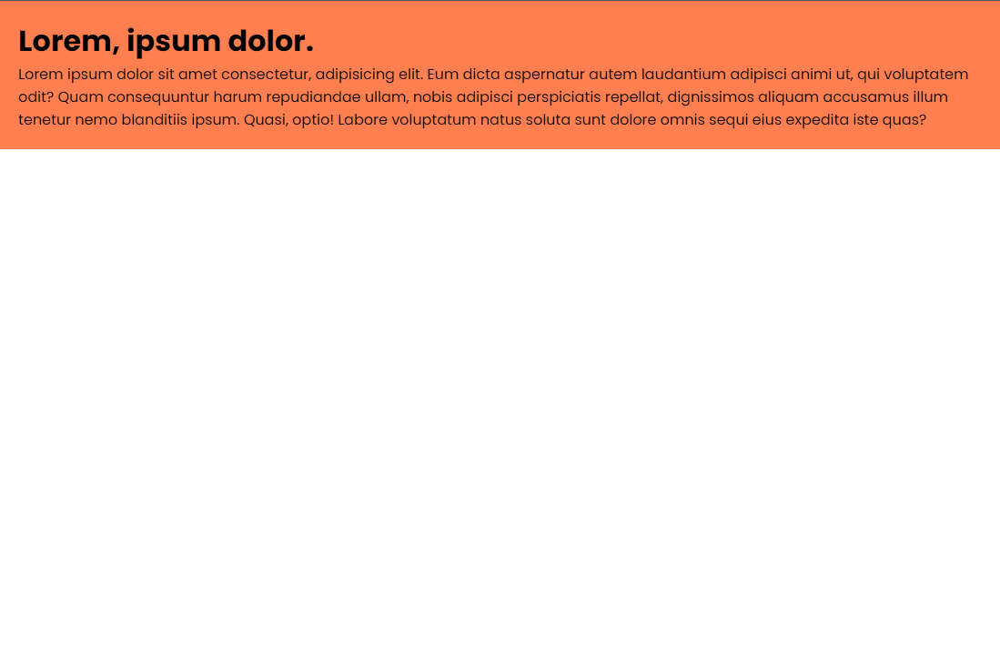
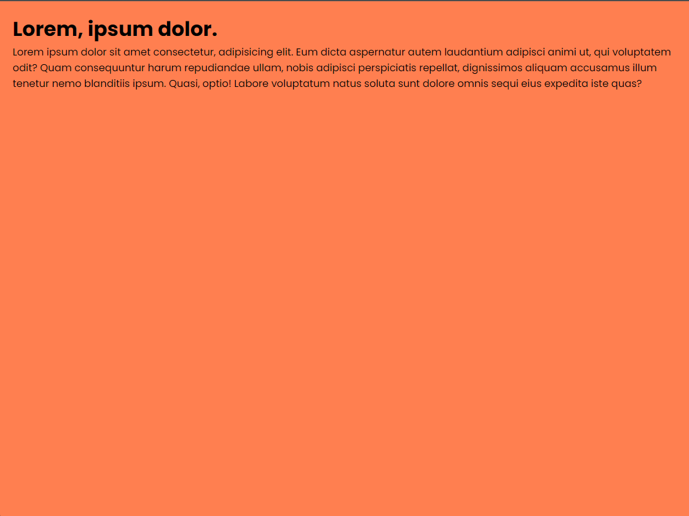
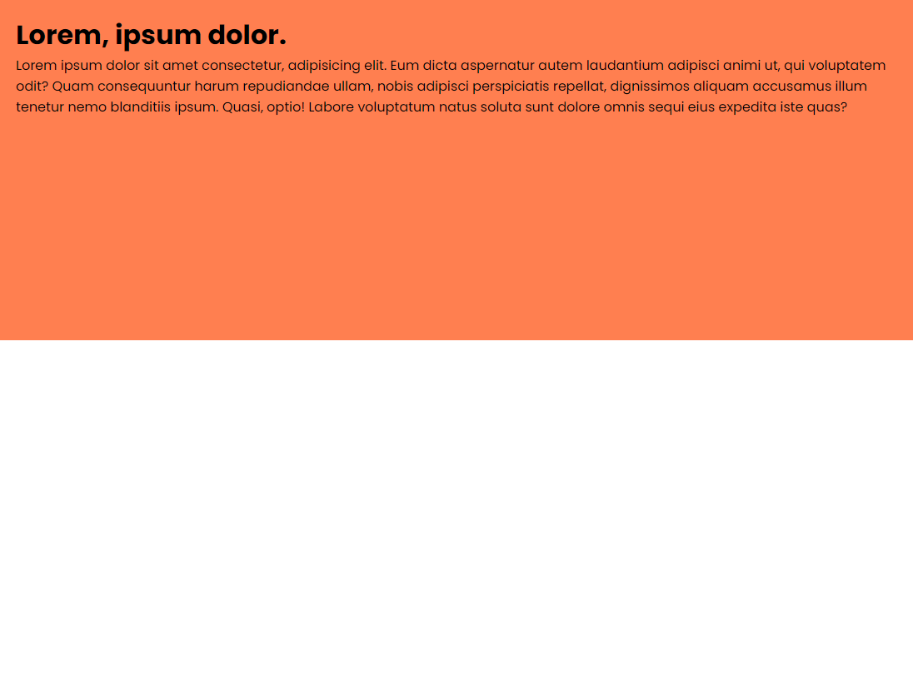
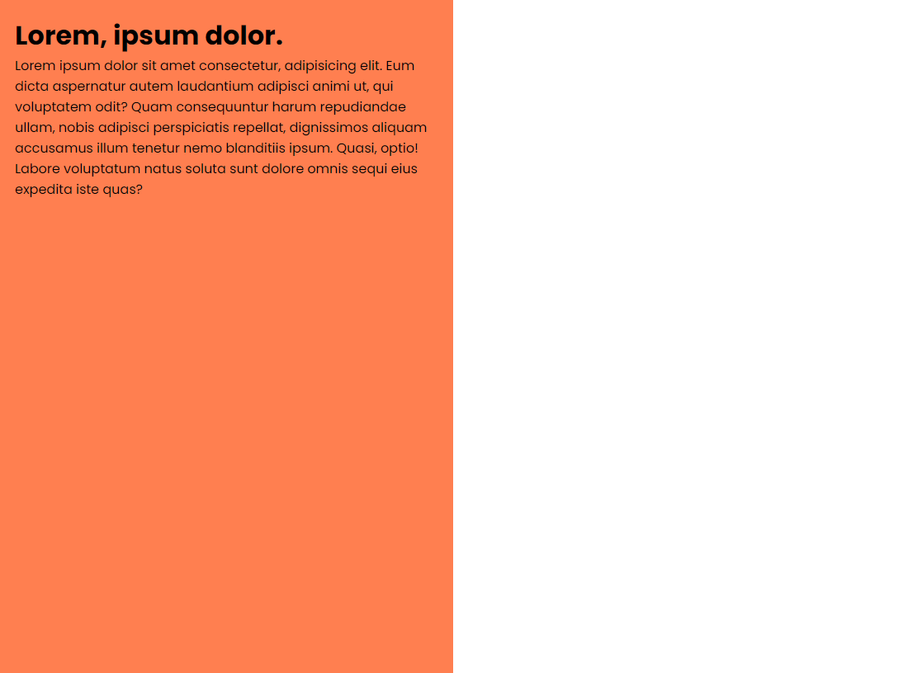

`vh` & `vw` Units

In the last lesson, we looked at `em` and `rem` units and how they can be used to make our text responsive. In this lesson, we will learn about `vh` and `vw` units, which stand for** viewport height** and **viewport width**, respectively.

## `vh` Unit

The `vh` unit is equal to 1% of the height of the viewport. If the viewport is `1000px` tall, `1vh` is equal to `10px`. If the viewport is `500px` tall, `1vh` is equal to `5px`. An easy way to think about it is to look at the height and width in `slices`. There are 100 slices across for the `vh` unit and 100 slices down for the `vw` unit. If you specify `50vh`, it will be 50 of the 100 slices down.

Let's use the following HTML:

```html
<div class="container">
  <h1>Lorem, ipsum dolor.</h1>
  <p>
    Lorem ipsum dolor sit amet consectetur, adipisicing elit. Eum dicta
    aspernatur autem laudantium adipisci animi ut, qui voluptatem odit? Quam
    consequuntur harum repudiandae ullam, nobis adipisci perspiciatis repellat,
    dignissimos aliquam accusamus illum tenetur nemo blanditiis ipsum. Quasi,
    optio! Labore voluptatum natus soluta sunt dolore omnis sequi eius expedita
    iste quas?
  </p>
</div>
```

and the following CSS:

```css
* {
  margin: 0;
  padding: 0;
  box-sizing: border-box;
}

body {
  font-family: 'Poppins', sans-serif;
}

.container {
  background: coral;
  padding: 20px;
}
```

We get this result:



The background color of the container is only as tall as the content inside it.

Let's set the height of the container to `100vh`:

```css
.container {
  background: coral;
  padding: 20px;
  height: 100vh;
}
```

Now the container is `100vh` tall and takes up all of the viewport height (all of the 100 slices).



If we set the height to `50vh`, the container will be `50` of the 100 slices down:

```css
.container {
  background: coral;
  padding: 20px;
  height: 50vh;
}
```



## `vw` Unit

The `vw` unit is equal to 1% of the width of the viewport. So it is the same thing as the `vh` unit, but for the width.

By default, the width of the container is `100%` of the viewport width. If we set the width to `50vw`, the container will be `50` of the 100 slices across.

Let's add the following:

```css
.container {
  background: coral;
  padding: 20px;
  height: 100vh;
  width: 50vw;
}
```

Now, the container is `100vh` tall and `50vw` wide.



## Difference between vh/vw and % Units

The difference between `vh`/`vw` and `%` units is that `vh`/`vw` units are always relative to the viewport, while `%` units are relative to the parent element.

Try and change the height of the container to `100%`:

```css
.container {
  background: coral;
  padding: 20px;
  height: 100%;
  width: 50vw;
}
```

The container will only be as tall as the content inside it, because the parent element is the body, which is only as tall as the content inside it. In order for the `100%` height to work, the parent element must have a height to be 100% of.

The reason that `100vh` works is because the viewport is the parent element of the container, and the viewport always has a height regardless of the height of ancestor elements.
