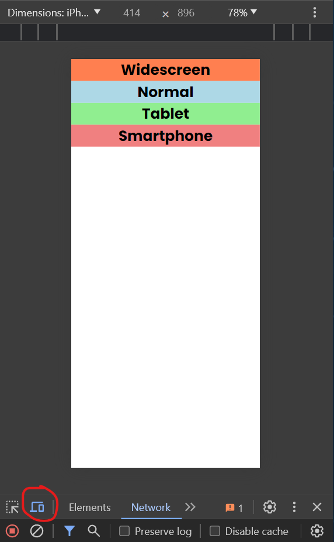
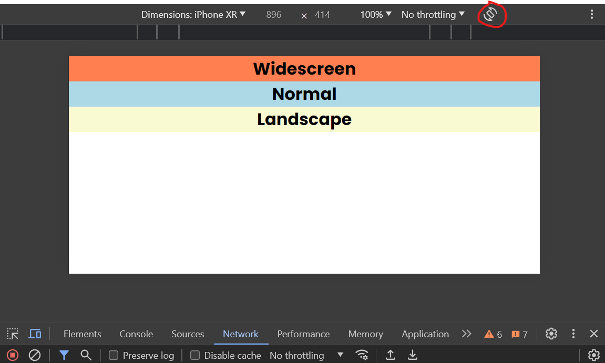

# Media Queries

Now we are going to get into the most important part of responsive design: media queries.

Media queries allow us to apply different styles for different screen sizes/devices. So you can have a different layout for desktop, tablet, and mobile.

Let's use the following HTML:

```html
<div class="widescreen"><h1>Widescreen</h1></div>
<div class="normal"><h1>Normal</h1></div>
<div class="tablet"><h1>Tablet</h1></div>
<div class="smartphone"><h1>Smartphone</h1></div>
<div class="landscape"><h1>Landscape</h1></div>
<div class="height"><h1>Height</h1></div>
```

Let's add a reset. font and initially set the `display` property of all the divs to `none`. We will also align the text to the center.

```css
* {
  margin: 0;
  padding: 0;
  box-sizing: border-box;
}

body {
  font-family: Arial, sans-serif;
}

div {
  display: none;
  text-align: center;
}
```

## Media Queries Syntax

The syntax for media queries is the following:

```css
@media screen and (max-width: 600px) {
  /* CSS rules */
}
```

The `@media` rule is used to define different style rules for different media types/devices. In this case, we are targeting the screen. you can also target `print`, `speech`, etc. Print would be for printing the page, and speech would be for screen readers, `all` is the default, so you can omit it if you do not need to target a specific media type.

The `and` keyword is used to combine different media features. In this case, we are combining the `screen` media type with the `max-width` feature.

Some other options for media features are:

- `min-width`: The minimum width of the viewport.
- `max-width`: The maximum width of the viewport.
- `orientation`: The orientation of the viewport. It can be `portrait` or `landscape`.

You may also see the word `only` before the media type. This is used to hide the styles from older browsers that do not support media queries.

```css
@media only screen and (max-width: 600px) {
  /* CSS rules */
}
```

It is not necessary to use it. In fact, the only thing that you need is the `@media` rule.

## Media Queries Example

Let's apply different styles for different screen sizes. Let's start with the widescreen layout:

```css
/* Widescreen */
@media screen and (max-width: 1200px) {
  .widescreen {
    display: block;
    background: coral;
  }
}
```

We are using a breakpoint of `1200px` to target the widescreen layout. We are setting the `display` property to `block` and changing the background color to `coral` if the screen width is less than `1200px`.

Once you hit `1200px`, the `display` property will be set to `none` again.

I don't commonly use 1200px with max-width because it is such a wide breakpoint and anything I want on 1200px, I would want on screens larger than that as well.

## Max Width vs Min Width

Wether you use `max-width` or `min-width` depends on your design. Some people like to develop for mobile first, so they use `min-width`. Others like to develop for desktop first, so they use `max-width`. I am more of a desktop-first person, so I tend to use `max-width`. You'll find your own preference as you develop more.

With desktop-first, you start with the desktop layout and then add media queries to adjust the layout for smaller screens. With mobile-first, you start with the mobile layout and then add media queries to adjust the layout for larger screens.

When you use `max-width`, you are targeting the maximum width of the viewport. So the styles will be applied to all screen sizes less than the specified width. This minimizes the number of media queries you need to write because if you want some of the same styles on a smartphone and tablet, you can just use a breakpoint of something like `768px` and the styles will be applied to both. This is often the case as you'll see as we create more layouts.

As far as breakpoints go, there is no right or wrong answer. You can use the ones that make sense for your design. Some common breakpoints are:

- `576px`: Smartphone
- `768px`: Tablet
- `992px`: Desktop
- `1024px`: Desktop & Tablet landscape
- `1200px`: Desktop widescreen

Let's add styles for the normal layout and under:

```css
/* Normal */
@media screen and (max-width: 992px) {
  .normal {
    display: block;
    background: lightblue;
  }
}
```

Since we used `max-width: 992px`, the styling will be applied to all screen sizes less than `992px`.

Let's add styles for the tablet layout:

```css
/* Tablet */
@media screen and (max-width: 768px) {
  .tablet {
    display: block;
    background: lightgreen;
  }
}
```

Let's add styles for the smartphone layout:

```css
/* Smartphone */
@media screen and (max-width: 576px) {
  .smartphone {
    display: block;
    background: lightcoral;
  }
}
```

You can use the device toolbar in Chrome DevTools to test the different layouts. It is the icon with the phone and tablet in the top left corner of the DevTools.



Let's add styles for the landscape layout:

```css
/* Orientation */
@media screen and (orientation: landscape) {
  .landscape {
    display: block;
    background: lightgoldenrodyellow;
  }
}
```

Click the orientation icon in the device toolbar to change the orientation.



We can also set a min or max height, just as we can width. This is not usually as common as width, but it can be useful in some cases.

```css
/* Height */
@media screen and (max-height: 500px) {
  .height {
    display: block;
    background: lightseagreen;
  }
}
```

## Logical Operators

We can also use logical operators to combine media features. We saw the `and` operator when we combined the `screen` media type with the `max-width` feature.

### And

We can also use the `and` operator to combine multiple media features. For example, we can target a specific height/width and orientation:

```css
@media (max-height: 500px) and (orientation: landscape) {
  /* CSS rules */
}
```

or we can test for a range of values:

```css
@media (min-width: 576px) and (max-width: 768px) {
  /* CSS rules */
}
```

### Or

We can also use the `or` operator to apply styles if any of the conditions are met. I don't use this as often as `and`, but it can be useful in some cases.

```css
@media (max-width: 576px) or (min-width: 1200px) {
  /* CSS rules */
}
```

### Not

We can also use the `not` operator to apply styles if the condition is not met. This is useful if you want to apply styles to all screen sizes except for a specific one.

```css
@media not (max-width: 576px) {
  /* CSS rules */
}
```
