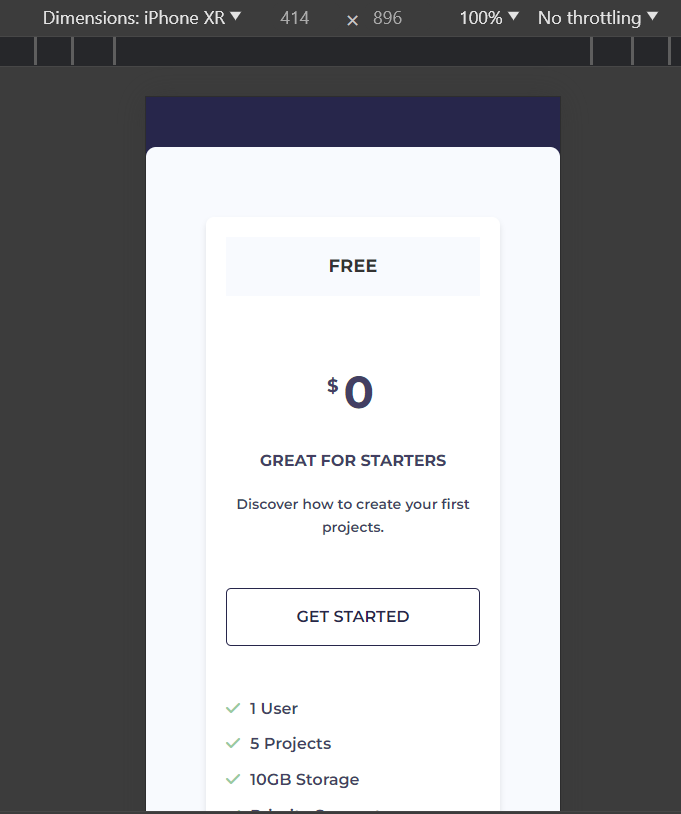
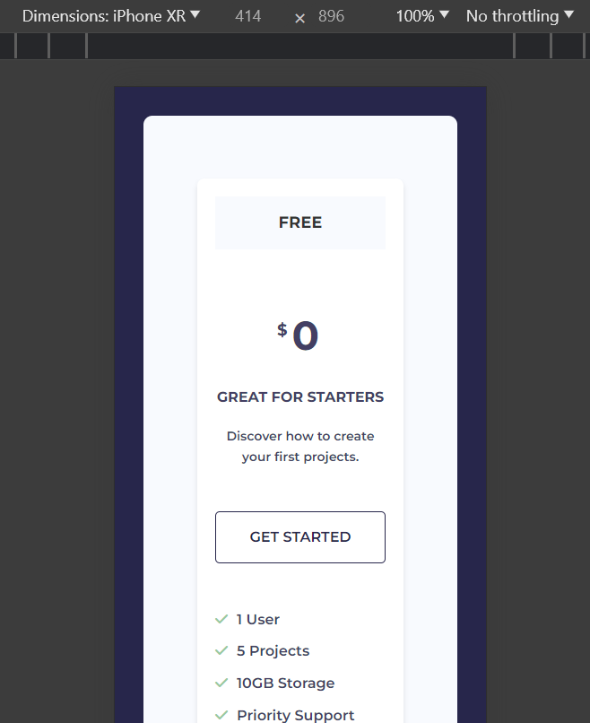
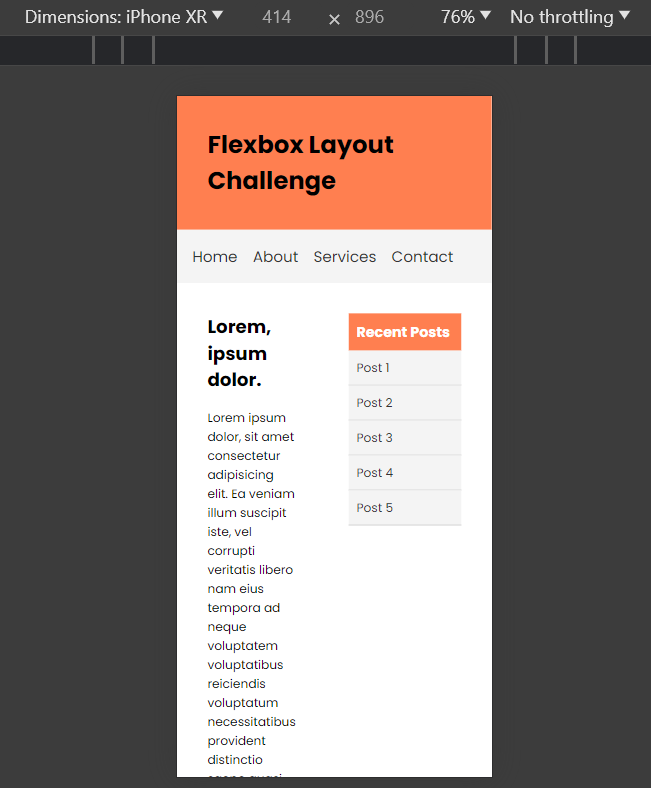
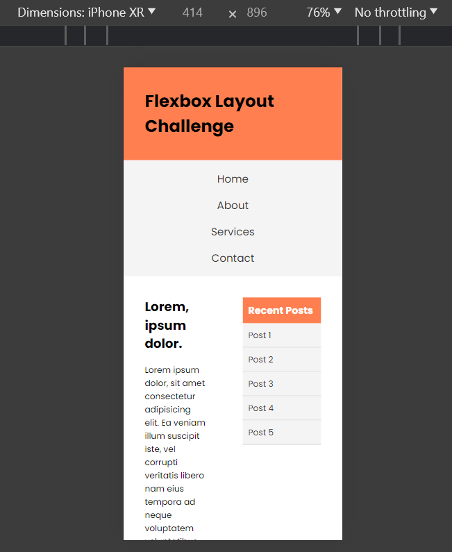
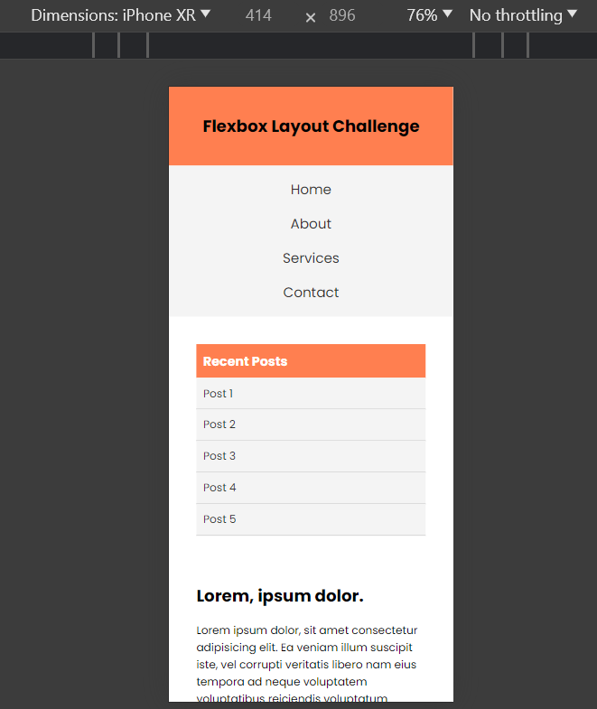

# Media Queries & Flexbox

When you combine media queries with Flexbox, you can create responsive layouts that adapt to different screen sizes. In this lesson, you will learn how to use media queries to change the layout of a webpage based on the screen size.

Let's take the flexbox layout challenge project and the pricing grid project and let's make them responsive with media queries.

The code will be in the sandbox for this section/lesson.

## Pricing Grid

We will start with the pricing grid project. As it is, it is somewhat responsive because we used flex-wrap to wrap the items when the screen size is smaller. In fact, if you use the device toolbar, you'll see that the cards wrap to the next line on really small smartphone screens.

If you select the "iPad" option or you make the browser a little smaller than 768px, they are not stacked. So let's make them stack on top of each other when the screen size is less than `768px`.

There are a few ways to do this.

The first way is to set the direction on the flex container from row to column when the screen size is less than a certain width. This will make the items stack on top of each other.

Let's add a media query to change the direction of the flex container to column when the screen size is less than `768px`:

```css
@media (max-width: 768px) {
  .pricing {
    flex-direction: column;
  }
}
```

That's it. Now the cards are stacked in a single column when the screen size is less than `768px`.



You may also want to add some margin to the container so that it is not touching the edges of the screen:

```css
@media (max-width: 768px) {
  .container {
    margin: 2rem;
  }

  .pricing {
    flex-direction: column;
  }
}
```



Another way you could do this is set the `display` property to `block` when the screen size is less than `768px`. This will make the items stack on top of each other as well:

```css
@media (max-width: 768px) {
  .pricing {
    display: block;
  }
}
```

A third way would be to set the `flex-basis` property of the actual flex items to `100%`:

```css
.card {
  flex: 1 1 100%;
}
```

All three of these methods will make the cards stack on top of each other when the screen size is less than `768px`.

## Flexbox Layout 

Now let's make the flexbox layout challenge project responsive.

Right now, if we use the device toolbar, it looks like this on mobile:



There are 2 issues. First, the navbar looks ok, however, if we added one more item to the navbar, it would overflow. Second, the items in the main content are not centered. Let's fix that.

With navbars, it is common to have a hamburger menu on mobile devices. That usually takes a bit of JavaScript and additional CSS to show and hide the menu. We will cover this later, but for now, let's just stack the items.

Let's add a media query to stack and center the items in the navbar when the screen size is less than `768px`:

```css
@media (max-width: 768px) {
  .main-menu {
    flex-direction: column;
    text-align: center;
  }
}
```

It doesn't look that great, but at least if we add more items, they won't overflow.



you may also want to make the header heading smaller and center it:

```css
@media (max-width: 768px) {
  .header h1 {
    font-size: 1.5rem;
    text-align: center;
  }

  .main-menu {
    flex-direction: column;
    text-align: center;
  }
}
```

For the main section, we can add the following:

```css
@media (max-width: 768px) {
  .main {
    flex-direction: column;
  }
}
```

This will stack, but the aside menu is on the bottom by default. We can change that by using `column-reverse`:

```css
@media (max-width: 768px) {
  .main {
    flex-direction: column-reverse;
  }
}
```

You could also use the `order` property.

The menu still looks off-center because it has a fixed width of 300px. Let's change it to 100%:

```css
@media (max-width: 768px) {
  .main aside {
    width: 100%;
  }
}
```

Now it should look like this:



Again, this is desktop-first. This is what makes the most sense to me, but in the next lesson, we will do a mobile-first approach.
