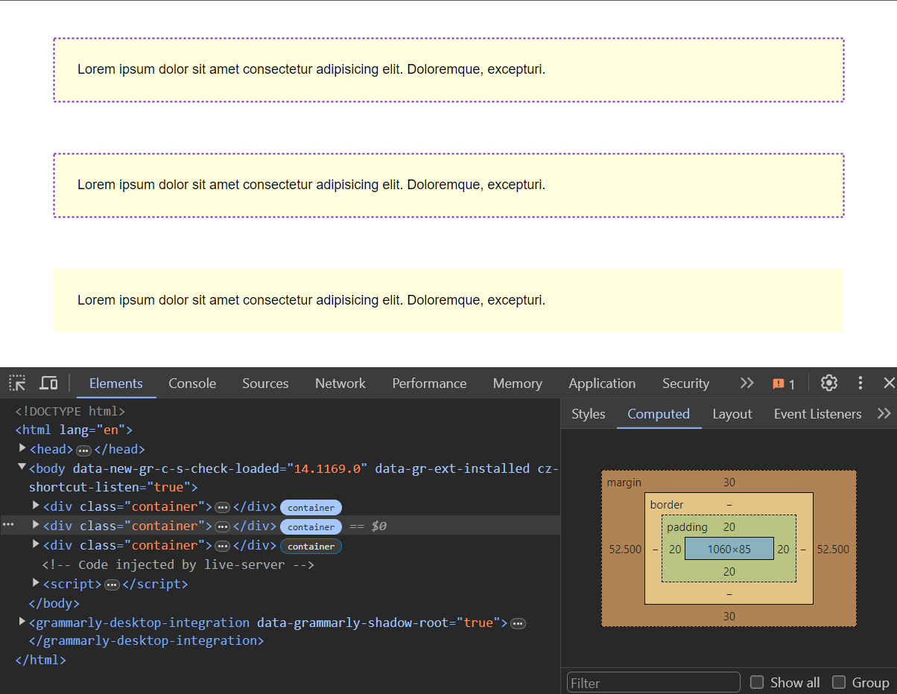

# Container Queries

Media queries have been around forever, but they have one major limitation: they are based on the viewport size. A container query is a media query that is based on the size of the container that the element is in. This is a newer feature of CSS but it is now supported in all of the major modern browsers. I'm not counting IE as a major browser. I made the decision to stop paying attention to IE a long time ago.

I personally am fairly new to container queries, but I think they're great and help us create more modular and reusable components. They will also allow us to create more responsive designs with less code. We aren't going to use them too much in this course because this is a fundamentals course and I want to keep it simple and have you really understand the necessary concepts. But I wanted to introduce you to them so you know they exist.

Let's use the following HTML to demonstrate container queries:

```html
<main>
  <p>
    Lorem ipsum dolor sit amet consectetur adipisicing elit. Doloremque,
    excepturi.
  </p>
</main>
```

Let's add some CSS:

```css
* {
  margin: 0;
  padding: 0;
  box-sizing: border-box;
}

body {
  font-family: Arial, sans-serif;
  font-size: 18px;
}

p {
  padding: 2rem;
}

main {
  max-width: 1100px;
  margin: 30px auto;
  padding: 20px;
}

main p {
  background: lightyellow;
}
```

So we have some base styling and we set the main element to have a max-width of 1100px. We also set the paragraph to have a background color of light yellow.

## `container-type`

We can use the `container-type` property to create a container from the `<main>` element. The possible values are `size` and `inline-size`. The `size` value takes into account both the width and height of the container. The `inline-size` value takes into account the width of the container. You are most likely going to use the `inline-size` value most of the time.

Let's set the following CSS:

```css
main {
  container-type: inline-size;
  max-width: 1100px;
  margin: 30px auto;
  padding: 20px;
}
```

If you look in the devtools, it actually marks the element as a container and you can click to see the outline of it:



Again, `inline-size` pertains only to the width and the height is up to the content. If you want to take into account both the width and height, you can use `size`. You'll notice if you change it to `size`, the container will basically collapse to 0px because it is now taking into account the height as well, which we haven't set. Most of the time, you are not setting a height on a container, so you will most likely use `inline-size`.

## `@container` Rule

Now, we can create the actual container rule for the query. Let's say we want to change the background color of the paragraph to lightblue when the container is less than 992px wide. We can do this by using the `@container` rule:

```css
@container (max-width: 992px) {
  main p {
    background: lightblue;
  }
}
```

It is formatted just like a media query but it is based on the container size as opposed to the viewport size.

When your container is resized to less than 992px, the background color of the paragraph will change to light blue.

Let's add two more:

```css
@container (max-width: 768px) {
  main p {
    background: lightgreen;
  }
}

@container (max-width: 576px) {
  main p {
    background: lightcoral;
  }
}
```

Now you will see the background color change as you resize the container.

If you were to set a strict `width` of 1100px on the main/container, the container query would not work because the container would never be less than 1100px wide. So you need to use `max-width` or `width: 100%` for the container query to work.

## Container Names

You can also name your containers. This is useful if you have multiple containers and you want to target a specific one.

To demonstrate, we are going to change up the layout a bit and add a sidebar.

First, let's move the containers that we have now into a `<main>` element:

```html
<main>
  <p>
    Lorem ipsum dolor sit amet consectetur adipisicing elit. Doloremque,
    excepturi.
  </p>
</main>
<aside>
  <p>
    Lorem ipsum dolor sit amet consectetur adipisicing elit. Doloremque,
    excepturi.
  </p>
</aside>
```

I want them side by side, so let's make the body a flexbox, since it only has the main and aside elements:

```css
body {
  //...
  display: flex;
}
```

Let's line up the main and aside elements side by side and make the main container 100%:

```css
main {
  container-type: inline-size;
  width: 100%;
  padding: 20px;
  flex: 1;
}

aside {
  flex: 0 0 30%;
  background: #f4f4f4;
  padding: 1rem;
}
```

Now we have the main content and the sidebar.

Let's say that I want to make the sidebar it's own container and I want to target it specifically. I can do this by naming the container.

```css
aside {
  //...
  container-type: inline-size;
  container-name: aside;
}
```

Now, I can create my container query for the sidebar. Let's say I want the paragraph to be lightgreen if the sidebar is less than 310px wide:

```css
@container aside (max-width: 310px) {
  aside p {
    background: lightgreen;
  }
}
```

Now, when you resize the sidebar, the background color of the paragraph will change to light green.
