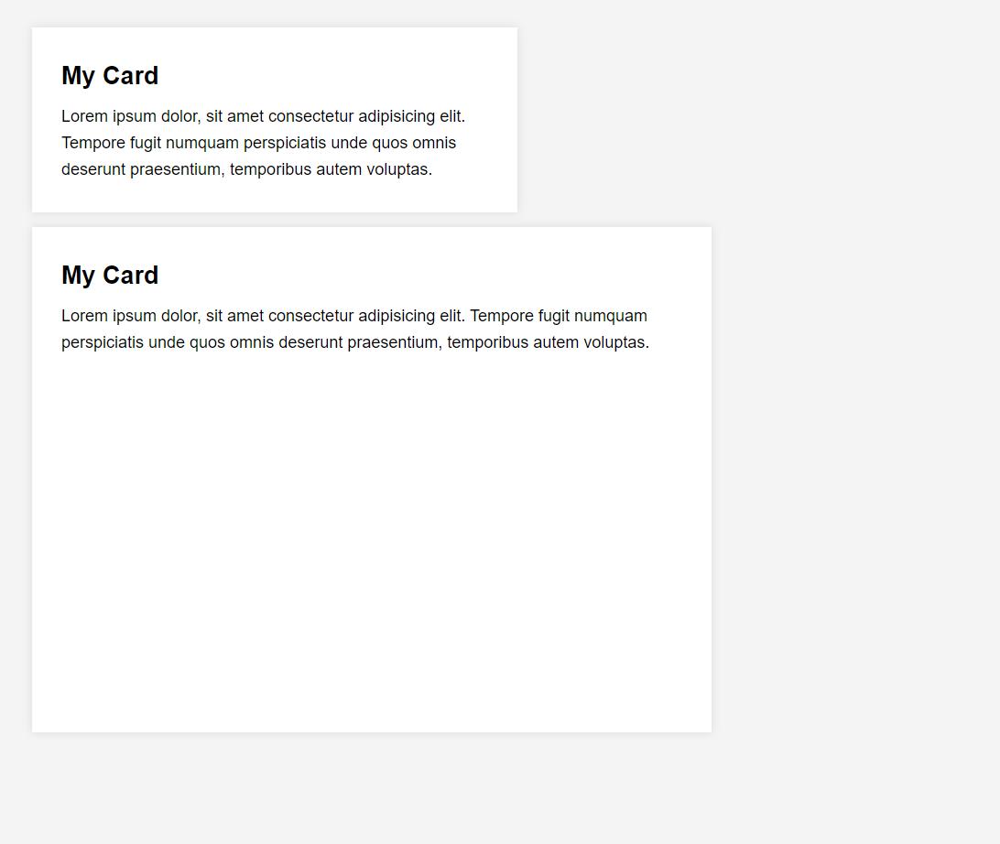

# Container Units

Another thing I want to look into is container units. These are units that are based on the size of the container. They work just like viewport units, but instead of being based on the size of the viewport, they are based on the size of the container.

We can use the `cqw` unit for width and the `cqh` unit for height. Let's try it out.

Let's use this HTML:

```html
<main>
  <div class="card">
    <h2>My Card</h2>
    Lorem ipsum dolor, sit amet consectetur adipisicing elit. Tempore fugit
    numquam perspiciatis unde quos omnis deserunt praesentium, temporibus autem
    voluptas.
  </div>

  <div class="card">
    <h2>My Card</h2>
    Lorem ipsum dolor, sit amet consectetur adipisicing elit. Tempore fugit
    numquam perspiciatis unde quos omnis deserunt praesentium, temporibus autem
    voluptas.
  </div>
</main>
```

And the base CSS:

```css
* {
  margin: 0;
  padding: 0;
  box-sizing: border-box;
}

body {
  font-family: Arial, sans-serif;
  font-size: 18px;
  line-height: 1.6;
}

p {
  padding: 2rem;
}

main {
  max-width: 1100px;
  margin: 0 auto;
  padding: 20px;
  background: #f4f4f4;
}
```

Let's make the `main` element a container:

```css
main {
  container-type: inline-size;
  //...
}
```

Let's style the `.card` elements:

```css
.card {
  background: #fff;
  padding: 2rem;
  margin: 1rem;
  box-shadow: 0 0 10px rgba(0, 0, 0, 0.1);
}

.card h2 {
  margin-bottom: 0.5rem;
}
```

Let's say that we want the cards to take up 50% of the width of the container. We can use the `cqw` unit for this:

```css
.card {
  //...
  width: 50cqw;
}
```

So it is just like using the `vw` unit, but it is based on the size of the container.

Let's make the second card 70% of the width of the container:

```css
.card-2 {
  width: 70cqw;
}
```

We can also use the `cqh` unit for height. Let's make the container a `size` container and set the height to 100vh:

```css
main {
  container-type: size;
  height: 100vh;
  max-width: 1100px;
  margin: 0 auto;
  padding: 20px;
  background: #f4f4f4;
}
```

Now let's make the second card 50% of the height of the container:

```css
.card-2 {
  height: 50cqh;
  width: 70cqw;
}
```



We can also set a container query to make both cards to take 95% of the width of the container when the container is less than 600px:

```css
@container (max-width: 600px) {
  .card,
  .card-2 {
    width: 95cqw;
  }
}
```
