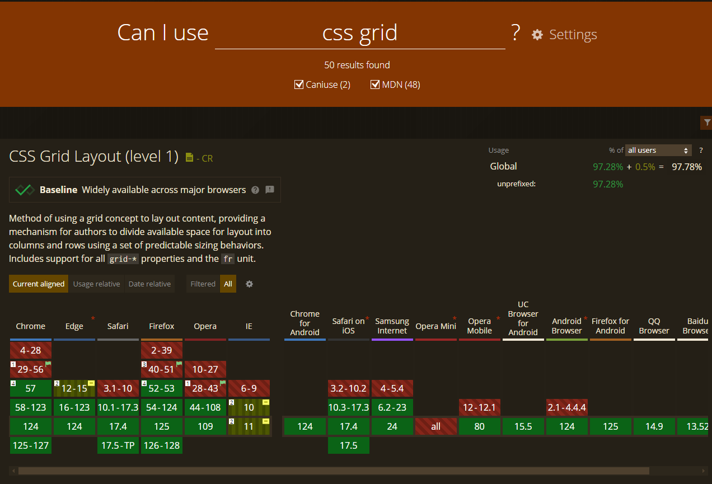

# Vendor Prefixes

You may have come across some CSS properties that have a `-webkit-`, `-moz-`, or `-ms-` prefix. These are called vendor prefixes. They are used to add support for new and experimental features in browsers that are still in development.

- `-webkit-` (Chrome, Safari, newer versions of Opera and Edge, almost all iOS browsers including Firefox for iOS; basically, any WebKit or Chromium-based browser)
- `-moz-` (Firefox)
- `-o-` (old pre-WebKit versions of Opera)
- `-ms-` (Internet Explorer and Microsoft Edge, before Chromium)

## caniuse.com

You can find out which properties need prefixes by checking [Can I Use](https://caniuse.com/). For instance you can type in "CSS Grid" and see which properties need prefixes. The grid is supported in all modern browsers, but you can see IE 6-9 it is not supported and it is partially supported in IE 10 and 11.

## Do You Need Them?

Back in the day, we needed them a lot more than now. I still remember using them for things like border-radius, box-shadow, and gradients. But now, most of the time, you don't need to worry about them because the browsers are pretty good at keeping up with the latest features and browsers now use flags for experimental features.

 The CSS specification has been split into several modules that are all actively developed by the CSSWG (CSS Working Group) and the W3C. This allows for more rapid development and iteration of the language, and it also allows for browser vendors to implement features as they are ready, rather than waiting for the entire specification to be complete.

As far as the fundamentals that you learn in this course, you won't need to worry about vendor prefixes. But if you are using some of the cutting edge features, you may need to add them.

There is a website at https://shouldiprefix.com/ that will tell you if you need to add prefixes to your CSS. You can search for a property and it will tell you if you need to add prefixes.

## Auto Prefixer

There are also tools that you can use to automatically add prefixes to your CSS. One of the most popular is [Auto Prefixer](https://autoprefixer.github.io/). You can paste your CSS in there and it will add the prefixes for you. You can also use it as a plugin in your build process but that is beyond the scope of this course.
