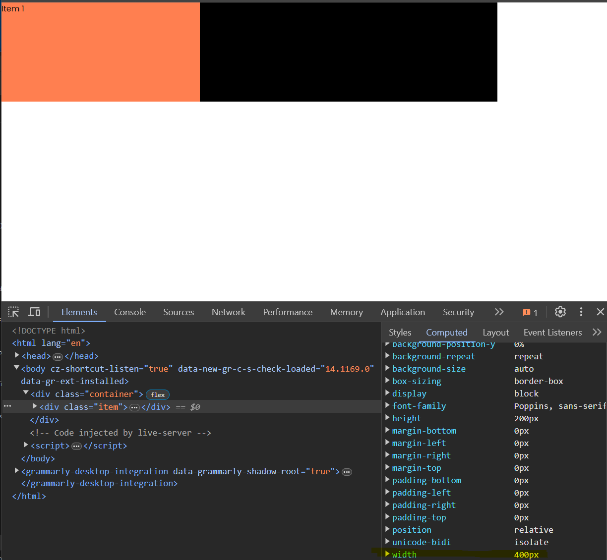
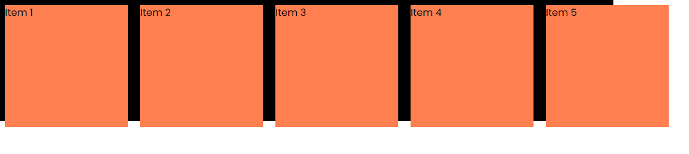
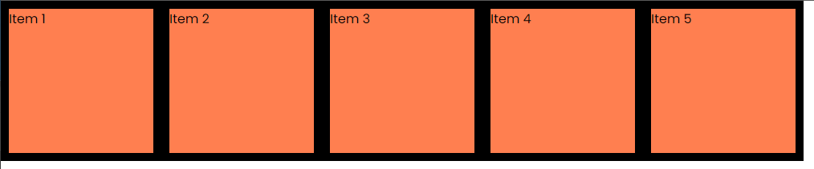

# calc() Function

The `calc()` function in CSS is used to perform calculations to determine the value of a property. It can be used to calculate lengths, percentages, and other values. This can be very useful for responsive design or for applying dynamic styles based on certain conditions.

Let's start with the following HTML:

```html
<div class="container">
  <div class="item"><p>Item 1</p></div>
</div>
```

And the following base CSS:

```css
* {
  margin: 0;
  padding: 0;
  box-sizing: border-box;
}

body {
  font-family: 'Poppins', sans-serif;
}

* {
  margin: 0;
  padding: 0;
  box-sizing: border-box;
}

body {
  font-family: 'Poppins', sans-serif;
}

.container {
  position: relative;
  display: flex;
  width: 1000px;
  height: 200px;
  background: #000;
}

.item {
  position: relative;
  height: 200px;
  background: coral;
}
```

We can use the `calc()` function to calculate the width of the `.item` element. Let's say we want the `.item` element to take up 50% of the width of the `.container` element minus 100px. We can use the following CSS:

```css
.item {
  //..
  width: calc(50% - 100px); // 50% - 100px (400px)
}
```

Now the `.item` element will take up 50% of the width of the `.container` element minus 100px, which in this case, is 400px.

You can open the devtools and click on the `Computed` tab to see the calculated width of the `.item` element.



One thing that is important to remember is that you need to have spaces around the `+`, `-`, `*`, and `/` operators in the `calc()` function. For example, this will not work:

```css
.item {
  //..
  width: calc(50%-100px); // This will not work
}
```

It doesn't have to be percentages and pixels. We could do something like this:

```css
.item {
  //..
  width: calc(100% - 2rem); // 100% - 32px (968px)
}
```

That brings the width to 100% minus 2rem, which in this case is 968px because 2rem is 32px unless the root font size is changed.

We could use 2 pixel units

```css
.item {
  //..
  width: calc(300px - 100px); // 200px
}
```

## calc() With Custom Properties

We can also use the `calc()` function with custom properties. Let's say we have the following custom properties:

```css
:root {
  --container-width: 1000px;
}

.container {
  //..
  width: var(--container-width);
}

.item {
  //..
  width: calc(var(--container-width) / 2);
}
```

## Useful Example

So this is cool and all, but why would we want to use this? Let's look at a more useful example.

Add some more items to the container:

```html
<div class="container">
  <div class="item"><p>Item 1</p></div>
  <div class="item"><p>Item 2</p></div>
  <div class="item"><p>Item 3</p></div>
  <div class="item"><p>Item 4</p></div>
  <div class="item"><p>Item 5</p></div>
</div>
```

Set the `.item` to the following styles:

```css
.item {
  position: relative;
  min-width: 200px;
  height: 200px;
  background: coral;
  margin: 10px;
}
```



We know the container is 1000px wide, and we have 5 items so we set each of the 5 items to be 200px wide and 200px height. However, we want to add a margin of 10px around all of the items, which now causes them to break out of the container. This is where the `calc()` function comes in.

```css
.item {
  //..
  min-width: calc(calc(100% / 5) - 20px);
}
```

Now they fit width--wise with the margin included. We could change the container width, and the items would still fit. Now the height is off, but we could use `calc()` for that as well.

```css
.item {
  //..
  height: calc(100% - 20px);
}
```

Now the items will always fit within the container, no matter the size.



This is a simple example, but you can see how powerful the `calc()` function can be when used correctly.
