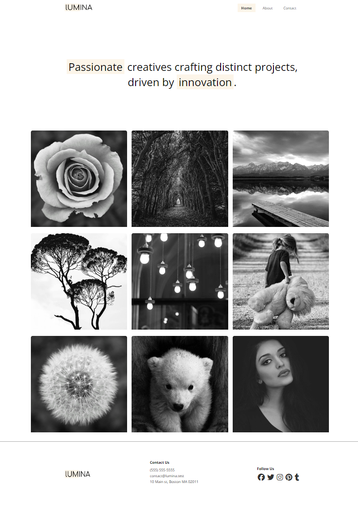

# Introduction

Now that we have learned most of the fundamentals of CSS along with flexbox, I want to finally create a real website. We will be creating a minimalistic portfolio website for a fictional design and photography company called Lumina Creative. This will be a simple website with a few pages. We will be using HTML, CSS, and a small JavaScript library for image lightboxes.

This website will consist of 3 pages:

1. Home
2. About
3. Contact

All pages will have the header with navigation, a hero section with a slogan and a footer.

The homepage will have a gallery of photos. We will be using flexbox to align everything. The gallery images will also open a lightbox when clicked. This will take a JavaScript library, but it is very simple to implement and you can use it for your own projects.

The about page will have a section for services as well as some photos of the team. We will use flexbox to align everything.

The contact page will have a reverse hero section with a contact form.

We will be pushing the project to Github and deploying it to Netlify.

Let's get started!
