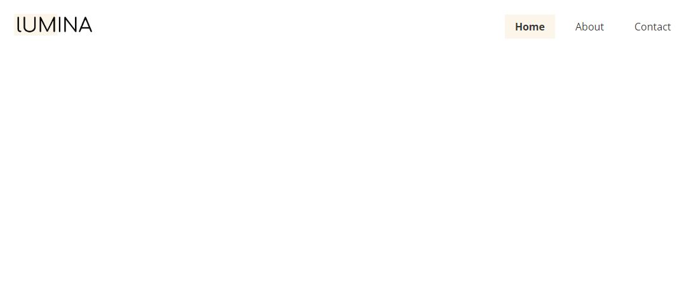
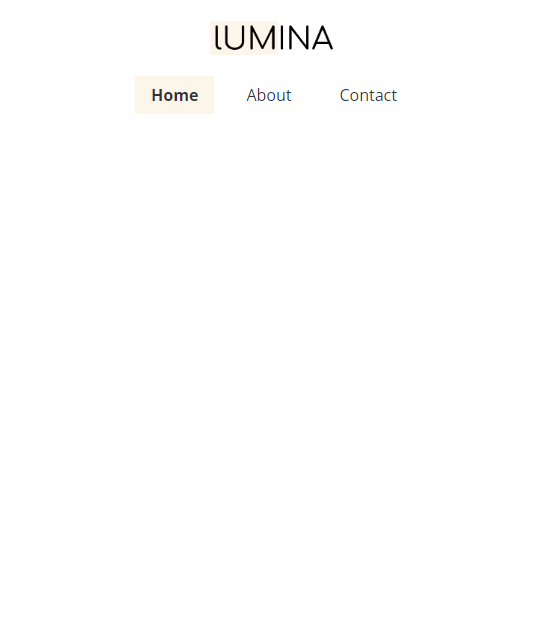

# Header & Navigation

We are going to work top to bottom, so the first thing to do is the header and navigation. We will first do the HTML and then move to the CSS to style everything.

## HTML

Add the following to the body of the `index.html` file:

```html
<header class="header">
  <div class="container container-sm header-flex">
    <div class="logo"></div>
    <ul class="main-menu">
      <li><a href="index.html" class="current">Home</a></li>
      <li><a href="about.html">About</a></li>
      <li><a href="contact.html">Contact</a></li>
    </ul>
  </div>
</header>
```

Let's go over this markup.

We wrap everything in a `<header>` tag. This is to make it semantic. Always use semantic tags over divs when it makes sense. I gave it a class because we should use a class selector in the CSS rather than just the tag itself, because you may use `<header>` somewhere else.

Next, we have a `.container` class. The container is a utility class to move the content to the middle and give it a width.

I added a class of `.header-flex` because I want this `div` to be a flexbox container with the two flex items (logo and ul). We could put the `display:flex` on the container, but I like the container to be strictly for the width, margin and maybe some padding.

In the container/flex div, we have a div with the class of `.logo`. In that is the image. I like to wrap images in a div. That's just my preference. We don't have to though.

Then we have the navigation, which is a `ul` tag with three list items with links to the other pages.

## CSS

Now, let's style this markup.

### Container

Add the following to the `styles.css` file:

```css
/* Utility Classes */

/* Container */
.container {
  max-width: 1100px;
  margin: 0 auto;
  padding: 0 1.5rem;
}

.container-lg {
  max-width: 1400px;
}

.container-sm {
  max-width: 900px;
}
```

This is something that I like to do sometimes. That is have multiple container widths. You may want some areas to be wider than others. They will always have the `.container` class, but you can add an additional one to widen or narrow the width. The main container has a max-width of `1100px`. The margin will move it to the middle. I also added some padding on the sides so that when on small screens, it is not up against the edges.

We are going to use `rem` units for most things in this project. It makes the text that much more responsive. `1.5rem` in this case is `24px` because the root `html` element is 16px by default and `16 * 1.5 = 24`.

I put a comment because this is where all of our utility classes will go. These are classes that you can use all around the website and not just in a single section.

### Header Flex

Now, we want to align the header. We want the logo on the left and the menu on the right with all of the remaining space in between.

```css
/* Header */
.header-flex {
  margin: 1.5rem auto;
  display: flex;
  justify-content: space-between;
  align-items: center;
}
```

I want to keep the margin on the left and right as `auto` but I do want some margin on the top and bottom to give it some space.

We use `display: flex` to make it a flex container. We also put any existing space in between the 2 elements, moving them to each side. We aligned the items center vertically with `alilgn-items: center`. Remember, when it is a flex row (default), `justify-content` is horizontal (main axis) and `align-items` is vertical (cross axis).

### Logo

Let's shrink that image down:

```css
.logo img {
  width: 130px;
}
```

### Main Menu

Now we want to align the menu items horizontally. We can do that with flexbox:

```css
/* Main Menu */
.main-menu {
  display: flex;
  gap: 1rem;
}
```

Let's add some padding to the links and we will have a background color on hover and for the active link:

```css
.main-menu a {
  padding: 0.5rem 1rem;
}

.main-menu a:hover {
  background: #fcf5e9;
}

.main-menu .current {
  background: #fcf5e9;
  font-weight: 600;
}
```

It should look like this:



## Responsiveness & Media Query

Right now, the header/navigation looks ok on small screens only because we have very few links. However, I want to move the navigation below the logo on small screens so that we can add more links if needed.

Now in most cases, responsive menus will use some kind of hamburger menu that you click and then the items slide in. That takes some JavaScript. I will show you how to do that later. I just don't want to on our first big project.

I want this layout to kick in when the screen/viewport is below `768px`. So it will activate on most tablets and all smartphones. Let's add the following to the CSS:

```css
/* Screens less than 768px */
@media screen and (max-width: 768px) {
  .header-flex {
    flex-direction: column;
    gap: 1.5rem;
  }
}
```

We are simply changing the direction from row to column so that the elements stack and we are setting a gap. We could have set it to `display:block` as well. There are a lot of ways to do this. I like this method.

Now on smaller screens, it should look like this:


