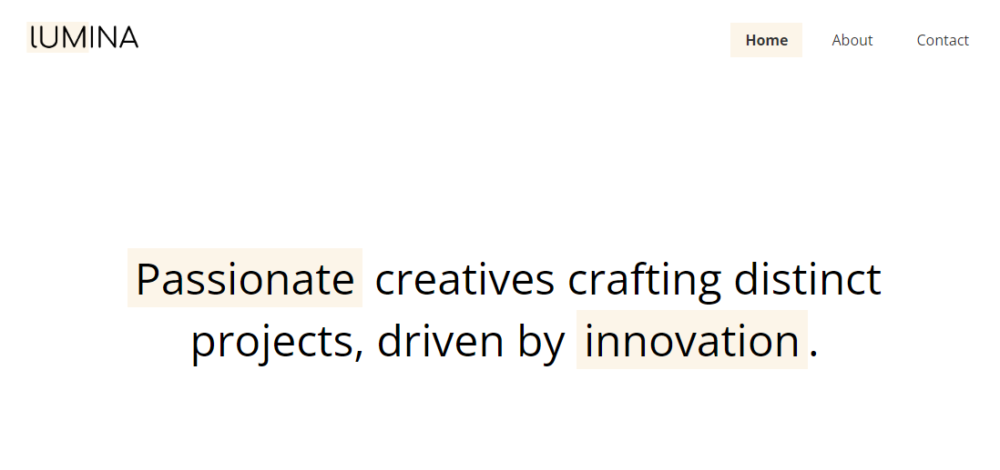

# Hero Section

Now we will do the hero section, which is pretty simple. It is just some large text.

## HTML

Let's add the HTML right under the header:

```html
<section class="hero">
  <div class="container container-sm">
    <h2>
      <span class="bg-primary">Passionate</span> creatives crafting distinct
      projects, driven by <span class="bg-primary">innovation</span>.
    </h2>
  </div>
</section>
```

We have another section with the class of `.hero`. Inside that is the `.container` that will add the width and move to the middle. I also added the `.container-sm` class which will make it `900px` wide instead of `1100px`.

The text is wrapped in an `h2` heading and there are certain words with a `span` and a class of `.bg-primary`. This will be a utility class that sets the background color.

### CSS

Let's add the main hero CSS:

```css
/* Hero */
.hero {
  height: 500px;
  display: flex;
  align-items: center;
  justify-content: center;
  text-align: center;
}
```

We are setting a fixed height of 500px for this section. We are using flexbox. Even though there is only one item (h2), I want to align it to the center vertically and horizontally and a really common way to do that is to set it to `display:flex` and then center align on both axes. We are also center aligning the text.

Let's add a few styles to the `h2`:

```css
.hero h2 {
  font-size: 3rem;
  line-height: 1.4;
  font-weight: normal;
}
```

We are setting the font to a relative unit (rem). Lowering the line height from the default `1.6` to `1.4` and setting the weight to normal rather than bold.

### `bg-primary` Class

We want some of the text to have a background color to stand out. Add the following to style the `.bg-primary` class and put it under the container so that we keep all of the utility classes in the same area:

```css
.bg-primary {
  background: #fcf5e9;
  padding: 0 0.5rem;
}
```

Primary is just the word for the main color of the website. This is a very minimalistic theme, so we don't have a secondary, etc but you could if you wanted to.

We are using this color in a few places, so this is a good case for CSS custom properties, which we will talk about in the next lesson.

I do want to change the height of the hero and the size of the text on smaller screens. Let's add to our media query:

```css
/* Screens less than 768px */
@media screen and (max-width: 768px) {
  /* Other styles... */

  .hero {
    height: 300px;
  }

  .hero h2 {
    font-size: 1.8rem;
  }
}
```

Now the site should look like this:


