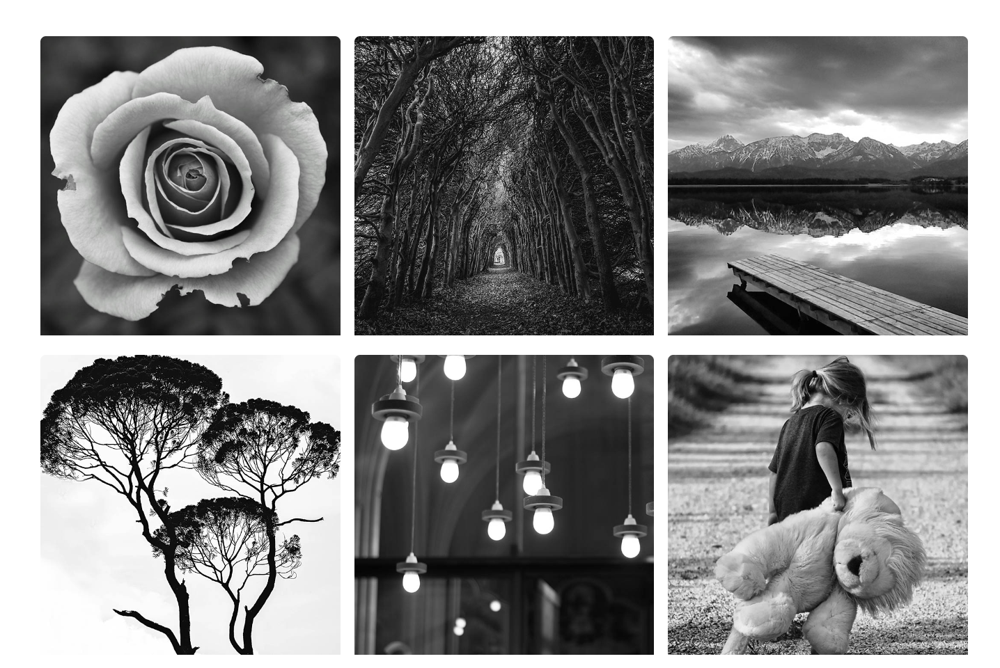

# Gallery Display

Now we are going to get to the gallery of images. Ultimatley, these will be able to be clicked and will open a larger version of the image in a lightbox. We will use a JS library for that. But for now, the images will just link to the actual image URL.

Let's add the following HTML:

```html
<section class="gallery">
  <div class="container container-lg gallery-flex">
    <div class="gallery-item">
      <a href="images/image1.jpg"></a>
    </div>
    <div class="gallery-item">
      <a href="images/image2.jpg"></a>
    </div>
    <div class="gallery-item">
      <a href="images/image3.jpg"></a>
    </div>
    <div class="gallery-item">
      <a href="images/image4.jpg"></a>
    </div>
    <div class="gallery-item">
      <a href="images/image5.jpg"></a>
    </div>
    <div class="gallery-item">
      <a href="images/image6.jpg"></a>
    </div>
    <div class="gallery-item">
      <a href="images/image6.jpg"></a>
    </div>
    <div class="gallery-item">
      <a href="images/image8.jpg"></a>
    </div>
    <div class="gallery-item">
      <a href="images/image9.jpg"></a>
    </div>
  </div>
</section>
```

We have a section with a class of `gallery`. We are using the large version of the container and adding a `gallery-flex` class on the div.

Then we have nine `div` elements with a class of `gallery-item`. Inside those are links to the large image (imageX.jpg) and they wrap around an image tag with the smaller image (portfolioX.jpg).

Right now, if you click on an image, it will just take you to that image in the browser. We will add a lightbox later.

## CSS

Now, we need to add the styles.

Let's make the `gallery-flex` a flexbox:

```css
/* Gallery */
.gallery-flex {
  display: flex;
  flex-wrap: wrap;
  gap: 20px;
}
```

We are also setting it to wrap.

So to keep the same structure that we have, we need to calculate the space to make it 3 per row. So add the following:

```css
.gallery-item {
  width: calc(33.333% - 20px); /* Set item width to 33.333% minus gap */
  overflow: hidden;
  border-radius: 10px;
}

.gallery-item img {
  border-radius: 10px;
}
```

What we have done here is used the `calc()` function to make the items take up 1/3 of the space and we subtracted 20 because of the `gap: 20px`.

We also set any overflow to be hidden and added a border radius.

Now the images will be 3 per row and we don't need to have the special HTML structure to put multiple flexboxes.

It should look like this:



Let's add a fade effect when hovered:

```css
.gallery-item:hover {
  opacity: 0.9;
}
```

## Responsiveness

Let's add some CSS to the media query to make it so there is only 2 per row on small screens:

```css
/* Screens less than 768px */
@media screen and (max-width: 768px) {
  /* Other styles... */

  .gallery-item {
    width: calc(50% - 20px); /* Set item width to 50% minus gap */
  }
}
```

We set the flex basis to 50% and subtracted the 20px gap.
