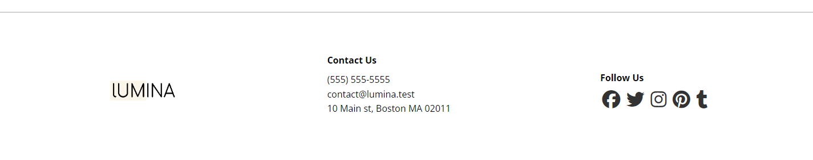

# Footer

Let's create the footer. It will have the logo, some contact info and some social media links.

## HTML

Here is the HTML:

```HTML
 <footer class="footer">
      <div class="container footer-flex">
        

        <div class="contact">
          <h4>Contact Us</h4>
          <ul>
            <li>(555) 555-5555</li>
            <li>contact@lumina.test</li>
            <li>10 Main st, Boston MA 02011</li>
          </ul>
        </div>

        <div class="social">
          <h4>Follow Us</h4>
          <a href="#"><i class="fab fa-facebook fa-2x"></i></a>
          <a href="#"><i class="fab fa-twitter fa-2x"></i></a>
          <a href="#"><i class="fab fa-instagram fa-2x"></i></a>
          <a href="#"><i class="fab fa-pinterest fa-2x"></i></a>
          <a href="#"><i class="fab fa-tumblr fa-2x"></i></a>
        </div>
      </div>
    </footer>
```

We have a class of `footer` on the semantic footer element. We are using the regular container with a flex container. There will be 3 flex items. We are using font awesome for the social icons and making them bigger with the `fa-2x` class.

## CSS

Let's add the CSS:

```css
/* Footer */
.footer {
  border-top: 1px solid #aaa;
  padding: 2rem 1.5rem;
  margin-top: 2rem;
}

.footer .footer-flex {
  display: flex;
  justify-content: space-between;
  align-items: center;
}

.footer img {
  width: 120px;
  height: 35px;
}

.footer h4 {
  font-size: 1rem;
  margin-bottom: 0.5rem;
}

.footer .social a {
  margin: 0.2rem;
}
```

We have some basic styling on the footer itself. We are making the `footer-flex` element a flexbox. We set a size for the image and added some basic styling on the headers and icon links.

It should look like this:



## Media Query

We want everything to stack on smaller screens so let's add the following to the media query:

```css
/* Screens less than 768px */
@media screen and (max-width: 768px) {
  .header-flex,
  .footer-flex {
    flex-direction: column;
    gap: 20px;
  }

  .footer-flex {
    text-align: center;
    gap: 30px;
  }
}
```

We just added the `.footer-flex` selector to the already existing style for the `.header-flex` selector. This will change the direction of the flexbox.

I also wanted to align the items to the center and increase the gap a bit.

It should look like this on small screens:


