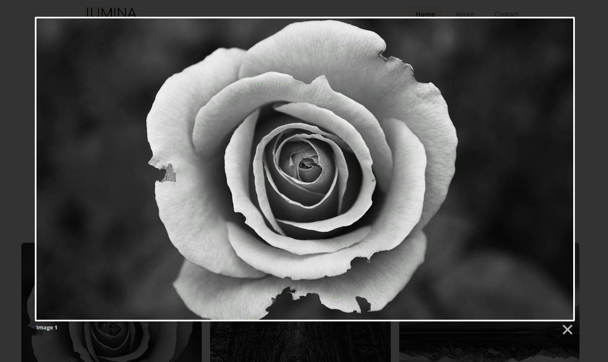

# Gallery Image Lightbox

This part of the project is optional because it does include using a JavaScript library, however it is a nice upgrade from what we have now, which is the image opening up on a separate page when clicked on. This will open up a nice lightbox.

## Lightbox 2

The library that we'll use is called **Lightbox 2** and it is super simple. You can read about it here - https://lokeshdhakar.com/projects/lightbox2/

In order to use it, we need to include the script and the CSS. If you go to https://cdnjs.com/ and search for "lightbox", it is the first result. Click on that and you will get the .js and .css links.

Here are the CDN links:

Put this in the `<head>` of the `index.html` page:

```html
<link
  rel="stylesheet"
  href="https://cdnjs.cloudflare.com/ajax/libs/lightbox2/2.11.4/css/lightbox.css"
  integrity="sha512-Woz+DqWYJ51bpVk5Fv0yES/edIMXjj3Ynda+KWTIkGoynAMHrqTcDUQltbipuiaD5ymEo9520lyoVOo9jCQOCA=="
  crossorigin="anonymous"
  referrerpolicy="no-referrer"
/>
```

We do need to include the jQuery CDN as well because it is a dependency of Lightbox 2.

Put this in the body right above the ending `</body>` tag:

```html
<script
  src="https://cdnjs.cloudflare.com/ajax/libs/jquery/3.7.1/jquery.min.js"
  integrity="sha512-v2CJ7UaYy4JwqLDIrZUI/4hqeoQieOmAZNXBeQyjo21dadnwR+8ZaIJVT8EE2iyI61OV8e6M8PP2/4hpQINQ/g=="
  crossorigin="anonymous"
  referrerpolicy="no-referrer"
></script>
<script
  src="https://cdnjs.cloudflare.com/ajax/libs/lightbox2/2.11.4/js/lightbox.min.js"
  integrity="sha512-Ixzuzfxv1EqafeQlTCufWfaC6ful6WFqIz4G+dWvK0beHw0NVJwvCKSgafpy5gwNqKmgUfIBraVwkKI+Cz0SEQ=="
  crossorigin="anonymous"
  referrerpolicy="no-referrer"
></script>
```

## Usage

We already have most of the usage done. You need to set the link around the image to the image that you want to show in the lightbox. We already have that:

```html
<a href="images/image1.jpg"></a>
```

We just need to add 2 custom HTML attributes to the links. One is `data-lightbox`, which is like an id and then `data-title`, which will be used for the display text.

Make your gallery section look like this:

```html
<section class="gallery">
  <div class="container container-lg gallery-flex">
    <div class="gallery-item">
      <a href="images/image1.jpg" data-lightbox="image-1" data-title="Image 1"
        ></a>
    </div>
    <div class="gallery-item">
      <a href="images/image2.jpg" data-lightbox="image-2" data-title="Image 2"
        ></a>
    </div>
    <div class="gallery-item">
      <a href="images/image3.jpg" data-lightbox="image-3" data-title="Image 3"
        ></a>
    </div>
    <div class="gallery-item">
      <a href="images/image4.jpg" data-lightbox="image-4" data-title="Image 4"
        ></a>
    </div>
    <div class="gallery-item">
      <a href="images/image5.jpg" data-lightbox="image-5" data-title="Image 5"
        ></a>
    </div>
    <div class="gallery-item">
      <a href="images/image6.jpg" data-lightbox="image-6" data-title="Image 6"
        ></a>
    </div>
    <div class="gallery-item">
      <a href="images/image6.jpg" data-lightbox="image-7" data-title="Image 7"
        ></a>
    </div>
    <div class="gallery-item">
      <a href="images/image8.jpg" data-lightbox="image-8" data-title="Image 8"
        ></a>
    </div>
    <div class="gallery-item">
      <a href="images/image9.jpg" data-lightbox="image-9" data-title="Image 9"
        ></a>
    </div>
  </div>
</section>
```

Now, when you click on an image, it will show the linked image in a nice lightbox:


