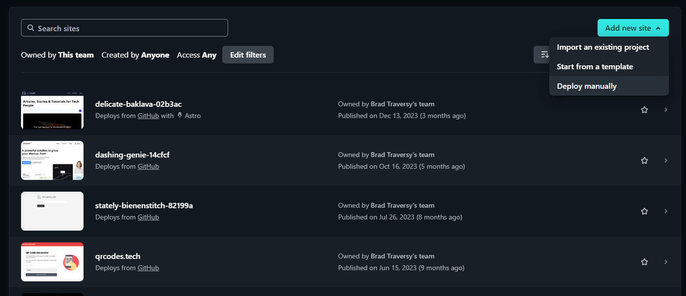

# Netlify Hosting

There are many different options for hosting. Netlify and Vercel are my two favorite free options. I mean they are free for small personal projects. If you have a serious project with a lot of traffic, you will need to use one of the paid options.

Go to [Netlify](https://www.netlify.com/) and log in with your Github account.

Once you are logged in, click on the `Import an existing project` option.

Choose your repository and click on the `Deploy` button.

it will take a few minutes to deploy your site. Once it is done, you will see a link to your live site.

The domain will be something like `https://your-site-name.netlify.app`. You can register a custom domain if you want. I will show you how to do that in a little bit.

That's it! Your site is now live on the internet.

I want to take it a step further and show you how to set up a contact form on your site. Netlify offers a service for this that is really easy to integrate.
