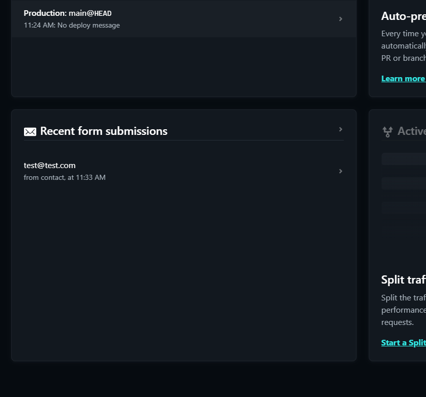

# Contact Form

In many cases, you will have some kind of server-side script that will handle the form submission. This script will take the form data and send it to an email address or store it in a database. This is a common practice, but it requires a server to run the script. Netlify has a service called Netlify Forms that allows you to handle form submissions without a server.

## Preparing The Form

We will be enabling the forms submission feature on Netlify. This will allow us to collect user emails from the website. There are a few things that you need to have in your form to do this. So in the `contact.html` page, add the following to your form:

```html
<form name="contact" netlify></form>
```

You need to give your form a name and add the `netlify` attribute to it. This will tell Netlify that this form should be processed by them. You also need to have a `name` attribute on your input field. This is the name of the field that will be sent to Netlify. Finally, make sure that you have a `type="submit"` button in your form. You should already have this in your form.

## Push To GitHub

Before we deploy the website to Netlify, we need to push our project to GitHub. This will allow Netlify to access our project files and deploy the site.

We already have Github setup, so all that you need to do is push the changes to the repository.

```bash
git add .
git commit -m "Add contact form"
git push
```

## Deploy To Netlify

Go to [Netlify](https://www.netlify.com/) and go to your project. Click on the `Deploys` tab and then click on the `Trigger deploy` button. This will deploy the changes to your site.

Once the site is deployed, you can test the form by submitting it. You should receive an email with the form data. You can also see the form submissions in the `Forms` tab in Netlify.



Now you have a working form.
