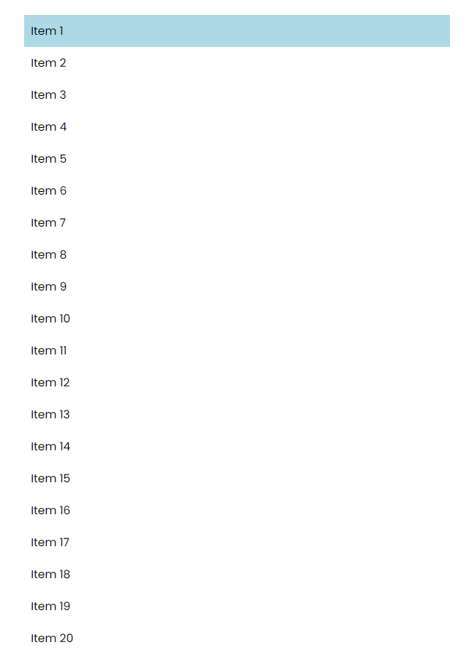
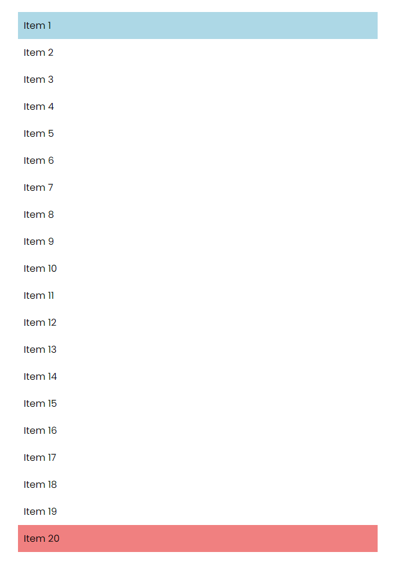
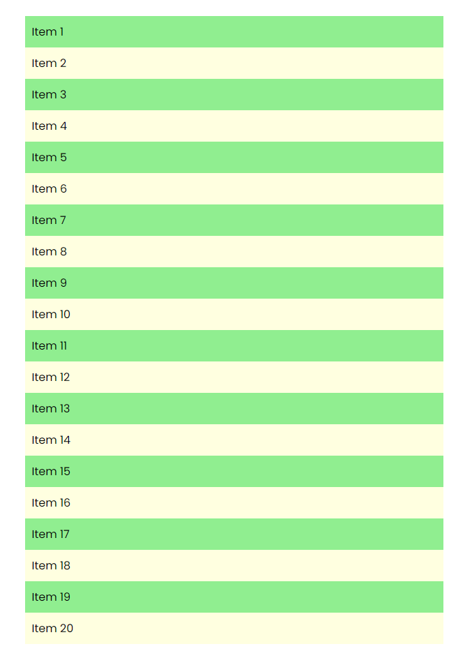
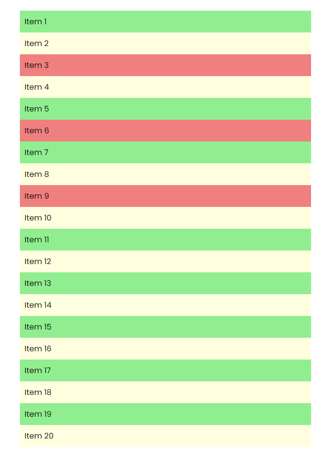
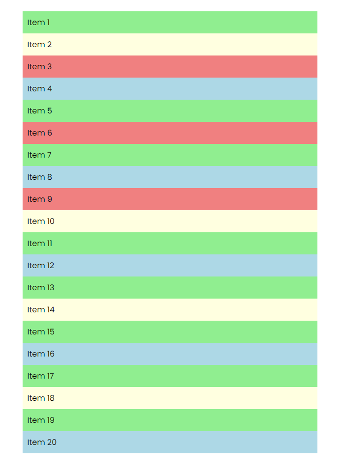

# nth-Child Pseudo Classes/Selectors

In this lesson, we will learn about the `first-child`, `last-child`, and `nth-child` pseudo classes/selectors. These selectors allow us to target elements based on their position in the DOM. This is useful because we don't have to add classes to each element to style them individually.

## Pseudo Classes vs. Pseudo Elements

Pseudo classes are used to style elements based on their state or position in the DOM and are prefixed with a single `:`. Pseudo elements, which we have already looked at are used to style a part of an element using certain keywords. They are prefixed with 2 `::` and are used to style things like the first letter of a paragraph or the first line of a paragraph. You can actually still use a single `:` for pseudo elements but it's recommended to use 2 `::`.

## The `first-child` Selector

The `first-child` selector allows us to target the first child of a parent element. This is useful when we want to style the first element in a list or group of elements.

Let's use a basic unordered list. You can use emmet and type `ul>li{Item $}*20` to generate a list with 20 items.:

```html
<div class="container">
  <ul>
    <li>Item 1</li>
    <li>Item 2</li>
    <li>Item 3</li>
    <li>Item 4</li>
    <li>Item 5</li>
    <li>Item 6</li>
    <li>Item 7</li>
    <li>Item 8</li>
    <li>Item 9</li>
    <li>Item 10</li>
    <li>Item 11</li>
    <li>Item 12</li>
    <li>Item 13</li>
    <li>Item 14</li>
    <li>Item 15</li>
    <li>Item 16</li>
    <li>Item 17</li>
    <li>Item 18</li>
    <li>Item 19</li>
    <li>Item 20</li>
  </ul>
</div>
```

And the following CSS:

```css
body {
  font-family: 'Poppins', sans-serif;
}

li {
  list-style: none;
  padding: 10px;
}

.container {
  max-width: 600px;
  margin: 30px auto;
}
```

Now, let's style the first item in the list:

```css
ul li:first-child {
  background-color: lightblue;
}
```

The first item in the list will now have a light blue background.



## The `last-child` Selector

The `last-child` selector allows us to target the last child of a parent element. This is useful when we want to style the last element in a list or group of elements.

Let's use the same list from the previous example and style the last item:

```css
ul li:last-child {
  background-color: lightcoral;
}
```

The last item in the list will now have a light coral background.



## The `nth-child` Selector

The `nth-child` selector allows us to target elements based on their position in the DOM. We can use this selector to target specific elements in a list or group of elements.

Let's use the same list from the previous example and style every even and odd item:

```css
ul li:nth-child(odd) {
  background-color: lightgreen;
}

ul li:nth-child(even) {
  background-color: lightyellow;
}
```

It will override the previous styles and style every odd item with a light green background and every even item with a light yellow background.



We can also target specific items by their position in the list. Let's style the 3rd, 6th, and 9th items:

```css
ul li:nth-child(3) {
  background-color: lightcoral;
}

ul li:nth-child(6) {
  background-color: lightcoral;
}

ul li:nth-child(9) {
  background-color: lightcoral;
}
```

The 3rd, 6th, and 9th items will now have a light coral background.



We can also use the `n` keyword to target items based on a formula. For example, we can target every 4th item:

```css
ul li:nth-child(4n) {
  background-color: lightblue;
}
```

Every 4th item will now have a light blue background.



This is very useful when we want to style elements based on their position in the DOM and you don't want to add classes to each element.

## The `only-child` Selector

The `only-child` selector allows us to target elements that are the only child of a parent element.

Let's add another list with only one item under the current list:

```html
<br />
<ul>
  <li>Only Child</li>
</ul>
```

And style the only child:

```css
ul li:only-child {
  background-color: black;
  color: white;
}
```

If you add another li, the styles will be removed.
