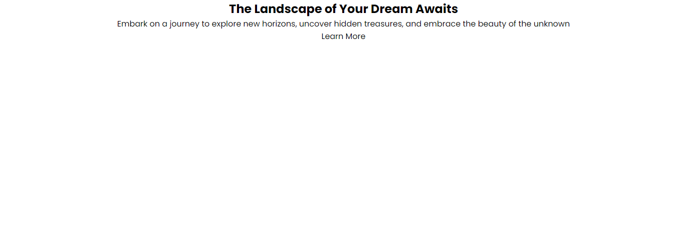

# Image Overlay

One common use of the `::before` and `::after` pseudo elements is to create an overlay on top of an image. This is a common pattern for hero sections or image galleries. The issue with simply making the background an image is that it can be hard to read text on top of it. By adding an overlay, you can make the text more readable. You can't simply use the `opacity` property on the image because it will also make the text less readable.

Let's use this HTML for our hero section:

```html
<section class="hero">
  <div class="container">
    <h1>The Landscape of Your Dream Awaits</h1>
    <p>
      Embark on a journey to explore new horizons, uncover hidden treasures, and
      embrace the beauty of the unknown
    </p>
    <div class="btn">Learn More</div>
  </div>
</section>
```

We will pretty much start the CSS from scratch. Let's just add a reset and font:

```css
* {
  margin: 0;
  padding: 0;
  box-sizing: border-box;
}

body {
  font-family: 'Poppins', sans-serif;
}
```

## Container Styles

I want the content to be within an 1100px container. I also want to center the content vertically and horizontally. We can do this by using flexbox.

Add the following CSS:

```css
.container {
  max-width: 1100px;
  margin: 0 auto;
  display: flex;
  flex-direction: column;
  align-items: center;
  justify-content: center;
  height: 100%;
}
```

This will center the content vertically and horizontally. We want the direction to be column so that the content stacks on top of each other.

It is important to add the height of 100% to the container so that it takes up the full height of the hero section.

It should look like this so far:



## Hero Styles

Let's set the height of the hero to be half the screen and add a background color for now:

```css
.hero {
  height: 50vh;
  background: coral;
  color: #fff;
}
```

## Text Styles

Now we will style the text:

```css
.hero h1 {
  font-size: 3rem;
  color: white;
  text-align: center;
  padding: 1rem;
}

.hero p {
  font-size: 1.5rem;
  color: white;
  text-align: center;
  padding: 1rem;
  margin-bottom: 2.5rem;
}
```

## Button Styles

And finally, the button/link:

```css
.hero .btn {
  font-size: 1.5rem;
  color: white;
  text-align: center;
  padding: 1rem;
  background: #333;
  border: none;
  border-radius: 5px;
  cursor: pointer;
}

.hero .btn:hover {
  background: #555;
}
```

It should look like this:


## Background Image

Now let's see what it looks like if we add a background image. You should have the `background.jpg` image in the sandbox folder. You can also get it from the final repo and I will try and remember to upload it to this section as well.

```css
.hero {
  height: 50vh;
  background: url('./background.jpg') center/cover no-repeat;
  color: #fff;
}
```

Now the image shows up, however, the text is hard to read.


## Overlay

The overlay will be positioned absolute within the hero section. So make the hero section relative:

```css
.hero {
  height: 50vh;
  background: url('./background.jpg') center/cover no-repeat;
  color: #fff;
  position: relative;
}
```

We can add an overlay by using the `::before` pseudo element. We will position it absolutely and give it a background color. We will also set the opacity to 0.5 so that the image is still visible.

Add the following CSS:

```css
.hero::before {
  content: '';
  position: absolute;
  top: 0;
  left: 0;
  width: 100%;
  height: 100%;
  background: rgba(0, 0, 0, 0.5);
}
```

This will create a black overlay with 50% opacity. The `rgba` function is used to set the color and the opacity. The first three values are the RGB values and the last value is the opacity.

Right now, the text is also hard to read because the overlay is on top of it. We can fix this by setting the `z-index` of the `.container` to 1. You also need to set the `position` to `relative` so that the `z-index` works.

```css
.container {
  max-width: 1100px;
  margin: 0 auto;
  display: flex;
  flex-direction: column;
  align-items: center;
  justify-content: center;
  position: relative;
  z-index: 1;
}
```

Now the text is readable:


You can change the color and transparency of the overlay by changing the `rgba` values. You can also change the opacity by changing the last value.

## Media Query

You may want to add a media query to make the text larger on smaller screens. Add the following CSS:

```css
@media screen and (max-width: 768px) {
  .hero h1 {
    font-size: 2.5rem;
  }

  .hero p {
    font-size: 1.25rem;
  }

  .hero .btn {
    font-size: 1.25rem;
  }
}
```

Now you know how to create an image overlay. This is a common pattern that you will see on many websites.
