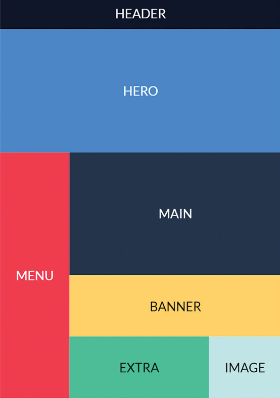

# What Is CSS Grid?

CSS Grid is a layout system that allows you to create complex layouts on a webpage. It is a two-dimensional system, meaning you can control both rows and columns. This is different from flexbox, which is a one-dimensional system. CSS Grid is supported in all modern browsers, including Chrome, Firefox, Safari, and Edge.

Like Flexbox, CSS Grid is made up of a parent container and child items. The parent container is defined using the `display: grid;` property, and the child elements are placed inside the grid using the `grid-column` and `grid-row` properties. There are also something called grid templates, which allow you to define the layout of the grid in a more structured way.

CSS Grid is two-dimensional, meaning it allows for precise control over both rows and columns simultaneously. This enables developers to create intricate layouts with ease, arranging elements not only horizontally and vertically but also in relation to each other across the grid. 

## Flexbox vs. CSS Grid

Flexbox and CSS Grid are both layout systems in CSS, but they have slightly different use cases. Flexbox is best suited for laying out items in a single dimension, such as in a row or column. It is great for creating responsive designs and aligning items within a container. CSS Grid, on the other hand, is best suited for creating complex layouts with multiple rows and columns. It is great for creating grid-based designs and aligning items in two dimensions. However, you can still use CSS Grid for a single column. 

This really comes down to user preference. Some people only use one or the other. Most, including myself use both. I like to use CSS grid for the main layout of a page or the big picture like rows of cards and hero sections and then use flexbox for smaller components within that layout. I might use CSS grid to create a two-column layout and then use flexbox to align items within those columns. Maybe we have a card component that has an image and some text. I would use flexbox to align the image and text within the card but the overall layout of the page would be done with CSS grid.

Eventually, you will find what works best for you and your projects. The important thing is to understand both systems and be consistent in your use of them.

## Grid Properties

There are many properties that you can use with CSS Grid to control the layout of your webpage. Here are some of the most common properties:

- `display: grid;` - Defines the parent container as a grid.
- `grid-template-columns` - Defines the number and size of columns in the grid.
- `grid-template-rows` - Defines the number and size of rows in the grid.
- `grid-gap` - Defines the space between grid items.
- `grid-column` - Places a grid item within a specific column range.
- `grid-row` - Places a grid item within a specific row range.
- `grid-area` - Places a grid item within a specific area of the grid.
- `justify-items` - Aligns items along the row axis.
- `align-items` - Aligns items along the column axis.
- `justify-content` - Aligns the grid along the row axis.
- `align-content` - Aligns the grid along the column axis.

## Two-Dimensional Layouts

One of the key features of CSS Grid is the ability to create two-dimensional layouts. This means you can control both rows and columns, allowing for more complex designs.

If we look at this image:

Notice the `MENU` column spans a bunch of rows and the `BANNER` and `MAIN` span the `EXTRA` and `IMAGE` columns. This is a two-dimensional layout. You can't do this with flexbox. With flexbox, you can only control one dimension at a time. Either rows or columns, not both.
