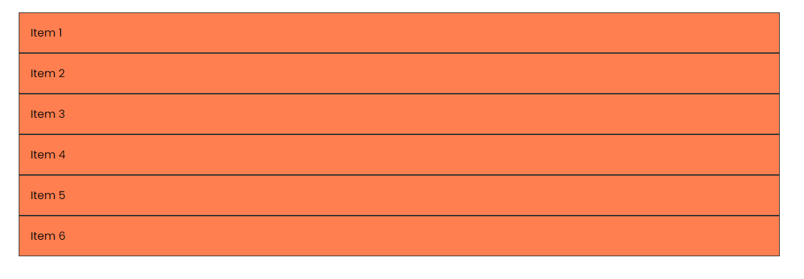
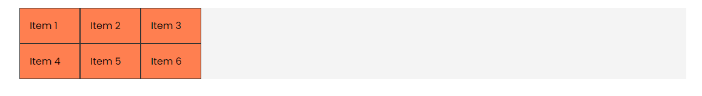
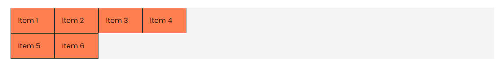
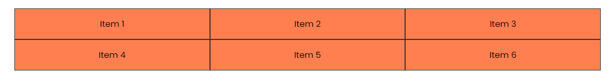
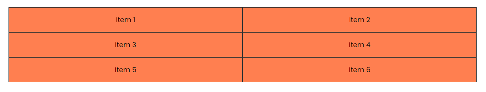
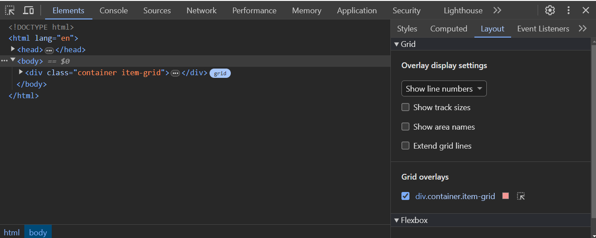
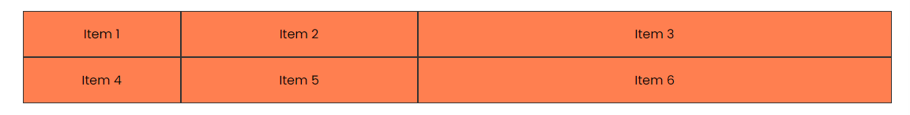
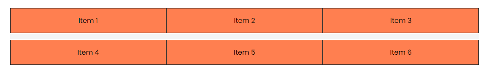
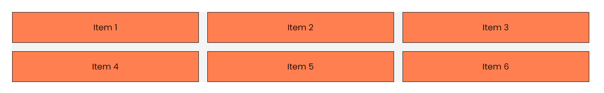

# Grid Columns (grid-template-columns)

In this lesson, we will learn how to create or enable a grid container and define the columns of the grid using the `grid-template-columns` property.

Let's start with the following HTML:

```html
<div class="container item-grid">
  <div class="item item-1">Item 1</div>
  <div class="item item-2">Item 2</div>
  <div class="item item-3">Item 3</div>
  <div class="item item-4">Item 4</div>
  <div class="item item-5">Item 5</div>
  <div class="item item-6">Item 6</div>
</div>
```

And the following CSS:

```css
body {
  font-family: Arial, sans-serif;
}

.container {
  max-width: 1100px;
  margin: 30px auto;
  background: #f4f4f4;
}

.item {
  background-color: coral;
  padding: 1rem;
  border: 1px solid #333;
  text-align: center;
}
```

We just have a container with six items. Let's enable the grid container and define the columns of the grid. Now you could just as well make the `.container` class the grid container. That is pretty common, but I like to keep the container class for width and margin and create a new class for the grid. This way, I can reuse the container class for other elements that are not grid containers. So I have added the `.item-grid` class to the container.



Add the following:

```css
.item-grid {
  display: grid;
}
```

Notice that it doesn't do anything. Unlike flexbox, the grid container doesn't automatically create columns. We have to define them.

### grid-template-columns

We define columns using the `grid-template-columns` property. This property accepts a value that defines the size of each column. We can use different units like pixels, percentages, or fractions. Let's define three columns with the same size:

```css
.item-grid {
  display: grid;
  grid-template-columns: 100px 100px 100px;
}
```

Now we have three columns with 100 pixels each.



It doesn't matter how many items we have; they will be placed in the columns. If we have more items than columns, they will be placed in the next row. If we have fewer items, the columns will have empty space.

If we added another `100px` to the `grid-template-columns` property, we would have four columns with 100 pixels each.

```css
.item-grid {
  display: grid;
  grid-template-columns: 100px 100px 100px 100px;
}
```



### Percentages

Many times, you want the items to fill the container width-wise. We have a couple options. We can use percentages. Let's define three columns with 33.33% each:

```css
.item-grid {
  display: grid;
  grid-template-columns: 33.33% 33.33% 33.33%;
}
```



### Auto

Another option is to use the `auto` keyword. This will make the columns as wide as the content inside them. Let's define three columns with the `auto` keyword:

```css
.item-grid {
  display: grid;
  grid-template-columns: auto auto auto;
}
```


### Fraction Units (fr)

A better option is to use the `fr` unit. The `fr` unit represents a fraction of the available space in the container. Let's define three columns with the `fr` unit:

```css
.item-grid {
  display: grid;
  grid-template-columns: 1fr 1fr 1fr;
}
```

This gives us the same result. They fill the container width-wise.

If you wanted to fill it with 2 columns, you could do:

```css
.item-grid {
  display: grid;
  grid-template-columns: 1fr 1fr;
}
```



With flexbox, when we want to fill the container width-wise, we use the `flex-grow` or `flex` property on the item itself. With grid, we define the columns on the container. This is a much better approach in my opinion.

## Devtools

Just like with flexbox, you can use the devtools to see the grid. Right-click on the container and select `Inspect`. Click `Layout` to see the grid properties.



## Unequal Columns

We don't have to use the same value for each column. We can use any value or list of values. Let's say we want the first column to be `200px`, the second to be `1fr`, and the third to be `2fr`:

```css
.item-grid {
  display: grid;
  grid-template-columns: 200px 1fr 2fr;
}
```



So you see how flexible the `grid-template-columns` property is. You can use any value or list of values.

Let's put it back to three columns:

```css
.item-grid {
  display: grid;
  grid-template-columns: 1fr 1fr 1fr;
}
```

## Grid Gap

Just like with flexbox, we can add space between the columns using the `gap` property. We can do horizontal and/or vertical spacing.

### grid-row-gap

Let's add a gap of `1rem` horizontally. We do this with a property called `grid-row-gap`:

```css
.item-grid {
  display: grid;
  grid-template-columns: 1fr 1fr 1fr;
  grid-row-gap: 1rem;
}
```



### grid-column-gap

We can also add a gap vertically. We do this with a property called `grid-column-gap`:

```css
.item-grid {
  display: grid;
  grid-template-columns: 1fr 1fr 1fr;
  grid-row-gap: 1rem;
  grid-column-gap: 1rem;
}
```



### gap

We can also use the `gap` property to define both the horizontal and vertical gap. Let's define a gap of `1rem` for both:

```css
.item-grid {
  display: grid;
  grid-template-columns: 1fr 1fr 1fr;
  gap: 1rem;
}
```

This gives us the same result.

So that is how you can create a grid container and define the columns of the grid using the `grid-template-columns` property and add space between the columns using the `gap` property.

## Inline Grid

One other thing I want to mention is that you can also create an inline grid. This is similar to an inline block. The items will be placed next to each other. Let's add the following:

```css
.item-grid {
  display: inline-grid;
  grid-template-columns: 1fr 1fr 1fr;
  gap: 1rem;
}
```

You can put it back to `grid` if you want. I barely use this, but this is how you can create an inline grid.
