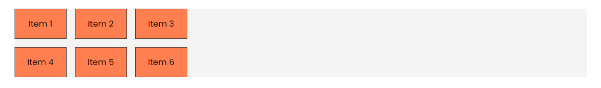
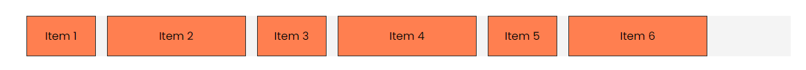

# `repeat()` and `minmax()` Functions

There are a few functions in CSS Grid that can help you write less code and make it more readable. The `repeat()` function and the `minmax()` function are two of them.

## The `repeat()` Function

The `repeat()` function is used to repeat a pattern. It takes two arguments: the number of times to repeat the pattern and the pattern itself. The pattern can be a value or a list of values.

Let's use the same HTML as before:

```html
<div class="container item-grid">
  <div class="item item-1">Item 1</div>
  <div class="item item-2">Item 2</div>
  <div class="item item-3">Item 3</div>
  <div class="item item-4">Item 4</div>
  <div class="item item-5">Item 5</div>
  <div class="item item-6">Item 6</div>
</div>
```

And the CSS that we left off with:

```css
body {
  font-family: Arial, sans-serif;
}

.container {
  max-width: 1100px;
  margin: 30px auto;
  background: #f4f4f4;
}

.item {
  background-color: coral;
  padding: 1rem;
  border: 1px solid #333;
  text-align: center;
}

.item-grid {
  display: grid;
  grid-template-columns: 1fr 1fr 1fr;
  gap: 1rem;
}
```

You can imagine if we had a grid with 12 columns. We would have to write `1fr` 12 times. That's a lot of repetition. We can use the `repeat()` function to make it more readable. Let's change the `grid-template-columns` property to use the `repeat()` function:

```css
.item-grid {
  display: grid;
  grid-template-columns: repeat(3, 1fr);
  gap: 1rem;
}
```

This is the same as before, but now it's easier to read.

Of course, it doesn't have to be a fraction. You can use any value or list of values:

```css
.item-grid {
  display: grid;
  grid-template-columns: repeat(3, 100px);
  gap: 1rem;
}
```

This will create three columns with 100 pixels each.



You can add more than one pattern:

```css
.item-grid {
  display: grid;
  grid-template-columns: repeat(3, 100px 200px);
  gap: 1rem;
}
```

This will create six columns: three with 100 pixels and three with 200 pixels and they will alternate.



## The `minmax()` Function

The `minmax()` function is used to define a size range. It takes two arguments: the minimum size and the maximum size. You can use any unit you want.

Let's say you want the columns to be at least 200 pixels and at most 300px. You can use the `minmax()` function:

```css
.item-grid {
  display: grid;
  grid-template-columns: repeat(3, minmax(200px, 300px));
  gap: 1rem;
}
```

This will create three columns with a minimum size of 200 pixels and a maximum size of 300 pixels. When you make the window smaller, the columns will shrink to 200 pixels. When you make the window bigger, the columns will grow up to 300 pixels.

You can also use fractions:

```css
.item-grid {
  display: grid;
  grid-template-columns: repeat(3, minmax(200px, 1fr));
  gap: 1rem;
}
```

Now the columns will be at least 200 pixels and grow to fill the available space.

We don't need to use `minmax()` within the `repeat()` function. We can use it alone:

```css
.item-grid {
  display: grid;
  grid-template-columns: minmax(200px, 1fr) minmax(200px, 1fr) minmax(200px, 1fr);
  gap: 1rem;
}
```

This gives us the same result.
