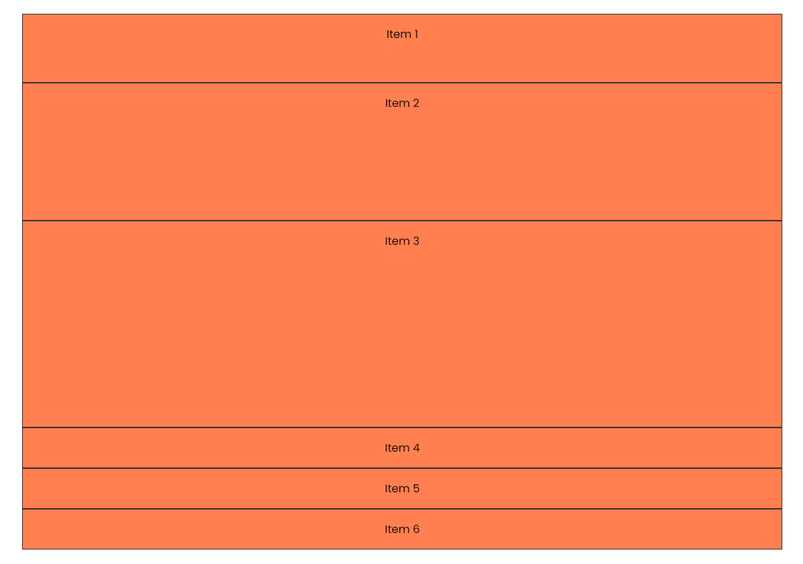
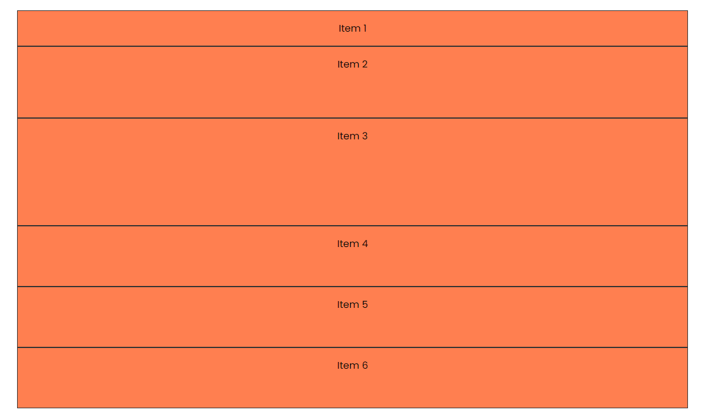
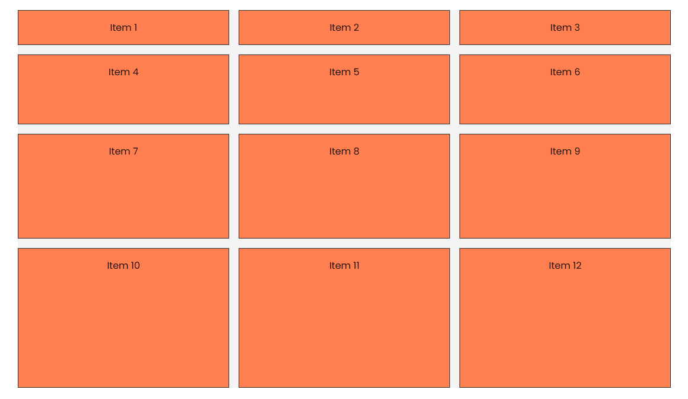

# Grid Rows (grid-template-rows)

We already know how to create columns in a grid, but what about rows? We can do that with the `grid-template-rows` property.

Let's start with the same HTML that we have been working with:

```html
<div class="container item-grid">
  <div class="item item-1">Item 1</div>
  <div class="item item-2">Item 2</div>
  <div class="item item-3">Item 3</div>
  <div class="item item-4">Item 4</div>
  <div class="item item-5">Item 5</div>
  <div class="item item-6">Item 6</div>
</div>
```

And the following CSS:

```css
body {
  font-family: Arial, sans-serif;
}

.container {
  max-width: 1100px;
  margin: 30px auto;
  background: #f4f4f4;
}

.item {
  background-color: coral;
  padding: 1rem;
  border: 1px solid #333;
  text-align: center;
}

.item-grid {
  display: grid;
}
```

We have a grid with 6 items. Let's add some rows to it:

```css
.item-grid {
  display: grid;
  grid-template-rows: 100px 200px 300px;
}
```

This will create 3 rows with the specified height. The first row will have a height of 100px, the second 200px, and the third 300px. Anything beyond that will be ignored and normal height of the content.



We can also use the `fr` unit to create rows with a fraction of the available space:

```css
.item-grid {
  display: grid;
  grid-template-rows: 1fr 2fr 3fr;
}
```

This will create 3 rows with the first row taking 1 part of the available space, the second 2 parts, and the third 3 parts.

We can also mix and match the units:

```css
.item-grid {
  display: grid;
  grid-template-rows: 100px 1fr 300px;
}
```

Let's put it back to `grid-template-rows: 1fr 2fr 3fr;`.

### grid-auto-rows

You may want the remaining rows to have a specific height. You can use the `grid-auto-rows` property to set the height of the rows that are not defined in the `grid-template-rows` property:

```css
.item-grid {
  display: grid;
  grid-template-rows: 1fr 2fr 3fr;
  grid-auto-rows: 100px;
}
```

Now the rows that are not defined in the `grid-template-rows` property will have a height of 100px. I am going to go over the `grid-auto-rows` and `grid-auto-columns` more in a later lesson.



### Grid Gap

Of course, we can add space between the rows using the `gap` property.

```css
.item-grid {
  display: grid;
  grid-template-rows: 1fr 2fr 3fr;
  grid-auto-rows: 100px;
  gap: 1rem;
}
```

This will add a gap of 1rem between the rows.

## Rows & Columns

We can also mix and match the `grid-template-rows` and `grid-template-columns` properties:

```css
.item-grid {
  display: grid;
  grid-template-columns: 1fr 2fr 3fr;
  grid-template-rows: 1fr 2fr 3fr;
  grid-auto-rows: 100px;
  gap: 1rem;
}
```

Now we have a grid with 3 columns and 3 rows.



In the next lesson, we will do a little challenge to practice what we have learned so far.
