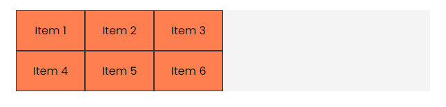
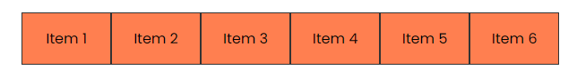
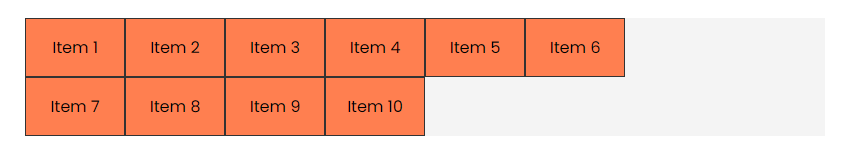
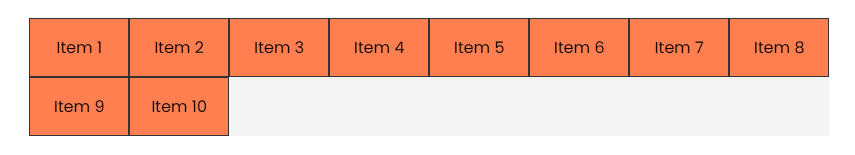
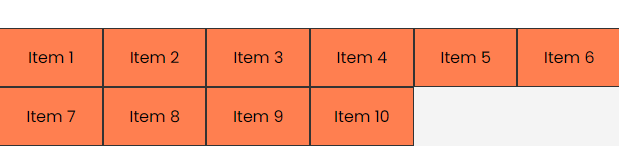
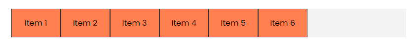
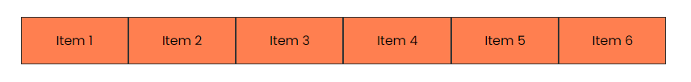

# Autofill & Autofit

We are going to take a look at two keywords that we can use with the `repeat()` function: `auto-fill` and `auto-fit`.

These keywords are used to create a grid with a dynamic number of columns. They are useful when we don't know how many items we are going to have in the grid. Up to this point, we have been using the `repeat()` function with a fixed number of columns. Let's see how we can use these keywords.

We will work with this HTML:

```html
<div class="container item-grid">
  <div class="item item-1">Item 1</div>
  <div class="item item-2">Item 2</div>
  <div class="item item-3">Item 3</div>
  <div class="item item-4">Item 4</div>
  <div class="item item-5">Item 5</div>
  <div class="item item-6">Item 6</div>
</div>
```

And this CSS:

```css
body {
  font-family: Arial, sans-serif;
}

.container {
  max-width: 600px;
  margin: 30px auto;
  background: #f4f4f4;
}

.item {
  background-color: coral;
  padding: 1rem;
  border: 1px solid #333;
  text-align: center;
}

.item-grid {
  display: grid;
  grid-template-columns: repeat(3, 100px);
}
```

We have a container that is 600px wide and a grid with three columns, each with a width of 100px. This will create a grid with three columns.



What if I want the grid to have as many columns as possible, but with a minimum width of 100px? I can manually set the number of columns to a high number. Since I know the container is 600px wide, I can set the number of columns to 6:

```css
.item-grid {
  display: grid;
  grid-template-columns: repeat(6, 100px);
}
```



Now it fills it, but what if I want to add more items and/or change the width of the container?

Let's change the container to 800px wide:

```css
.container {
  max-width: 800px;
  margin: 30px auto;
  background: #f4f4f4;
}
```

and let's add in more items:

```html
<div class="container item-grid">
  <div class="item item-1">Item 1</div>
  <div class="item item-2">Item 2</div>
  <div class="item item-3">Item 3</div>
  <div class="item item-4">Item 4</div>
  <div class="item item-5">Item 5</div>
  <div class="item item-6">Item 6</div>
  <div class="item item-7">Item 7</div>
  <div class="item item-8">Item 8</div>
  <div class="item item-9">Item 9</div>
  <div class="item item-10">Item 10</div>
</div>
```

Now we have a grid with 10 items:



The items no longer take up the entire width of the container. We can fix this by using the `auto-fit` or `auto-fill` keyword. These are both very similar. The difference is that `auto-fill` will create as many columns as possible, even if they are empty, while `auto-fit` will create as many columns as possible without empty space.

Let's use `auto-fit`:

```css
.item-grid {
  display: grid;
  grid-template-columns: repeat(auto-fit, 100px);
}
```

Now it fills the container:



If you resize the browser, you will see that the grid will adjust the number of columns to fill the container.

The issue here is that you still have some empty space at the end of the grid. You can fix this by using `minmax()`:

```css
.item-grid {
  display: grid;
  grid-template-columns: repeat(auto-fit, minmax(100px, 1fr));
}
```



The `minmax()` function will create columns with a minimum width of 100px and a maximum width of 1fr. This will make the columns take up the entire width of the container.

This makes our grid responsive and dynamic. It will adjust the number of columns based on the width of the container.

If you change `auto-fit` to `auto-fill`, you won't see any difference in this case.

Let's remove some items so that we only have 6 items:

```html
<div class="container item-grid">
  <div class="item item-1">Item 1</div>
  <div class="item item-2">Item 2</div>
  <div class="item item-3">Item 3</div>
  <div class="item item-4">Item 4</div>
  <div class="item item-5">Item 5</div>
  <div class="item item-6">Item 6</div>
</div>
```

With `auto-fill`, you will see that the grid will create as many columns as possible, even if they are empty:



With `auto-fit`, the grid will create as many columns as possible without empty space:


