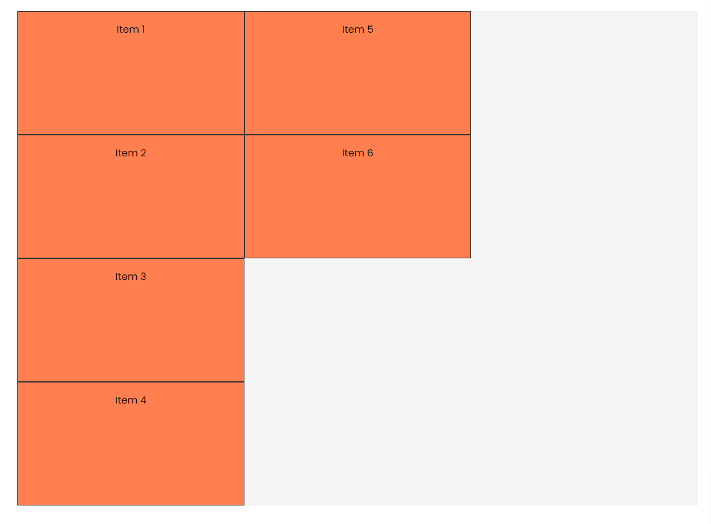

# Grid Template & Autoflow

IN this lesson, I want to show you a shorthand way to set the grid template columns and rows by using the `grid-template` property and we will also look at the `grid-auto-flow` property.

Let's use this HTML:

```html
<div class="container item-grid">
  <div class="item item-1">Item 1</div>
  <div class="item item-2">Item 2</div>
  <div class="item item-3">Item 3</div>
  <div class="item item-4">Item 4</div>
  <div class="item item-5">Item 5</div>
  <div class="item item-6">Item 6</div>
</div>
```

And this CSS:

```css
body {
  font-family: Arial, sans-serif;
}

.container {
  max-width: 1100px;
  margin: 30px auto;
  background: #f4f4f4;
}

.item {
  background-color: coral;
  padding: 1rem;
  border: 1px solid #333;
  text-align: center;
  height: 200px;
}

.item-grid {
  display: grid;
}
```

Now we know if we want to set 3 rows and 4 columns all 1fr, we can do this:

```css
.item-grid {
  display: grid;
  grid-template-columns: repeat(3, 1fr);
  grid-template-rows: repeat(4, 1fr);
}
```

We can shorten this a bit by using the `grid-template` property:

```css
.item-grid {
  display: grid;
  grid-template: repeat(4, 1fr) / repeat(3, 1fr);
}
```

## Grid Auto Flow

The `grid-auto-flow` property controls how the grid items are placed in the grid. The default value is `row`, which places the items in rows. You can also set it to `column` to place the items in columns.

```css
.item-grid {
  display: grid;
  grid-template: repeat(4, 1fr) / repeat(3, 1fr);
  grid-auto-flow: column;
}
```

Now as you add new items, they will be placed in columns instead of rows.


