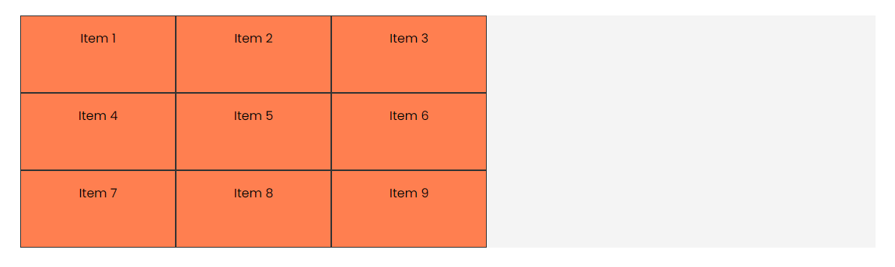
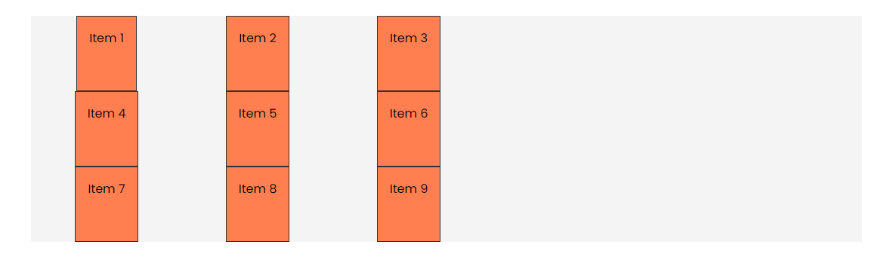
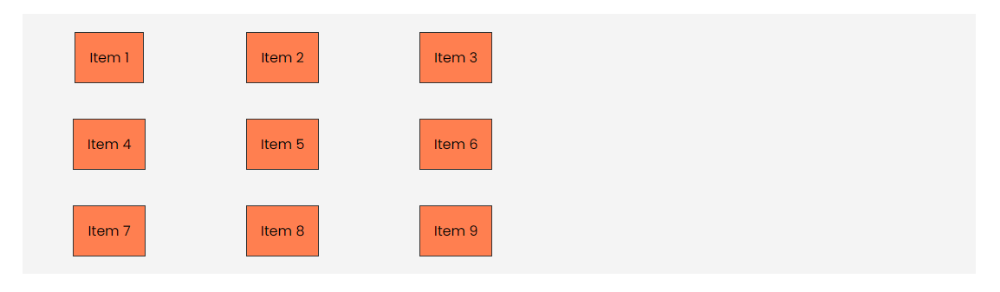
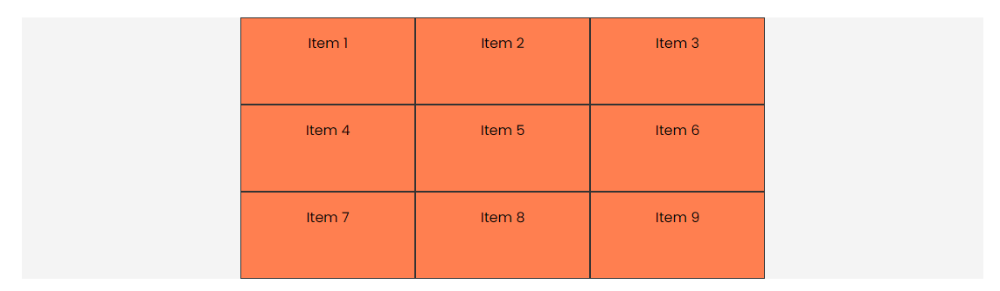
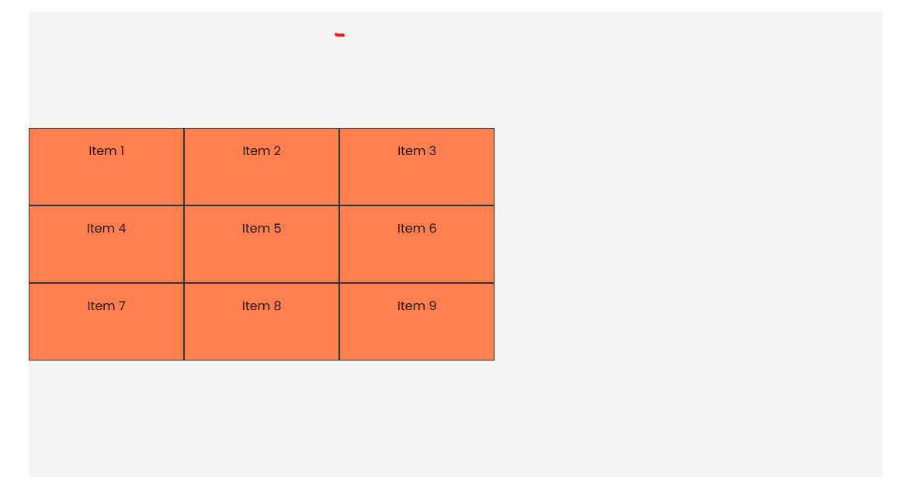
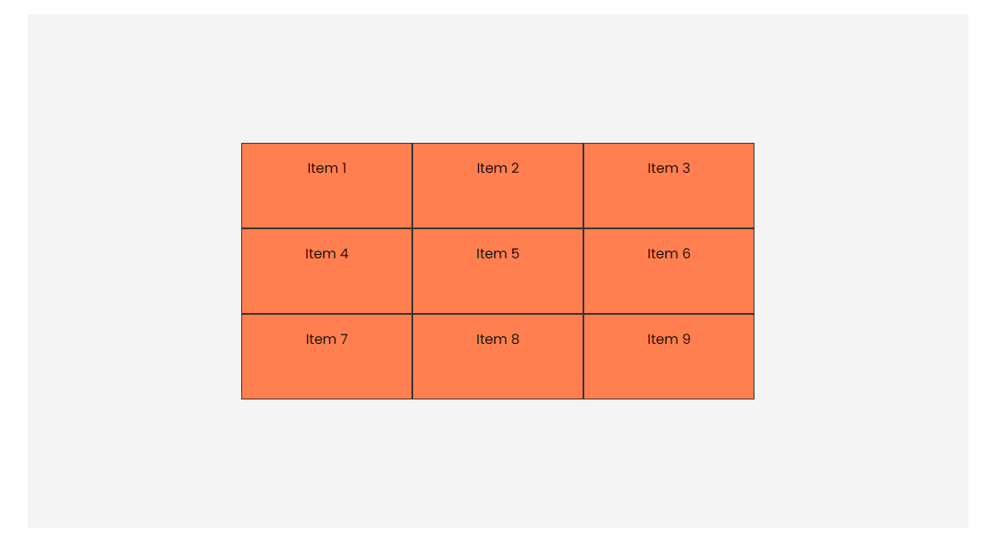
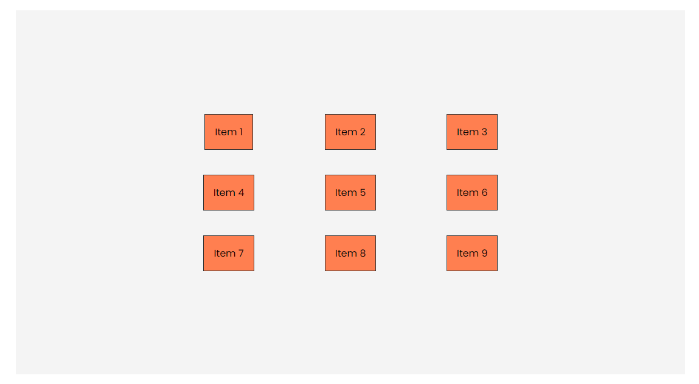

# Align & Justify

When it comes to aligning and justifying items in a grid, we do it in a similar way to flexbox. We have a few different properties that we can use:

- `justify-items`: Aligns the items inside the grid along the row axis.
- `align-items`: Aligns the items inside the grid along the column axis.
- `justify-content`: Aligns the grid along the row axis.
- `align-content`: Aligns the grid along the column axis.
- `place-items`: A shorthand for `align-items` and `justify-items`.
- `place-content`: A shorthand for `align-content` and `justify-content`.

Let's take a look at how these properties work.

We will work with this HTML:

```html
<div class="container item-grid">
  <div class="item item-1">Item 1</div>
  <div class="item item-2">Item 2</div>
  <div class="item item-3">Item 3</div>
  <div class="item item-4">Item 4</div>
  <div class="item item-5">Item 5</div>
  <div class="item item-6">Item 6</div>
  <div class="item item-7">Item 7</div>
  <div class="item item-8">Item 8</div>
  <div class="item item-9">Item 9</div>
</div>
```

And this CSS:

```css
body {
  font-family: Arial, sans-serif;
}

.container {
  max-width: 1100px;
  margin: 30px auto;
  background: #f4f4f4;
}

.item {
  background-color: coral;
  padding: 1rem;
  border: 1px solid #333;
  text-align: center;
}

.item-grid {
  display: grid;
  grid-template-columns: repeat(3, 200px);
  grid-template-rows: repeat(3, 100px);
}
```

It will look like this:



## Justify Items

The `justify-items` property aligns the items inside the grid along the row axis. This means that it will align the items horizontally. The default value is `stretch`.

```css
.item-grid {
  display: grid;
  grid-template-columns: repeat(3, 200px);
  grid-template-rows: repeat(3, 100px);
  justify-items: center;
}
```



The `justify-items` property can take the following values:

- `stretch`: Stretches the items to fill the row (default).
- `start`: Aligns the items at the start of the row.
- `end`: Aligns the items at the end of the row.
- `center`: Aligns the items at the center of the row.

## Align Items

The `align-items` property aligns the items inside the grid along the column axis. This means that it will align the items vertically. The default value is `stretch`.

```css
.item-grid {
  display: grid;
  grid-template-columns: repeat(3, 200px);
  grid-template-rows: repeat(3, 100px);
  justify-items: center;
  align-items: center;
}
```



The `align-items` property can take the same values as `justify-items`.

## Justify Content

The `justify-content` property aligns the grid along the row axis. This means that it will align the grid horizontally. The default value is `stretch`.

```css
.item-grid {
  display: grid;
  grid-template-columns: repeat(3, 200px);
  grid-template-rows: repeat(3, 100px);
  justify-items: center;
  align-items: center;
  justify-content: center;
}
```



The `justify-content` property can take the following values:

- `start`: Aligns the grid at the start of the row.
- `end`: Aligns the grid at the end of the row.
- `center`: Aligns the grid at the center of the row.
- `space-around`: Distributes the items with space around them.
- `space-between`: Distributes the items with space between them.
- `space-evenly`: Distributes the items with equal space between them.

## Align Content

The `align-content` property aligns the grid along the column axis. This means that it will align the grid vertically. The default value is `stretch`.

You won't see a difference unless you add a height to the container.

Add a height of `600px` to the container:

```css
.container {
  max-width: 1100px;
  margin: 30px auto;
  background: #f4f4f4;
  height: 600px;
}
```

And add the `align-content` property:

```css
.item-grid {
  display: grid;
  grid-template-columns: repeat(3, 200px);
  grid-template-rows: repeat(3, 100px);
  align-content: center;
}
```



The `align-content` property can take the same values as `justify-content`.

## Place Items

The `place-items` property is a shorthand for `align-items` and `justify-items`. It sets both the horizontal and vertical alignment of the items inside the grid.

```css
.item-grid {
  display: grid;
  grid-template-columns: repeat(3, 200px);
  grid-template-rows: repeat(3, 100px);
  place-items: center;
}
```



The `place-items` property can take the same values as `justify-items` and `align-items`.

## Place Content

The `place-content` property is a shorthand for `align-content` and `justify-content`. It sets both the horizontal and vertical alignment of the grid.

```css
.item-grid {
  display: grid;
  grid-template-columns: repeat(3, 200px);
  grid-template-rows: repeat(3, 100px);
  place-items: center;
  place-content: center;
}
```


