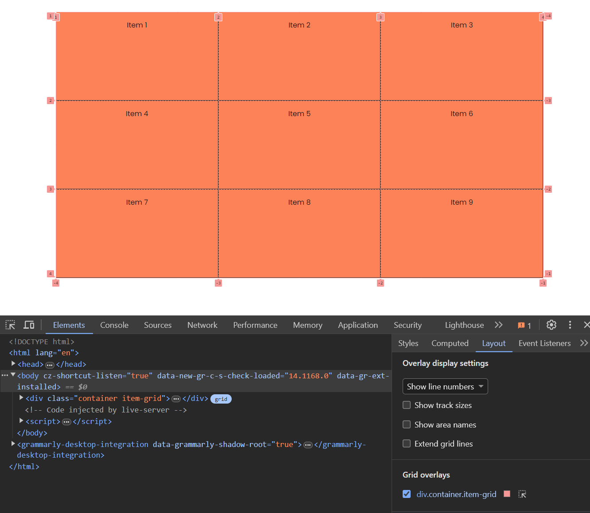
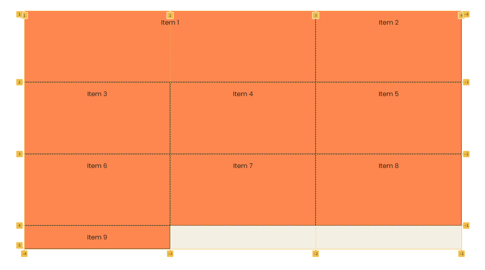
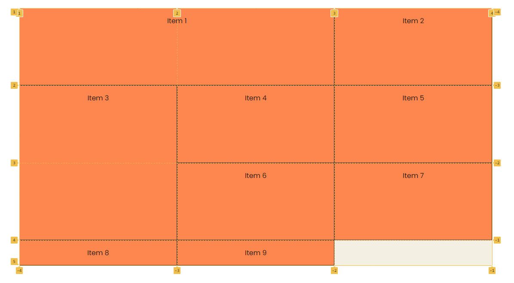
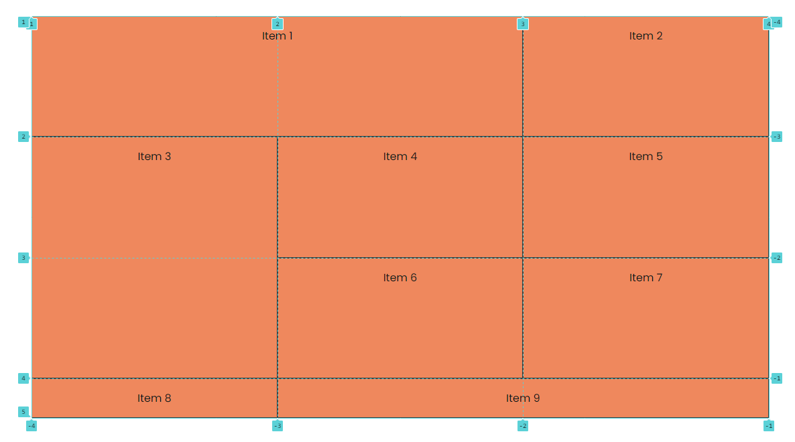

# Positioning & Spanning Grid Items

Up to this point, we have been creating very simple grid layouts. We have been letting the grid automatically place the items in the grid. But what if we want to place the items in specific locations?

We can do this by using the `grid-column` and `grid-row` properties. These properties allow us to place the items in specific columns and rows.

For this lesson, let's start with the following HTML:

```html
<div class="container item-grid">
  <div class="item item-1">Item 1</div>
  <div class="item item-2">Item 2</div>
  <div class="item item-3">Item 3</div>
  <div class="item item-4">Item 4</div>
  <div class="item item-5">Item 5</div>
  <div class="item item-6">Item 6</div>
  <div class="item item-7">Item 7</div>
  <div class="item item-8">Item 8</div>
  <div class="item item-9">Item 9</div>
</div>
```

And the following CSS:

```css
body {
  font-family: Arial, sans-serif;
}

.container {
  max-width: 1100px;
  margin: 30px auto;
  background: #f4f4f4;
  height: 600px;
}

.item {
  background-color: coral;
  padding: 1rem;
  border: 1px solid #333;
  text-align: center;
}

.item-grid {
  display: grid;
  grid-template-columns: repeat(3, 1fr);
  grid-template-rows: repeat(3, 1fr);
}
```

## Grid Lines

Before we start positioning the items, let's talk about grid lines. Grid lines are the horizontal and vertical lines that make up the grid. They are numbered starting from 1.

Open your devtools and click on the `Layout` tab and check the `Grid Overlays` checkbox. You will see the grid lines.



Starting from the top left corner, the horizontal lines are numbered from 1 to 4 and the vertical lines are numbered from 1 to 4. These are the grid lines for rows. The vertical lines are the grid lines for columns.

## grid-column

The `grid-column` property allows us to place an item in a specific column. It takes two values: the start line and the end line. If you only provide one value, the item will span that many columns.

Let's place the first item in the first column:

```css
.item-1 {
  grid-column: 1 / 3;
}
```

Now the first item spans from the first column to the third column.



The `grid-column` property is shorthand for `grid-column-start` and `grid-column-end`.

You can do the same thing like this:

```css
.item-1 {
  grid-column-start: 1;
  grid-column-end: 3;
}
```

## grid-row

The `grid-row` property works the same way as the `grid-column` property. It allows us to place an item in a specific row. It takes two values: the start line and the end line. If you only provide one value, the item will span that many rows.

Let's make item 3 span from the second row to the fourth row:

```css
.item-3 {
  grid-row: 2 / 4;
}
```

This is the same as:

```css
.item-3 {
  grid-row-start: 2;
  grid-row-end: 4;
}
```



We have an open space in the grid. Things get pushed down. This is because the grid is auto-placing the items.

Let's make item 9 span from column 2 to 4:

```css
.item-9 {
  grid-column: 2 / 4;
}
```

Now it should look like this:



This is something that we could not really do with flexbox. We can do it with the grid because we have more control over the layout.

## Span Keyword

There is another way of specifying the start and end lines. You can use the `span` keyword. This keyword allows you to specify how many columns or rows an item should span instead pf specifying the exact lines.

Let's comment out the `grid-column` and `grid-row` properties for the items and use span instead:

```css
.item-1 {
  /* grid-column: 1 / 3; */
  grid-column: 1 / span 2;
}

.item-3 {
  /* grid-row: 2 / 4; */
  grid-row: 2 / span 2;
}

.item-9 {
  /* grid-column: 2 / 4; */
  grid-column: 2 / span 2;
}
```

For item 1, we are saying that it should start from the first column and span 2 columns. For item 3, we are saying that it should start from the second row and span 2 rows. For item 9, we are saying that it should start from the second column and span 2 columns.

## Shorthand Span

Since all of these items are spanning from the start or their original position, we can use the `span` keyword only:

```css
.item-1 {
  /* grid-column: 1 / 3; */
  /* grid-column: 1 / span 2; */
  grid-column: span 2;
}

.item-3 {
  /* grid-row: 2 / 4; */
  /* grid-row: 2 / span 2; */
  grid-row: span 2;
}

.item-9 {
  /* grid-column: 2 / 4; */
  /* grid-column: 2 / span 2; */
  grid-column: span 2;
}
```

It's a bit more readable than specifying the exact lines, however, it's up to you which one you prefer.
