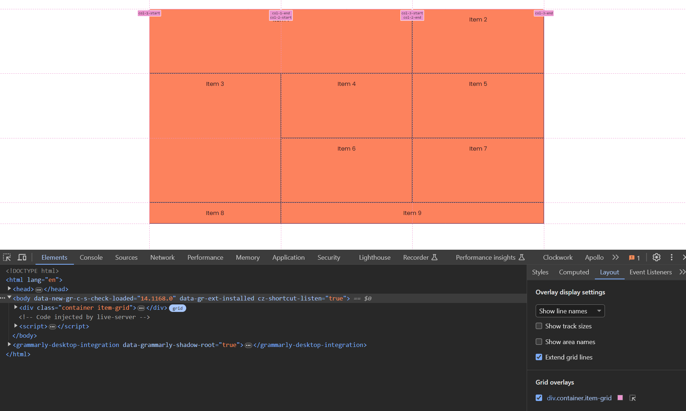
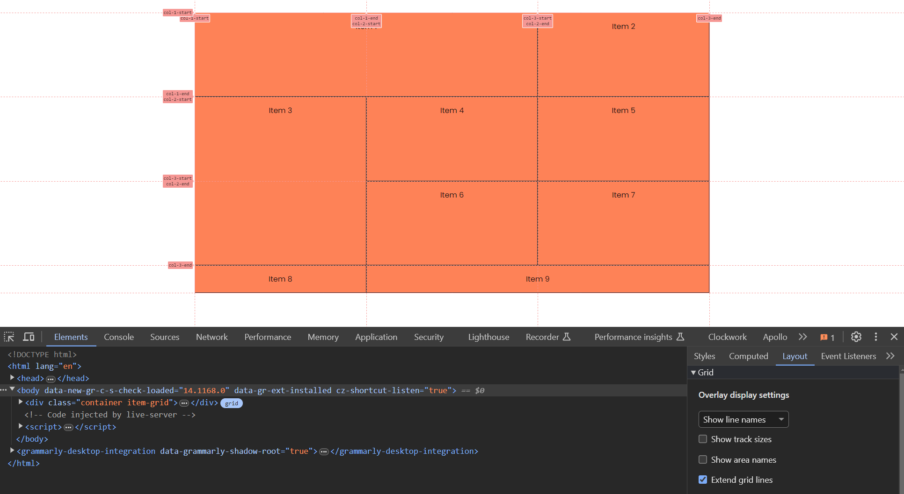

# Naming Grid Lines

This is completely optional, but you can name your grid lines. This can help when using the devtools to debug your layout. We can also use these names when placing items on the grid.

Let's use the following HTML:

```html
<div class="container item-grid">
  <div class="item item-1">Item 1</div>
  <div class="item item-2">Item 2</div>
  <div class="item item-3">Item 3</div>
  <div class="item item-4">Item 4</div>
  <div class="item item-5">Item 5</div>
  <div class="item item-6">Item 6</div>
  <div class="item item-7">Item 7</div>
  <div class="item item-8">Item 8</div>
  <div class="item item-9">Item 9</div>
</div>
```

And the following CSS:

```css
body {
  font-family: Arial, sans-serif;
}

.container {
  max-width: 1100px;
  margin: 30px auto;
  background: #f4f4f4;
  height: 600px;
}

.item {
  background-color: coral;
  padding: 1rem;
  border: 1px solid #333;
  text-align: center;
}

.item-grid {
  display: grid;
  grid-template-columns: repeat(3, 1fr);
  grid-template-rows: repeat(3, 1fr);
}

.item-1 {
  grid-column: span 2;
}

.item-3 {
  grid-row: span 2;
}

.item-9 {
  grid-column: span 2;
}
```

This is the same code we left off with in the last lesson. We have a grid with 3 columns and 3 rows and we are spanning a few items across multiple columns and rows.

Let's remove the repeat for both the columns and rows so that we can name them:

```css
.item-grid {
  display: grid;
  grid-template-columns: 1fr 1fr 1fr;
  grid-template-rows: 1fr 1fr 1fr;
}
```

We still have the same result. Now let's add names to the grid lines for the columns:

```css
.item-grid {
  display: grid;
  grid-template-columns: [col-1-start] 1fr [col-1-end col-2-start] 1fr [col-2-end col-3-start] 1fr [col-3-end];
  grid-template-rows: 1fr 1fr 1fr;
}
```

Now open up the devtools and inspect the grid. Select the `Layout` tab and then select "Show line names" from the dropdown. You should see the names we just added.



Now name the rows:

```css
.item-grid {
  display: grid;
  grid-template-columns: [col-1-start] 1fr [col-1-end col-2-start] 1fr [col-2-end col-3-start] 1fr [col-3-end];
  grid-template-rows: [row-1-start] 1fr [row-1-end row-2-start] 1fr [row-2-end row-3-start] 1fr [row-3-end];
}
```

You should now see the names for the rows as well.



Now let's use these names to place items on the grid:

```css
.item-1 {
  grid-column-start: col-1-start;
  grid-column-end: col-2-end;
}

.item-3 {
  grid-row-start: row-2-start;
  grid-row-end: row-3-end;
}

.item-9 {
  grid-column-start: col-2-start;
  grid-column-end: col-3-end;
}
```

This should give you the same result as before. It is a bit easier to read and understand what is happening with the grid when you name the lines. Again, this is completely optional, but it can be helpful when debugging your layout.
